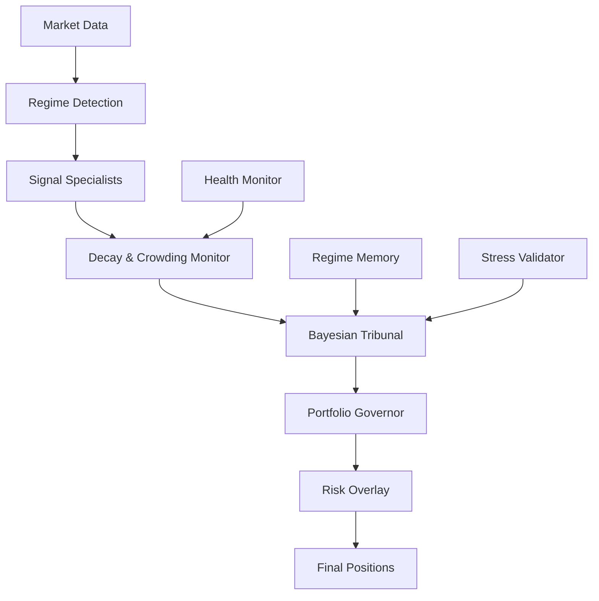

# Design Document

## Overview

The Institutional Alpha Engine transforms Northstar's signal spine from generic quant factors into a professional hedge fund-grade capital allocation system. Instead of simple momentum/value/quality signals that run continuously, we create regime-aware specialists that compete for capital through a Bayesian tribunal.

The core insight is that professional funds don't average signals - they run internal capital markets where alpha strategies compete for allocation based on evidence, regime fit, and risk-adjusted performance. Each specialist becomes a trader within the system, submitting capital requests that are evaluated probabilistically.

## Architecture

### High-Level System Flow



### Core Components

1. **Regime Detection Engine**: Classifies market environment
2. **Signal Specialists**: Regime-aware alpha generators  
3. **Decay & Crowding Monitor**: Signal health tracking
4. **Bayesian Tribunal**: Probabilistic capital allocation
5. **Portfolio Governor**: Risk-adjusted position sizing
6. **Stress Validator**: Historical regime testing
7. **Health Monitor**: Real-time system oversight

## Components and Interfaces

### 1. Regime Detection Engine

**Purpose**: Classify current market environment to gate specialist activation

**Interface**:
```python
class RegimeDetector:
    def detect_current_regime(self) -> RegimeState
    def get_regime_confidence(self) -> float
    def get_transition_probability(self) -> Dict[str, float]
```

**Regime Types**:
- `Expansion`: Growth + Low Vol + Positive Liquidity
- `Late_Bear`: High Vol + Negative Sentiment + Oversold
- `Recession`: Negative Growth + Risk Aversion + Quality Flight
- `Transition`: Regime Uncertainty + Mixed Signals
- `Liquidity_On`: Central Bank Easing + Low Rates
- `Liquidity_Off`: Tightening + Rising Rates

### 2. Signal Specialists

**Purpose**: Generate regime-aware, cross-sectional alpha signals

#### Momentum Specialist
```python
class MomentumSpecialist:
    def is_regime_favorable(self, regime: RegimeState) -> bool
    def generate_signal(self, universe: List[str]) -> CrossSectionalRanking
    def compute_multi_horizon_momentum(self, stock: str) -> float
    def adjust_for_volatility(self, returns: np.array, vol: np.array) -> np.array
```

**Activation Conditions**: Expansion, Liquidity_On regimes
**Signal Construction**: 
- 21d (50%), 63d (30%), 126d (20%) momentum
- Volatility adjustment: return / realized_vol
- Cross-sectional percentile ranking
- Focus on top/bottom 15%

#### Value Specialist  
```python
class ValueSpecialist:
    def is_regime_favorable(self, regime: RegimeState) -> bool
    def generate_signal(self, universe: List[str]) -> CrossSectionalRanking
    def compute_multi_factor_value(self, stock: str) -> float
    def exclude_junk_stocks(self, candidates: List[str]) -> List[str]
```

**Activation Conditions**: Late_Bear, Mean_Reversion regimes
**Signal Construction**:
- Earnings yield + FCF yield + ROIC + Balance sheet strength
- Exclude: High leverage, Negative FCF, Accounting anomalies
- Cross-sectional cheapness ranking

#### Quality Specialist
```python
class QualitySpecialist:
    def is_regime_favorable(self, regime: RegimeState) -> bool  
    def generate_signal(self, universe: List[str]) -> CrossSectionalRanking
    def compute_quality_score(self, stock: str) -> float
    def filter_defensive_characteristics(self, stock: str) -> bool
```

**Activation Conditions**: Recession, Risk_Off regimes
**Signal Construction**:
- ROE + Debt/Equity + Interest Coverage + Earnings Stability
- 3-year averages to avoid cyclical distortions
- Focus on defensive characteristics

#### Macro Specialist
```python
class MacroSpecialist:
    def is_regime_favorable(self, regime: RegimeState) -> bool
    def generate_signal(self, universe: List[str]) -> SectorFactorWeights
    def compute_regime_positioning(self, regime: RegimeState) -> Dict[str, float]
    def adjust_for_liquidity_cycle(self, base_weights: Dict) -> Dict[str, float]
```

**Activation Conditions**: Transition, Uncertainty regimes
**Signal Construction**:
- Sector rotation based on regime
- Factor tilts (Growth vs Value, Large vs Small)
- Liquidity cycle positioning

### 3. Decay & Crowding Monitor

**Purpose**: Track signal health and competitive degradation

```python
class SignalHealthMonitor:
    def compute_information_coefficient(self, signal: np.array, returns: np.array, horizons: List[int]) -> Dict[int, float]
    def fit_decay_curve(self, ic_series: Dict[int, float]) -> float  # half_life
    def measure_crowding_index(self, signal: np.array) -> float
    def compute_alpha_health(self, specialist: str) -> float
```

**Decay Measurement**:
- IC at 5d, 21d, 63d, 126d horizons
- Exponential decay fit: IC(t) = IC0 * exp(-t / half_life)
- Half-life threshold: 30 days minimum

**Crowding Detection**:
- Cross-sectional correlation spikes
- Turnover anomalies  
- ETF overlap metrics
- Flow concentration measures

### 4. Bayesian Tribunal

**Purpose**: Probabilistic capital allocation between competing specialists

```python
class BayesianTribunal:
    def evaluate_capital_request(self, specialist: str, request: CapitalRequest) -> float
    def compute_likelihood(self, evidence: Evidence, hypothesis: str) -> float
    def update_priors(self, specialist: str, regime: RegimeState) -> float
    def compute_posterior(self, specialist: str) -> float
    def allocate_capital(self) -> Dict[str, float]
```

**Evidence Structure**:
```python
@dataclass
class Evidence:
    information_coefficient: float
    decay_rate: float
    crowding_index: float
    regime_fit: float
    recent_pnl: float
    volatility_adjusted_return: float
```

**Bayesian Update**:
```
P(Specialist_i deserves capital | Evidence) = 
    P(Evidence | Specialist_i good) * P(Specialist_i good in this regime) / 
    P(Evidence)
```

**Likelihood Function**:
```python
likelihood = (
    sigmoid(IC) * 
    exp(-decay_rate) * 
    exp(-crowding_index) * 
    regime_fit * 
    pnl_quality_score
)
```

### 5. Portfolio Governor

**Purpose**: Convert capital allocations to risk-adjusted positions

```python
class PortfolioGovernor:
    def convert_to_positions(self, capital_allocations: Dict[str, float]) -> Dict[str, float]
    def apply_portfolio_awareness(self, raw_signals: Dict, current_weights: Dict) -> Dict
    def enforce_concentration_limits(self, positions: Dict) -> Dict
    def apply_liquidity_constraints(self, positions: Dict) -> Dict
```

**Portfolio-Aware Adjustments**:
- Signal strength / current portfolio weight
- Concentration penalties (>5% individual, >25% sector)
- Correlation-based position sizing
- Liquidity-adjusted sizing

## Data Models

### RegimeState
```python
@dataclass
class RegimeState:
    regime_type: str  # Expansion, Late_Bear, etc.
    confidence: float  # 0-1
    transition_probabilities: Dict[str, float]
    duration_estimate: int  # days
    historical_analogs: List[str]  # similar periods
```

### CrossSectionalRanking
```python
@dataclass  
class CrossSectionalRanking:
    stock_percentiles: Dict[str, float]  # 0-100 percentile
    top_quintile: List[str]  # top 20%
    bottom_quintile: List[str]  # bottom 20%
    signal_strength: float  # overall conviction
    regime_alignment: float  # how well suited to current regime
```

### CapitalRequest
```python
@dataclass
class CapitalRequest:
    specialist_name: str
    desired_allocation: float  # 0-1
    conviction: float  # 0-1
    expected_sharpe: float
    max_drawdown_estimate: float
    turnover_estimate: float
    regime_dependency: Dict[str, float]
```

### AlphaHealth
```python
@dataclass
class AlphaHealth:
    information_coefficient: float
    half_life_days: float
    crowding_percentile: float  # vs historical
    regime_fit_score: float
    recent_performance: float
    overall_health: float  # composite 0-1
```

## Correctness Properties

*A property is a characteristic or behavior that should hold true across all valid executions of a system-essentially, a formal statement about what the system should do. Properties serve as the bridge between human-readable specifications and machine-verifiable correctness guarantees.*

Now I'll analyze the acceptance criteria to determine which can be tested as properties, examples, or edge cases.
### Converting EARS to Properties

Based on the prework analysis, I'll convert the acceptance criteria into testable properties, consolidating related criteria for efficiency:

**Property 1: Regime-Based Specialist Activation**
*For any* market regime state R, when R ∈ {Expansion, Liquidity_On}, momentum_weight ≥ 0.8, and when R ∉ {Expansion, Liquidity_On}, momentum_weight ≤ 0.05. When R ∈ {Late_Bear, Recovery}, value_weight ≥ 0.8, else value_weight ≤ 0.05. When R ∈ {Recession, Risk_Off}, quality_weight ≥ 0.8, else quality_weight ≤ 0.05. After regime change at time t, |capital_allocation[t+30] - target_allocation| ≤ 0.05
**Validates: Requirements 1.1, 1.2, 1.3, 1.4, 1.5, 1.6, 1.7**

**Property 2: Cross-Sectional Signal Generation**
*For any* signal generation operation, output must be percentile rankings where min(percentiles) = 0, max(percentiles) = 100, and exactly 15% of stocks have percentile ≥ 85 and exactly 15% have percentile ≤ 15. Momentum signals must satisfy: signal = (0.5 * mom_21d + 0.3 * mom_63d + 0.2 * mom_126d) / realized_volatility
**Validates: Requirements 2.1, 2.2, 2.3, 2.4, 2.5, 2.6, 2.7**

**Property 3: Point-in-Time Data Integrity**
*For any* computation at time t, state[t] may only access data with timestamp ≤ t. When future data is randomly scrambled, all outputs must remain identical within ε = 1e-10. No signal, regime detection, or allocation decision may use information from time > t
**Validates: Requirements 2.1, 3.1, 5.1, 7.1**

**Property 4: Multi-Horizon Signal Construction**
*For any* momentum computation, output = 0.5 * momentum_21d + 0.3 * momentum_63d + 0.2 * momentum_126d ± ε. When volatility > 95th percentile, short_term_weight ≤ 0.3. When stress_detected = True, quality_weight + macro_weight ≥ 0.6
**Validates: Requirements 3.1, 3.2, 3.3, 3.4, 3.5, 3.6, 3.7**

**Property 5: Signal Health Monitoring and Response**
*For any* signal health measurement, when crowding_percentile > 75, specialist_conviction ≤ 0.5 * base_conviction. When half_life < 30 days, allocation_weight ≤ 0.5 * target_weight. When multiple specialists show simultaneous decay (health < 0.25), cash_allocation ≥ 0.3
**Validates: Requirements 4.1, 4.2, 4.3, 4.4, 4.5, 4.6, 4.7**

**Property 6: Adversarial Alpha Eviction**
*For any* alpha that shows pnl < 0 for 20 consecutive days after initial success, capital_weight must drop to ≤ 0.05 within 30 trading days. When IC drops from ≥ 0.3 to ≤ -0.2, allocation must reduce by ≥ 50% within 20 days
**Validates: Requirements 5.1, 5.2, 8.5**

**Property 7: Bayesian Capital Allocation with Execution Costs**
*For any* capital allocation decision, posterior_i = likelihood_i * prior_i / Σ(likelihood_j * prior_j), where likelihood incorporates execution cost = k * turnover + m * volatility. High-turnover alphas must receive lower allocation. Total allocation must sum to 1.0 ± ε
**Validates: Requirements 5.1, 5.2, 5.3, 5.4, 5.5, 5.6, 5.7**

**Property 8: Capital Flow Correctness**
*For any* regime transition from R1 to R2, capital must flow to appropriate specialist within 30 days. In historical crises, momentum_weight must drop ≥ 50%, risk_weight must rise ≥ 30%, and total portfolio exposure must fall ≥ 40%
**Validates: Requirements 1.6, 7.2, 9.6**

**Property 6: Portfolio-Aware Position Sizing**
*For any* position sizing decision, the system should adjust signal strength by current portfolio weights, apply concentration penalties (>5% individual → 50% reduction, >25% sector → sector penalties), reduce sizing for high correlation (>0.7) and low liquidity, and scale proportionally when risk budgets are exceeded
**Validates: Requirements 6.1, 6.2, 6.3, 6.4, 6.5, 6.6, 6.7**

**Property 7: Stress Testing and Validation**
*For any* stress test execution, the system should replay historical regimes without future data, verify appropriate capital flows to specialists, ensure adaptation within 30 days, maintain drawdowns <40% in crises, achieve Sharpe >1.0 in favorable/>0 in hostile regimes, and trigger recalibration on failures
**Validates: Requirements 7.1, 7.2, 7.3, 7.4, 7.5, 7.6, 7.7**

**Property 8: Economic Causality Validation**
*For any* signal validation, the system should verify economic justification (momentum→capital rotation, value→overreaction, quality→risk aversion, macro→liquidity cycles) and trigger review processes when justification is lacking or contradicted by new research
**Validates: Requirements 8.1, 8.2, 8.3, 8.4, 8.5, 8.6, 8.7**

**Property 9: Portfolio Survival Invariant**
*For any* historical crisis period (volatility > 95th percentile), portfolio drawdown must be ≤ 40%, momentum_weight must drop ≥ 50%, risk_weight must rise ≥ 30%, and total exposure must fall ≥ 40%. System must not die in known failure modes
**Validates: Requirements 7.4, 9.6**

**Property 10: Real-Time Health Monitoring**
*For any* health monitoring operation, when any metric falls below 25th percentile, alert must be generated within 1 trading day. When multiple specialists show health < 0.25 simultaneously, defensive_mode = True and cash_allocation ≥ 0.3. When volatility > 95th percentile, survival_protocols = True
**Validates: Requirements 9.1, 9.2, 9.3, 9.4, 9.5, 9.6, 9.7**

## Error Handling

The institutional alpha engine must handle various error conditions gracefully:

### Data Quality Issues
- **Missing regime data**: Fall back to neutral regime assumption with reduced conviction
- **Incomplete fundamental data**: Exclude affected stocks from value/quality calculations
- **Price data gaps**: Use last available data with staleness penalties
- **Correlation matrix singularities**: Apply regularization techniques

### System Failures
- **Specialist failures**: Redistribute capital to remaining healthy specialists
- **Bayesian computation errors**: Fall back to equal-weight allocation with reduced risk
- **Regime detection failures**: Use ensemble of backup regime indicators
- **Memory/performance issues**: Implement graceful degradation with core functionality

### Market Anomalies
- **Extreme volatility events**: Activate survival protocols and reduce all risk
- **Liquidity crises**: Increase cash allocation and reduce position sizes
- **Regime transition uncertainty**: Increase prior weights and reduce conviction
- **Signal breakdown**: Implement circuit breakers and manual override capabilities

## Testing Strategy

The institutional alpha engine requires comprehensive testing across multiple dimensions:

### Unit Testing
- Test individual specialist signal generation with known inputs
- Verify Bayesian computation accuracy with controlled scenarios
- Test regime detection with historical labeled data
- Validate portfolio-aware adjustments with synthetic portfolios

### Property-Based Testing
- Generate random market regimes and verify specialist activation rules
- Test signal health monitoring with synthetic decay/crowding scenarios  
- Verify Bayesian allocation with random evidence combinations
- Test stress validation with synthetic historical regime sequences

**Property Test Configuration:**
- Minimum 100 iterations per property test
- Each test tagged with: **Feature: institutional-alpha-engine, Property {number}: {property_text}**
- Use hypothesis library for Python property-based testing
- Generate realistic market data distributions for testing

### Integration Testing
- Test full pipeline from market data to final positions
- Verify regime transition handling across multiple specialists
- Test system behavior during simulated market crises
- Validate reporting accuracy with known scenarios

### Stress Testing
- Historical regime replay without future data leakage
- Monte Carlo simulation of extreme market scenarios
- Capacity testing with large universes and high-frequency updates
- Performance testing under computational constraints

The dual testing approach ensures both specific edge cases are handled correctly (unit tests) and universal properties hold across all inputs (property tests), providing comprehensive validation of this complex institutional-grade system.
**Property 11: Institutional Reporting Accuracy**
*For any* performance report, breakdown must satisfy: Σ(specialist_returns) = total_return ± ε, all Bayesian posteriors must sum to 1.0 ± ε, and regime-specific Sharpe ratios must be computed using only data from that regime period
**Validates: Requirements 10.1, 10.2, 10.3, 10.4, 10.5, 10.6, 10.7**

### Adversarial Testing Components

The institutional alpha engine must include adversarial testing to prevent overfit and ensure survival:

#### Adversarial Alpha Harness
```python
class AdversarialAlpha:
    """Fake alpha designed to look perfect then collapse - tests allocator robustness"""
    def __init__(self, collapse_after: int = 200):
        self.t = 0
        self.collapse_after = collapse_after
    
    def generate_signal(self, market_data) -> CapitalRequest:
        self.t += 1
        
        if self.t < self.collapse_after:
            # Phase 1: Perfect backtest
            return CapitalRequest(
                specialist_name="AdversarialAlpha",
                desired_allocation=0.9,
                conviction=0.95,
                expected_sharpe=3.0,  # Impossibly good
                recent_pnl=0.02,
                information_coefficient=0.3
            )
        else:
            # Phase 2: Reality hits
            return CapitalRequest(
                specialist_name="AdversarialAlpha", 
                desired_allocation=0.9,  # Still claims to be good
                conviction=0.95,
                expected_sharpe=3.0,
                recent_pnl=-0.05,  # Actually losing money
                information_coefficient=-0.2  # Actually harmful
            )
```

#### Regime Switch Stress Harness
```python
class RegimeSwitchStressor:
    """Tests allocator behavior during rapid regime transitions"""
    def generate_stress_sequence(self) -> List[RegimeState]:
        return [
            RegimeState("Expansion", confidence=0.9),
            RegimeState("Crisis", confidence=0.95),      # Sudden crash
            RegimeState("Recovery", confidence=0.8),     # Quick bounce
            RegimeState("Tightening", confidence=0.9),   # Policy shift
            RegimeState("Recession", confidence=0.85)    # Economic decline
        ]
    
    def test_capital_flow_correctness(self, allocator):
        """Verify capital flows to right specialists during transitions"""
        for regime in self.generate_stress_sequence():
            allocator.update_regime(regime)
            allocation = allocator.get_capital_allocation()
            
            if regime.regime_type == "Crisis":
                assert allocation["Momentum"] <= 0.2  # Must reduce momentum
                assert allocation["Risk"] >= 0.3      # Must increase cash/defensive
            elif regime.regime_type == "Expansion":
                assert allocation["Momentum"] >= 0.6  # Must increase momentum
```

#### Point-in-Time Integrity Tester
```python
class PointInTimeValidator:
    """Ensures no future data leakage"""
    def test_temporal_integrity(self, alpha_engine, historical_data):
        # Run normal computation
        normal_result = alpha_engine.compute_signals(historical_data)
        
        # Scramble future data randomly
        corrupted_data = self.scramble_future_data(historical_data)
        corrupted_result = alpha_engine.compute_signals(corrupted_data)
        
        # Results must be identical (no future data used)
        assert np.allclose(normal_result, corrupted_result, atol=1e-10)
    
    def scramble_future_data(self, data):
        """Randomly permute data with timestamps > current time"""
        # Implementation scrambles future data while preserving past
        pass
```