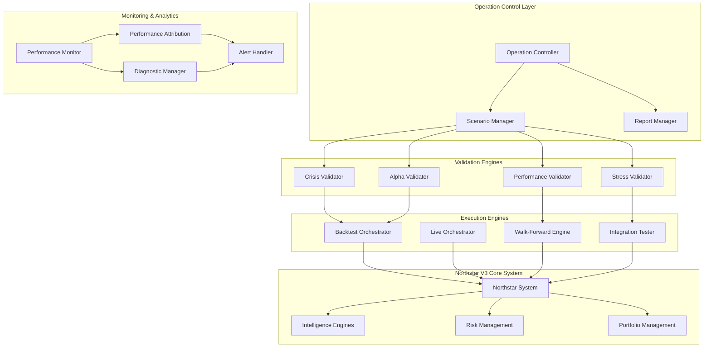

# Design Document: Northstar V3 Comprehensive Operation System

## Overview

The Northstar V3 Comprehensive Operation System is a sophisticated orchestration framework that coordinates the execution, validation, and monitoring of the complete Northstar V3 trading system. It provides automated testing across historical crisis periods, alpha validation across market regimes, comprehensive backtesting, real-time monitoring, and live operation management.

The system is designed as a hierarchical orchestrator that can run individual components or coordinate full system-wide operations, with comprehensive logging, reporting, and diagnostic capabilities.

## Architecture

### High-Level Architecture



### Component Interactions

The system follows a layered architecture where:
1. **Operation Control Layer** manages high-level orchestration and reporting
2. **Validation Engines** execute specific validation scenarios
3. **Execution Engines** coordinate different types of system runs
4. **Monitoring & Analytics** provide real-time insights and diagnostics
5. **Northstar V3 Core System** is the underlying trading system being validated

## Components and Interfaces

### Operation Controller

**Purpose**: Central orchestrator for all system operations

**Key Methods**:
- `run_comprehensive_validation()`: Execute full system validation suite
- `run_crisis_scenarios()`: Execute historical crisis backtests
- `run_alpha_validation()`: Validate alpha generation across regimes
- `start_live_operations()`: Initialize live trading operations
- `generate_system_report()`: Create comprehensive system reports

**Configuration**:
```python
class OperationConfig:
    crisis_periods: List[CrisisPeriod]
    validation_scenarios: List[ValidationScenario]
    performance_thresholds: Dict[str, float]
    alert_settings: AlertConfig
    reporting_config: ReportConfig
```

### Crisis Validator

**Purpose**: Validate system performance during historical market crises

**Key Methods**:
- `validate_2008_crisis()`: Test performance during 2008 financial crisis
- `validate_2020_covid_crash()`: Test performance during COVID market crash
- `validate_2000_dotcom_bubble()`: Test performance during dot-com bubble burst
- `generate_crisis_report()`: Create crisis performance analysis

**Crisis Periods**:
```python
CRISIS_PERIODS = {
    "2008_financial_crisis": {
        "start_date": "2007-10-01",
        "end_date": "2009-03-31",
        "severity": "extreme",
        "characteristics": ["credit_crunch", "liquidity_crisis", "volatility_spike"]
    },
    "2020_covid_crash": {
        "start_date": "2020-02-01",
        "end_date": "2020-05-31",
        "severity": "extreme",
        "characteristics": ["pandemic_shock", "circuit_breakers", "policy_response"]
    },
    "2000_dotcom_bubble": {
        "start_date": "2000-03-01",
        "end_date": "2002-10-31",
        "severity": "high",
        "characteristics": ["tech_bubble", "valuation_reset", "recession"]
    }
}
```

### Alpha Validator

**Purpose**: Validate alpha generation across different market regimes

**Key Methods**:
- `validate_bull_market_alpha()`: Test alpha during bull markets
- `validate_bear_market_alpha()`: Test alpha during bear markets
- `validate_sideways_market_alpha()`: Test alpha during sideways markets
- `analyze_alpha_consistency()`: Analyze alpha consistency over time
- `generate_alpha_report()`: Create alpha validation report

**Market Regime Detection**:
```python
class MarketRegimeDetector:
    def detect_regime(self, market_data: pd.DataFrame) -> str:
        # Bull: sustained upward trend with low volatility
        # Bear: sustained downward trend with high volatility
        # Sideways: range-bound with moderate volatility
        pass
```

### Backtest Orchestrator

**Purpose**: Coordinate comprehensive backtesting across multiple scenarios

**Key Methods**:
- `run_multi_year_backtest()`: Execute multi-year historical simulation
- `run_regime_specific_backtests()`: Test performance in specific regimes
- `run_strategy_attribution_backtest()`: Attribute performance to strategies
- `validate_risk_management()`: Validate risk management during backtests
- `generate_backtest_report()`: Create comprehensive backtest analysis

**Backtest Configuration**:
```python
class BacktestConfig:
    start_date: datetime
    end_date: datetime
    initial_capital: float
    rebalance_frequency: str
    transaction_costs: TransactionCostModel
    risk_limits: RiskLimits
    benchmark: str
    validation_metrics: List[str]
```

### Performance Monitor

**Purpose**: Real-time monitoring of system performance and health

**Key Methods**:
- `monitor_real_time_performance()`: Track live performance metrics
- `detect_performance_anomalies()`: Identify unusual performance patterns
- `validate_system_health()`: Check system component health
- `trigger_alerts()`: Send alerts for critical issues
- `log_performance_data()`: Store performance data for analysis

**Monitoring Metrics**:
```python
class PerformanceMetrics:
    returns: float
    volatility: float
    sharpe_ratio: float
    max_drawdown: float
    var_95: float
    tracking_error: float
    information_ratio: float
    system_latency: float
    data_quality_score: float
```

### Walk-Forward Engine

**Purpose**: Execute walk-forward analysis for strategy validation

**Key Methods**:
- `run_walk_forward_analysis()`: Execute rolling window analysis
- `validate_out_of_sample_performance()`: Test out-of-sample results
- `detect_strategy_degradation()`: Identify declining strategy performance
- `optimize_strategy_parameters()`: Optimize parameters over time
- `generate_walk_forward_report()`: Create walk-forward analysis report

**Walk-Forward Configuration**:
```python
class WalkForwardConfig:
    training_window: int  # months
    testing_window: int   # months
    step_size: int       # months
    optimization_metric: str
    reoptimization_frequency: str
    minimum_observations: int
```

## Data Models

### Operation Result

```python
@dataclass
class OperationResult:
    operation_id: str
    operation_type: str
    start_time: datetime
    end_time: datetime
    status: str  # "success", "failure", "warning"
    performance_metrics: Dict[str, float]
    validation_results: Dict[str, bool]
    alerts_generated: List[Alert]
    report_path: str
    diagnostic_info: Dict[str, Any]
```

### Crisis Validation Result

```python
@dataclass
class CrisisValidationResult:
    crisis_period: str
    start_date: datetime
    end_date: datetime
    total_return: float
    max_drawdown: float
    volatility: float
    sharpe_ratio: float
    var_breach_count: int
    risk_limit_breaches: List[RiskBreach]
    recovery_time_days: int
    stress_test_passed: bool
```

### Alpha Validation Result

```python
@dataclass
class AlphaValidationResult:
    regime: str
    period_start: datetime
    period_end: datetime
    alpha_generated: float
    information_ratio: float
    hit_rate: float
    signal_quality_score: float
    consistency_score: float
    regime_adaptation_score: float
    validation_passed: bool
```

### System Health Status

```python
@dataclass
class SystemHealthStatus:
    timestamp: datetime
    overall_health: str  # "healthy", "warning", "critical"
    component_status: Dict[str, str]
    performance_score: float
    data_quality_score: float
    latency_metrics: Dict[str, float]
    error_counts: Dict[str, int]
    alert_level: str
    recommended_actions: List[str]
```

## Error Handling

### Error Categories

1. **Data Errors**: Missing data, corrupted data, delayed data feeds
2. **System Errors**: Component failures, memory issues, connectivity problems
3. **Performance Errors**: Performance below thresholds, risk limit breaches
4. **Validation Errors**: Failed validation tests, inconsistent results

### Error Handling Strategy

```python
class ErrorHandler:
    def handle_data_error(self, error: DataError) -> ErrorResponse:
        # Attempt data recovery, use backup sources, or skip problematic periods
        pass
    
    def handle_system_error(self, error: SystemError) -> ErrorResponse:
        # Restart components, switch to backup systems, or graceful degradation
        pass
    
    def handle_performance_error(self, error: PerformanceError) -> ErrorResponse:
        # Trigger alerts, reduce position sizes, or halt trading
        pass
    
    def handle_validation_error(self, error: ValidationError) -> ErrorResponse:
        # Re-run validation, adjust parameters, or flag for manual review
        pass
```

### Recovery Procedures

1. **Automatic Recovery**: System attempts automatic recovery for known issues
2. **Graceful Degradation**: System continues with reduced functionality
3. **Manual Intervention**: System alerts operators for manual intervention
4. **Emergency Shutdown**: System shuts down safely in critical situations

## Testing Strategy

### Unit Testing
- Test individual components in isolation
- Mock external dependencies and data sources
- Validate error handling and edge cases
- Test configuration and parameter validation

### Integration Testing
- Test component interactions and data flow
- Validate end-to-end operation scenarios
- Test error propagation and recovery
- Validate timing and synchronization

### Property-Based Testing
- Test system properties across random inputs
- Validate invariants during all operations
- Test performance characteristics under load
- Validate data consistency and integrity

### Performance Testing
- Load testing with high-volume data
- Stress testing under extreme conditions
- Latency testing for real-time operations
- Memory and resource usage testing

## Correctness Properties

*A property is a characteristic or behavior that should hold true across all valid executions of a system-essentially, a formal statement about what the system should do. Properties serve as the bridge between human-readable specifications and machine-verifiable correctness guarantees.*

### Property 1: Crisis Report Generation
*For any* completed crisis validation run, the system should generate a comprehensive report containing performance metrics, risk analysis, and diagnostic information.
**Validates: Requirements 1.4**

### Property 2: Performance Threshold Alert Generation
*For any* crisis validation result where performance falls below acceptable thresholds, the system should generate alerts and provide actionable recommendations.
**Validates: Requirements 1.5**

### Property 3: Alpha Signal Generation Across Regimes
*For any* market regime (bull, bear, sideways), when alpha validation runs, the system should generate signals appropriate to that regime's characteristics.
**Validates: Requirements 2.1, 2.2, 2.3**

### Property 4: Alpha Signal Quality Validation
*For any* set of generated alpha signals, the system should validate signal quality metrics and consistency scores meet minimum thresholds.
**Validates: Requirements 2.4**

### Property 5: Alpha Performance Degradation Response
*For any* detected alpha performance degradation, the system should trigger appropriate alerts and initiate diagnostic procedures.
**Validates: Requirements 2.5**

### Property 6: Multi-Year Backtest Execution
*For any* valid date range spanning multiple years, the backtest orchestrator should successfully execute historical simulations and produce results.
**Validates: Requirements 3.1**

### Property 7: Simultaneous Engine Operation
*For any* backtesting execution, all intelligence engines should operate simultaneously without conflicts or resource contention.
**Validates: Requirements 3.2**

### Property 8: Portfolio and Risk Validation During Backtesting
*For any* backtesting run, portfolio construction and risk management components should function correctly and maintain risk limits.
**Validates: Requirements 3.3**

### Property 9: Backtest Report Generation
*For any* completed backtest, the system should generate detailed performance attribution reports with all required metrics.
**Validates: Requirements 3.4**

### Property 10: Diagnostic Information Provision
*For any* identified issues during backtesting, the system should provide actionable diagnostic information for resolution.
**Validates: Requirements 3.5**

### Property 11: Real-Time Performance Tracking
*For any* live system operation, the performance monitor should continuously track and record performance metrics within acceptable latency limits.
**Validates: Requirements 4.1**

### Property 12: Performance Deviation Alert Triggering
*For any* performance metric that deviates beyond expected ranges, the system should trigger immediate alerts with appropriate severity levels.
**Validates: Requirements 4.2**

### Property 13: Health Degradation Diagnostic Initiation
*For any* detected system health degradation, the performance monitor should automatically initiate appropriate diagnostic procedures.
**Validates: Requirements 4.3**

### Property 14: Emergency Protocol Execution
*For any* critical issue detection, the system should execute emergency protocols according to predefined procedures without delay.
**Validates: Requirements 4.4**

### Property 15: Monitoring Data Storage
*For any* collected monitoring data, the system should store it persistently for historical analysis and retrieval.
**Validates: Requirements 4.5**

### Property 16: System Component Validation at Startup
*For any* live operation initialization, the operation controller should validate all system components are operational before proceeding.
**Validates: Requirements 5.1**

### Property 17: Market Data Processing Latency
*For any* incoming market data, the system should process it within acceptable latency limits as defined in system requirements.
**Validates: Requirements 5.2**

### Property 18: Risk-Compliant Signal Execution
*For any* generated trading signal, the system should execute it only if it complies with all defined risk parameters and limits.
**Validates: Requirements 5.3**

### Property 19: Graceful Error Handling
*For any* system error occurrence, the operation controller should handle it gracefully without data loss or system corruption.
**Validates: Requirements 5.4**

### Property 20: Daily Report Generation
*For any* completed trading day, the system should generate comprehensive daily reports with all required performance and operational metrics.
**Validates: Requirements 5.5**

### Property 21: Stress Test Scenario Simulation
*For any* stress testing execution, the system should successfully simulate extreme market volatility, liquidity crisis, and data interruption scenarios.
**Validates: Requirements 6.1, 6.2, 6.3**

### Property 22: Risk Limit Maintenance During Stress Tests
*For any* stress test execution, the system should maintain all risk limits and not breach predefined thresholds.
**Validates: Requirements 6.4**

### Property 23: Failure Documentation and Recovery
*For any* stress test failure, the system should document failure modes and record recovery procedures for future reference.
**Validates: Requirements 6.5**

### Property 24: Performance Attribution Accuracy
*For any* performance analysis run, the system should accurately attribute returns to individual strategies, market factors, and alpha/beta components.
**Validates: Requirements 7.1, 7.2, 7.3**

### Property 25: Investor Report Generation
*For any* completed attribution analysis, the system should generate investor-ready reports in appropriate formats.
**Validates: Requirements 7.4**

### Property 26: Performance Pattern Change Detection
*For any* significant change in performance patterns, the system should detect and highlight these deviations for review.
**Validates: Requirements 7.5**

### Property 27: Comprehensive System Validation
*For any* system validation run, the validation suite should test all data pipelines, intelligence engines, and risk management components.
**Validates: Requirements 8.1, 8.2, 8.3**

### Property 28: Health Certificate Generation
*For any* successful system validation, the system should generate health certificates confirming system integrity.
**Validates: Requirements 8.4**

### Property 29: Validation Failure Diagnostics
*For any* validation failure, the system should provide detailed diagnostic information to facilitate issue resolution.
**Validates: Requirements 8.5**

### Property 30: Walk-Forward Analysis Execution
*For any* walk-forward analysis run, the system should test strategies across rolling time windows and validate out-of-sample performance.
**Validates: Requirements 9.1, 9.2**

### Property 31: Strategy Degradation Detection
*For any* walk-forward analysis execution, the system should detect strategy degradation over time and provide evolution insights.
**Validates: Requirements 9.3, 9.4**

### Property 32: Strategy Rebalancing Recommendations
*For any* detected strategy performance degradation, the system should provide recommendations for rebalancing or updates.
**Validates: Requirements 9.5**

### Property 33: Integration Testing Validation
*For any* integration testing run, the system should validate data flow, timing synchronization, and error handling across all components.
**Validates: Requirements 10.1, 10.2, 10.3**

### Property 34: System Readiness Certification
*For any* successful integration testing completion, the system should provide certification of system readiness for operation.
**Validates: Requirements 10.4**

### Property 35: Component-Level Diagnostic Provision
*For any* integration issues found, the system should provide detailed component-level diagnostics to facilitate troubleshooting.
**Validates: Requirements 10.5**