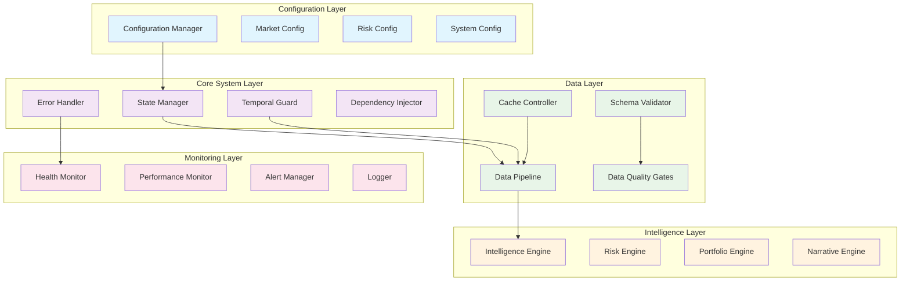
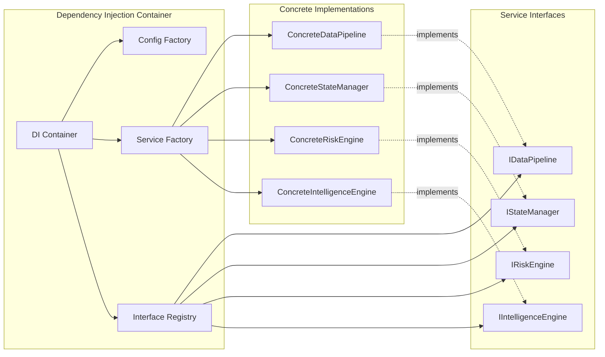

# Design Document

## Overview

The Northstar V3 System Cohesion project transforms a fragmented investment intelligence system into a unified, reliable, and maintainable platform. This design addresses 17 major categories of systemic issues through a comprehensive architectural overhaul that implements enterprise-grade patterns for configuration management, dependency injection, temporal data consistency, and error handling.

The solution follows a layered architecture with clear separation of concerns, centralized configuration management, and robust error handling. Key architectural principles include fail-fast behavior, single source of truth for all system state, and comprehensive validation at every system boundary.

## Architecture

### System Architecture Overview



### Dependency Flow Architecture



## Components and Interfaces

### 1. Configuration Management System

**Purpose**: Centralized, validated configuration management with environment-specific overrides and hot-reload capabilities.

**Core Components**:

```python
class ConfigurationManager:
    """Centralized configuration management with validation and hot-reload"""
    
    def __init__(self, config_dir: str, environment: str):
        self.config_dir = config_dir
        self.environment = environment
        self.configs = {}
        self.validators = {}
        self.watchers = {}
    
    def load_config(self, config_name: str) -> Dict[str, Any]:
        """Load and validate configuration with environment overrides"""
        
    def register_validator(self, config_name: str, validator: Callable):
        """Register configuration validator"""
        
    def watch_config(self, config_name: str, callback: Callable):
        """Watch configuration for changes and trigger callbacks"""
        
    def validate_all_configs(self) -> ValidationResult:
        """Validate all loaded configurations"""

class MarketConfiguration:
    """Market-specific configuration with validation"""
    
    market_name: str
    currency: str
    trading_hours: Dict[str, str]
    sector_classifications: Dict[str, List[str]]
    risk_parameters: Dict[str, float]
    data_sources: Dict[str, str]
    
    def validate(self) -> ValidationResult:
        """Validate market configuration completeness"""

class RiskConfiguration:
    """Unified risk parameter configuration"""
    
    max_position_size: float
    max_sector_exposure: float
    max_drawdown_threshold: float
    volatility_threshold: float
    correlation_threshold: float
    emergency_brake_params: Dict[str, float]
    
    def validate_consistency(self) -> ValidationResult:
        """Validate risk parameter consistency"""
```

**Configuration File Structure**:
```yaml
# config/markets/india.yaml
market:
  name: "india"
  currency: "INR"
  trading_hours:
    pre_open: "09:00"
    open: "09:15"
    close: "15:30"
  sectors:
    - "BANKING"
    - "IT"
    - "PHARMA"
    # ... other sectors
  indices:
    primary: "NIFTY50"
    broad: "NIFTY500"
  risk_limits:
    max_single_position: 0.08
    max_sector_exposure: 0.30
```

### 2. Unified State Management System

**Purpose**: Single source of truth for all system state with atomic updates, history tracking, and authority-based conflict resolution.

**Core Components**:

```python
class UnifiedStateManager:
    """Single source of truth for all system state"""
    
    def __init__(self, persistence_layer: IPersistenceLayer):
        self.current_state = SystemState()
        self.state_history = StateHistory()
        self.subscribers = {}
        self.authority_hierarchy = AuthorityHierarchy()
        self.persistence = persistence_layer
    
    def update_state(self, 
                    component: str, 
                    updates: Dict[str, Any], 
                    authority: AuthorityLevel,
                    timestamp: datetime = None) -> StateUpdateResult:
        """Atomic state update with authority validation"""
        
    def get_state(self, as_of: datetime = None) -> SystemState:
        """Get current or historical state"""
        
    def subscribe_to_changes(self, 
                           component: str, 
                           callback: Callable,
                           filter_func: Callable = None):
        """Subscribe to state changes with optional filtering"""
        
    def resolve_conflicts(self, conflicts: List[StateConflict]) -> Resolution:
        """Resolve state conflicts using authority hierarchy"""

class SystemState:
    """Complete system state representation"""
    
    market_state: MarketState
    portfolio_state: PortfolioState
    risk_state: RiskState
    intelligence_state: IntelligenceState
    system_health: HealthState
    timestamp: datetime
    version: int
    
    def validate_consistency(self) -> ValidationResult:
        """Validate state consistency across components"""

class StateHistory:
    """Temporal state history with efficient querying"""
    
    def add_snapshot(self, state: SystemState):
        """Add state snapshot to history"""
        
    def get_state_at(self, timestamp: datetime) -> SystemState:
        """Get state as it was at specific timestamp"""
        
    def get_changes_between(self, start: datetime, end: datetime) -> List[StateChange]:
        """Get all state changes in time range"""
```

### 3. Temporal Data Protection System

**Purpose**: Enforce point-in-time data consistency to prevent data leakage in backtesting and ensure regulatory compliance.

**Core Components**:

```python
class TemporalGuard:
    """Point-in-time data access protection"""
    
    def __init__(self, state_manager: UnifiedStateManager):
        self.state_manager = state_manager
        self.current_time_context = None
        self.violation_logger = ViolationLogger()
    
    def set_time_context(self, as_of_date: datetime):
        """Set temporal context for all subsequent data access"""
        
    def validate_data_access(self, 
                           data_timestamp: datetime, 
                           request_timestamp: datetime) -> ValidationResult:
        """Validate that data access respects temporal boundaries"""
        
    def wrap_data_source(self, data_source: IDataSource) -> TemporalDataSource:
        """Wrap data source with temporal protection"""
        
    def audit_temporal_violations(self) -> List[TemporalViolation]:
        """Get all temporal violations for audit"""

class TemporalDataSource:
    """Data source wrapper with temporal protection"""
    
    def __init__(self, wrapped_source: IDataSource, guard: TemporalGuard):
        self.wrapped_source = wrapped_source
        self.guard = guard
    
    def read_data(self, query: DataQuery) -> DataFrame:
        """Read data with temporal validation"""
        # Validate query respects temporal boundaries
        # Apply as-of filtering
        # Log access for audit
        
    def get_data_as_of(self, as_of_date: datetime, query: DataQuery) -> DataFrame:
        """Get data as it existed at specific point in time"""
```

### 4. Schema Validation and Data Quality System

**Purpose**: Ensure data consistency and quality through comprehensive validation at every system boundary.

**Core Components**:

```python
class SchemaValidator:
    """Comprehensive data schema validation"""
    
    def __init__(self, schema_registry: SchemaRegistry):
        self.schema_registry = schema_registry
        self.validation_cache = ValidationCache()
    
    def validate_dataframe(self, 
                          df: DataFrame, 
                          schema_name: str,
                          strict_mode: bool = True) -> ValidationResult:
        """Validate DataFrame against registered schema"""
        
    def register_schema(self, name: str, schema: DataSchema):
        """Register new data schema"""
        
    def auto_detect_schema(self, df: DataFrame) -> DataSchema:
        """Auto-detect schema from DataFrame"""

class DataQualityGate:
    """Data quality validation gates"""
    
    def __init__(self, quality_rules: List[QualityRule]):
        self.quality_rules = quality_rules
        self.quality_history = QualityHistory()
    
    def validate_quality(self, 
                        data: DataFrame, 
                        context: DataContext) -> QualityResult:
        """Validate data quality against rules"""
        
    def quarantine_bad_data(self, 
                           data: DataFrame, 
                           violations: List[QualityViolation]):
        """Quarantine data that fails quality checks"""
        
    def get_quality_trends(self, 
                          data_source: str, 
                          time_range: TimeRange) -> QualityTrends:
        """Get data quality trends for monitoring"""

class DataSchema:
    """Data schema definition with validation rules"""
    
    name: str
    version: str
    columns: Dict[str, ColumnSchema]
    constraints: List[Constraint]
    temporal_columns: List[str]
    
    def validate_dataframe(self, df: DataFrame) -> ValidationResult:
        """Validate DataFrame against this schema"""
```

### 5. Integrated Data Pipeline System

**Purpose**: Unified data pipeline that coordinates all data sources with quality gates, dependency management, and error recovery.

**Core Components**:

```python
class IntegratedDataPipeline:
    """Unified data pipeline with quality gates and dependency management"""
    
    def __init__(self, 
                 config_manager: ConfigurationManager,
                 schema_validator: SchemaValidator,
                 temporal_guard: TemporalGuard):
        self.config_manager = config_manager
        self.schema_validator = schema_validator
        self.temporal_guard = temporal_guard
        self.data_sources = {}
        self.processors = {}
        self.dependency_graph = DependencyGraph()
    
    def register_data_source(self, 
                           name: str, 
                           source: IDataSource,
                           dependencies: List[str] = None):
        """Register data source with dependencies"""
        
    def process_data_pipeline(self, 
                            force_refresh: bool = False) -> PipelineResult:
        """Process entire data pipeline in dependency order"""
        
    def validate_data_lineage(self) -> LineageValidation:
        """Validate data lineage and dependencies"""
        
    def recover_from_failure(self, 
                           failed_component: str, 
                           error: Exception) -> RecoveryResult:
        """Implement automatic recovery from pipeline failures"""

class DataProcessor:
    """Base class for data processors with quality gates"""
    
    def __init__(self, 
                 name: str,
                 input_schema: str,
                 output_schema: str,
                 quality_gates: List[QualityGate]):
        self.name = name
        self.input_schema = input_schema
        self.output_schema = output_schema
        self.quality_gates = quality_gates
    
    def process(self, input_data: DataFrame) -> ProcessingResult:
        """Process data with validation gates"""
        # Validate input schema
        # Apply processing logic
        # Validate output schema
        # Run quality gates
        # Return result with quality metrics
```

### 6. Dependency Injection System

**Purpose**: Clean dependency management with interface-based design, eliminating circular dependencies and enabling testability.

**Core Components**:

```python
class DependencyContainer:
    """Dependency injection container with interface registration"""
    
    def __init__(self):
        self.interfaces = {}
        self.implementations = {}
        self.singletons = {}
        self.factories = {}
    
    def register_interface(self, interface_type: Type, implementation_type: Type):
        """Register interface implementation"""
        
    def register_singleton(self, interface_type: Type, instance: Any):
        """Register singleton instance"""
        
    def register_factory(self, interface_type: Type, factory: Callable):
        """Register factory function for interface"""
        
    def resolve(self, interface_type: Type) -> Any:
        """Resolve interface to implementation"""
        
    def validate_dependencies(self) -> ValidationResult:
        """Validate all dependencies can be resolved"""

class ServiceLocator:
    """Service locator pattern for dependency resolution"""
    
    def __init__(self, container: DependencyContainer):
        self.container = container
        self.resolution_cache = {}
    
    def get_service(self, service_type: Type) -> Any:
        """Get service instance with caching"""
        
    def clear_cache(self):
        """Clear resolution cache"""
```

## Data Models

### Configuration Models

```python
@dataclass
class SystemConfiguration:
    """Complete system configuration"""
    market_config: MarketConfiguration
    risk_config: RiskConfiguration
    data_config: DataConfiguration
    monitoring_config: MonitoringConfiguration
    
    def validate(self) -> ValidationResult:
        """Validate complete system configuration"""

@dataclass
class DataConfiguration:
    """Data pipeline configuration"""
    sources: Dict[str, DataSourceConfig]
    schemas: Dict[str, str]  # schema name -> file path
    quality_rules: Dict[str, List[str]]
    freshness_thresholds: Dict[str, timedelta]
    
    def validate_completeness(self) -> ValidationResult:
        """Validate data configuration completeness"""
```

### State Models

```python
@dataclass
class MarketState:
    """Market state with temporal tracking"""
    regime: str
    risk_on_probability: float
    volatility_regime: str
    market_stress: float
    breadth_metrics: Dict[str, float]
    timestamp: datetime
    confidence: float
    data_sources: List[str]
    
    def validate_consistency(self) -> ValidationResult:
        """Validate market state consistency"""

@dataclass
class PortfolioState:
    """Portfolio state with position tracking"""
    positions: Dict[str, Position]
    total_exposure: float
    sector_exposures: Dict[str, float]
    risk_metrics: Dict[str, float]
    last_rebalance: datetime
    pending_orders: List[Order]
    
    def validate_risk_limits(self, risk_config: RiskConfiguration) -> ValidationResult:
        """Validate portfolio against risk limits"""
```

### Error and Validation Models

```python
@dataclass
class ValidationResult:
    """Standardized validation result"""
    is_valid: bool
    errors: List[ValidationError]
    warnings: List[ValidationWarning]
    metadata: Dict[str, Any]
    
    def raise_if_invalid(self):
        """Raise exception if validation failed"""

@dataclass
class ValidationError:
    """Detailed validation error"""
    code: str
    message: str
    field: str
    value: Any
    severity: ErrorSeverity
    timestamp: datetime
```

## Correctness Properties

*A property is a characteristic or behavior that should hold true across all valid executions of a system-essentially, a formal statement about what the system should do. Properties serve as the bridge between human-readable specifications and machine-verifiable correctness guarantees.*

**CRITICAL**: These are not suggestions or guidelines. These are **SYSTEM LAWS** that must hold on every execution. Violation of any invariant means the system is broken and the run is invalid.

### Configuration System Invariants - Make It Unbreakable

**Property 1: Single Source of Truth (C1)**
*For any* point in time, there must exist exactly one active configuration set
```python
assert len(ConfigurationManager.active_configs) == 1
```
No overrides, no hidden configs, no side channels.
**Validates: Requirements 2.1, 4.1**

**Property 2: Risk Parameter Consistency (C2)**
*For any* risk configuration, mathematical consistency must be enforced
```python
# If max_position_size = 8% and max_sector_exposure = 30%
# Then: 8% × 4 ≤ 30% (max 4 positions per sector)
assert (max_position_size * min_positions_per_sector) <= max_sector_exposure
```
Otherwise the config is self-contradictory and must refuse to boot.
**Validates: Requirements 7.3, 7.7**

**Property 3: Configuration Completeness (C3)**
*For any* market configuration, all required fields must be present and valid
```python
required_fields = ['currency', 'trading_hours', 'sectors', 'risk_limits']
assert all(field in config and config[field] is not None for field in required_fields)
```
**Validates: Requirements 2.6**

### State Manager Invariants - Kill Split-Brain

**Property 4: Atomic State Updates (S1)**
*For any* state change, all components must see the same version simultaneously
```python
# If market regime changes at time T, portfolio and risk must see it at the same T
assert all(component.state_version == current_version for component in subscribers)
# State version must increase exactly once per atomic update
assert new_state.version == old_state.version + 1
```
No half-updates allowed.
**Validates: Requirements 3.2, 3.6**

**Property 5: Temporal Monotonicity (S2)**
*For any* state update, timestamps must be strictly increasing
```python
# State must be monotonic - no time travel
assert state.timestamp[t] > state.timestamp[t-1]
# No retroactive edits without explicit versioning
```
**Validates: Requirements 3.3**

**Property 6: State Authority Hierarchy (S3)**
*For any* conflicting state updates, authority hierarchy must be respected
```python
# Emergency authority overrides all others
if conflict.authority_level == AuthorityLevel.EMERGENCY:
    assert conflict.resolution == "emergency_wins"
```
**Validates: Requirements 3.4**

### Temporal Guard Invariants - The Heart of Truth

**Property 7: No Future Data Access (T1)**
*For any* data row accessed with as_of_time, temporal consistency must be enforced
```python
# CRITICAL: This is the most important invariant in the entire system
for row in data:
    assert row.timestamp <= as_of_time
# Violation = system invalid, run must be terminated
```
**Validates: Requirements 1.6, 11.1, 11.2**

**Property 8: Scramble Test Invariance (T2)**
*For any* historical analysis, randomly shuffling future data must not change results
```python
# If you randomly shuffle future data, output must not change
original_result = run_analysis(data, as_of_date)
shuffled_future = shuffle_data_after(data, as_of_date)
scrambled_result = run_analysis(shuffled_future, as_of_date)
assert original_result == scrambled_result
```
This catches: look-ahead bias, leakage, regime peeking. This is what real hedge funds use internally.
**Validates: Requirements 11.6**

**Property 9: As-Of-Date Filtering Completeness (T3)**
*For any* data source, as-of-date filtering must be comprehensive and consistent
```python
# All data sources must respect as-of filtering
for source in data_sources:
    filtered_data = source.get_data_as_of(as_of_date)
    assert all(row.timestamp <= as_of_date for row in filtered_data)
```
**Validates: Requirements 11.5**

### Data Quality Gate Invariants - Stop Garbage

**Property 10: No Silent Data Loss (D1)**
*For any* data transformation, data loss must be explained and within thresholds
```python
# If 1000 rows go in and 600 come out, you must explain why
input_count = len(input_data)
output_count = len(output_data)
drop_ratio = (input_count - output_count) / input_count
assert drop_ratio <= allowed_threshold or explanation_provided
```
**Validates: Requirements 6.3, 6.4**

**Property 11: Data Freshness Enforcement (D2)**
*For any* data used in calculations, freshness must be within configured thresholds
```python
# If macro data is 30 days stale but threshold is 10 days → hard fail
data_age = current_time - data.timestamp
assert data_age <= freshness_threshold
```
**Validates: Requirements 1.7**

**Property 12: Schema Validation Completeness (D3)**
*For any* data entering the system, schema validation must pass before processing
```python
# All data must pass schema validation before use
for dataset in incoming_data:
    validation_result = schema_validator.validate(dataset)
    assert validation_result.is_valid
```
**Validates: Requirements 1.1, 1.2**

### Portfolio and Risk Invariants - Survival Laws

**Property 13: Capital Conservation (R1)**
*For any* portfolio update, capital must be conserved (no magic money)
```python
# NAV[t] = NAV[t-1] + PnL[t] - costs[t]
expected_nav = previous_nav + pnl - transaction_costs - management_fees
assert abs(current_nav - expected_nav) < tolerance
```
**Validates: Requirements 7.1, 7.5**

**Property 14: Crisis De-Risking (R2)**
*For any* crisis condition, exposure must be reduced within specified timeframes
```python
# If volatility > crisis_threshold then gross_exposure must fall ≥ 40% within 10 days
if market_volatility > crisis_threshold:
    days_since_crisis = (current_date - crisis_start_date).days
    if days_since_crisis <= 10:
        required_reduction = 0.40
        actual_reduction = (pre_crisis_exposure - current_exposure) / pre_crisis_exposure
        assert actual_reduction >= required_reduction
```
If it doesn't, NorthStar is lying about risk management.
**Validates: Requirements 7.4, 7.6**

**Property 15: Risk-of-Ruin Protection (R3)**
*For any* crisis window, maximum drawdown must not exceed survival thresholds
```python
# Across all crisis windows: max_drawdown ≤ 40%
for crisis_period in historical_crises:
    drawdown = calculate_max_drawdown(portfolio_nav, crisis_period)
    assert drawdown <= 0.40  # 40% maximum drawdown
# If violated → system uninvestable
```
**Validates: Requirements 7.4**

**Property 16: Position Size Limits (R4)**
*For any* portfolio position, size limits must be strictly enforced
```python
# No position can exceed configured limits
for position in portfolio.positions:
    assert position.weight <= max_position_size
    
# Sector exposure limits must be respected
for sector in sectors:
    sector_exposure = sum(pos.weight for pos in portfolio.get_sector_positions(sector))
    assert sector_exposure <= max_sector_exposure
```
**Validates: Requirements 7.1, 7.3**

### Intelligence Engine Invariants - No Hallucinations

**Property 17: Regime Consistency (I1)**
*For any* market regime, strategy allocations must be consistent with regime characteristics
```python
# If market.regime == "Crisis" then momentum_weight ≤ 0.2
if market_regime == "Crisis":
    assert momentum_strategy_weight <= 0.20
# No momentum YOLO in crashes
```
**Validates: Requirements 3.4**

**Property 18: Signal Decay Enforcement (I2)**
*For any* predictive signal, information content must decay over time
```python
# Signals must lose power over time
# IC[t+180] < IC[t+30] - if not → overfitting
ic_30_days = calculate_information_coefficient(signal, 30)
ic_180_days = calculate_information_coefficient(signal, 180)
assert ic_180_days < ic_30_days
```
**Validates: Requirements 5.4**

**Property 19: Intelligence State Consistency (I3)**
*For any* intelligence update, all derived states must be recalculated consistently
```python
# When intelligence state changes, all dependent calculations must update
if intelligence_state.version != previous_version:
    assert portfolio_state.intelligence_version == intelligence_state.version
    assert risk_state.intelligence_version == intelligence_state.version
```
**Validates: Requirements 3.2**

### End-to-End System Law - The Ultimate Test

**Property 20: Walk-Forward Reality Invariance (Z1)**
*For any* change to future data, historical portfolio decisions must remain identical
```python
# THE BIG ONE: This separates toys from funds
# If you change: future prices, earnings, macro BUT NOT the past
# Then: The portfolio up to that date must be bit-for-bit identical

original_portfolio = run_backtest(original_data, end_date)
modified_future_data = modify_data_after(original_data, end_date)
rerun_portfolio = run_backtest(modified_future_data, end_date)

# Portfolio up to end_date must be identical
for date in dates_up_to(end_date):
    assert original_portfolio[date] == rerun_portfolio[date]
```
This is what separates toys from funds. Violation means the system has look-ahead bias.
**Validates: Requirements 11.1, 11.6**

### Error Handling Invariants - Fail Fast, Fail Clear

**Property 21: Critical Error Fail-Fast (E1)**
*For any* critical error, system must terminate immediately rather than continue with corrupted state
```python
# When critical errors occur, system must fail fast
if error.severity == ErrorSeverity.CRITICAL:
    assert system.state == SystemState.TERMINATED
    assert error.logged_with_context == True
```
**Validates: Requirements 5.2**

**Property 22: Error Escalation Consistency (E2)**
*For any* error, escalation must follow configured severity rules
```python
# Errors must escalate according to severity
for error in system_errors:
    expected_escalation = get_escalation_level(error.severity)
    assert error.escalation_level == expected_escalation
```
**Validates: Requirements 5.5**

### Performance and Resource Invariants

**Property 23: Cache Freshness Validation (P1)**
*For any* cached data access, freshness must be validated before use
```python
# Cached data must be fresh or explicitly stale-acceptable
for cache_entry in cache.entries:
    if cache_entry.accessed:
        age = current_time - cache_entry.timestamp
        assert age <= cache_entry.max_age or cache_entry.stale_acceptable
```
**Validates: Requirements 9.2**

**Property 24: Memory Threshold Enforcement (P2)**
*For any* memory usage above thresholds, eviction policies must activate
```python
# When memory exceeds thresholds, eviction must occur
if memory_usage > memory_threshold:
    assert cache_eviction_triggered == True
    assert memory_usage_after_eviction < memory_threshold
```
**Validates: Requirements 9.4**

### System Health Invariants

**Property 25: Health Monitoring Completeness (H1)**
*For any* critical component, health metrics must be monitored and alerts triggered
```python
# All critical components must have health monitoring
for component in critical_components:
    assert component.health_monitor.active == True
    if component.health_metrics.exceeds_threshold():
        assert alert_manager.alert_triggered(component.name) == True
```
**Validates: Requirements 12.1, 12.2**

**Property 26: Failover Consistency (H2)**
*For any* component failure, failover must maintain system consistency
```python
# When components fail, failover must preserve system state
if component.status == ComponentStatus.FAILED and component.has_failover:
    assert failover_component.state.consistent_with(primary_component.last_known_state)
```
**Validates: Requirements 12.4**

## Error Handling

The system implements a comprehensive error handling strategy based on fail-fast principles and explicit error propagation. All errors are categorized by severity and handled according to strict escalation rules.

### Error Categories

1. **CRITICAL**: System integrity compromised - immediate termination required
2. **HIGH**: Data integrity issues - quarantine and alert
3. **MEDIUM**: Performance degradation - log and monitor
4. **LOW**: Minor issues - log for analysis

### Error Recovery Patterns

- **Transient Failures**: Automatic retry with exponential backoff
- **Data Corruption**: Immediate quarantine and operator alert
- **Configuration Errors**: Fail-fast on startup with detailed diagnostics
- **Component Failures**: Graceful degradation with failover where possible

## Testing Strategy

The system employs a dual testing approach combining traditional unit testing with comprehensive property-based testing to ensure all invariants are validated.

### Property-Based Testing Configuration

- **Minimum 100 iterations** per property test due to randomization
- **Hypothesis library** for Python property-based testing
- **Test tagging format**: `Feature: northstar-v3-system-cohesion, Property {number}: {property_text}`
- **Invariant validation**: Each property test must validate its corresponding system invariant

### Unit Testing Balance

- **Unit tests** focus on specific examples, edge cases, and integration points
- **Property tests** handle comprehensive input coverage through randomization
- **Integration tests** validate end-to-end system behavior
- **Chaos engineering tests** validate system resilience under failure conditions

### Critical Test Categories

1. **Temporal Consistency Tests**: Validate all temporal invariants
2. **Configuration Validation Tests**: Ensure configuration completeness and consistency
3. **State Management Tests**: Validate atomic updates and consistency
4. **Error Handling Tests**: Ensure proper error detection and recovery
5. **Performance Tests**: Validate caching and resource management
6. **Security Tests**: Validate data access controls and audit trails

Now I'll use the prework tool to analyze the acceptance criteria before writing the correctness properties.

<function_calls>
<invoke name="prework">
<parameter name="featureName">northstar-v3-system-cohesion