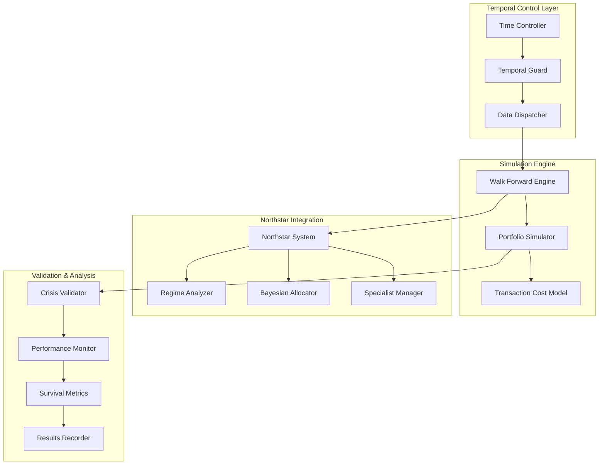

# Design Document

## Overview

The Walk-Forward Validation Engine is a sophisticated testing framework that validates Northstar's performance through rigorous point-in-time simulation. Unlike traditional backtesting that can suffer from look-ahead bias, this system replays market history day-by-day, ensuring that only historically available data influences decisions. The engine incorporates realistic transaction costs, slippage modeling, and comprehensive performance tracking to provide an honest assessment of what Northstar would have achieved with real capital.

This system addresses the critical gap between research-grade backtesting and production-ready validation. It serves as the definitive certification mechanism that transforms Northstar from an advanced research platform into a fund-ready trading system.

## Architecture

The Walk-Forward Validation Engine follows a time-machine architecture that maintains strict temporal boundaries while providing comprehensive simulation capabilities:



### Key Architectural Principles

1. **Temporal Isolation**: Strict enforcement of point-in-time data access
2. **Realistic Execution**: Comprehensive modeling of market frictions
3. **Crisis Resilience**: Specialized validation during market stress periods
4. **Performance Attribution**: Detailed tracking of all performance drivers
5. **Regime Awareness**: Validation across different market environments

### Universe Manager

Handles survivorship bias and corporate actions with brutal honesty:

```python
class UniverseManager:
    def __init__(self):
        self.delisting_events = self.load_delisting_history()
        self.corporate_actions = self.load_corporate_actions()
        self.earnings_calendar = self.load_earnings_calendar()
    
    def get_universe_at_date(self, date: datetime) -> List[str]:
        """Returns only stocks that actually existed and traded at this date"""
        # Include stocks that:
        # 1. Were listed before this date
        # 2. Had not been delisted yet
        # 3. Were actually trading (not suspended)
        
        active_stocks = []
        for symbol in self.all_symbols:
            listing_date = self.get_listing_date(symbol)
            delisting_date = self.get_delisting_date(symbol)
            
            if (listing_date <= date and 
                (delisting_date is None or delisting_date > date) and
                self.was_trading_on_date(symbol, date)):
                active_stocks.append(symbol)
        
        return active_stocks
    
    def apply_corporate_actions(self, symbol: str, date: datetime, 
                              price_data: Dict) -> Dict:
        """Applies splits, dividends, spin-offs with proper timing"""
        actions = self.corporate_actions.get(symbol, [])
        
        for action in actions:
            if action['effective_date'] == date:
                if action['type'] == 'split':
                    price_data = self.apply_split(price_data, action['ratio'])
                elif action['type'] == 'dividend':
                    price_data = self.apply_dividend(price_data, action['amount'])
                elif action['type'] == 'spinoff':
                    price_data = self.apply_spinoff(price_data, action)
        
        return price_data
    
    def get_fundamental_data_at_date(self, symbol: str, date: datetime) -> Dict:
        """Returns only fundamental data available at this date"""
        # CRITICAL: Use earnings release dates, not report dates
        available_data = {}
        
        for report in self.earnings_calendar.get(symbol, []):
            if report['release_date'] <= date:
                # Data becomes available on release date, not report period end
                available_data.update(report['financials'])
        
        return available_data
```

### Reality Check Engine

Enforces the 12 critical constraints that kill fake systems:

```python
class RealityCheckEngine:
    def __init__(self):
        self.max_adv_fraction = 0.05  # Max 5% of ADV
        self.execution_delay = 1  # T+1 execution
        self.turnover_penalty_factor = 0.1
        self.crowding_threshold = 0.7  # 70% correlation = crowded
        
    def validate_execution_reality(self, trades: Dict[str, float], 
                                 market_data: MarketData,
                                 date: datetime) -> ExecutionResult:
        """Applies all 12 reality constraints"""
        
        # 1. Liquidity constraints
        executable_trades = {}
        delayed_trades = {}
        
        for symbol, size in trades.items():
            adv = market_data.get_adv(symbol, date)
            
            if abs(size) <= adv * self.max_adv_fraction:
                executable_trades[symbol] = size
            else:
                # Large trades get delayed and penalized
                delayed_trades[symbol] = size
                executable_trades[symbol] = np.sign(size) * adv * self.max_adv_fraction
        
        # 2. Turnover penalty
        turnover = self.calculate_turnover(executable_trades)
        execution_penalty = np.exp(-turnover * self.turnover_penalty_factor)
        
        # 3. Factor crowding check
        crowding_penalty = self.calculate_crowding_penalty(executable_trades, date)
        
        # 4. Corporate action timing
        executable_trades = self.apply_corporate_action_delays(executable_trades, date)
        
        return ExecutionResult(
            executable_trades=executable_trades,
            delayed_trades=delayed_trades,
            execution_penalty=execution_penalty,
            crowding_penalty=crowding_penalty,
            total_penalty=execution_penalty * crowding_penalty
        )
    
    def calculate_crowding_penalty(self, trades: Dict[str, float], 
                                 date: datetime) -> float:
        """Penalizes crowded factor exposures"""
        # Calculate factor loadings of current trades
        factor_exposures = self.get_factor_exposures(trades, date)
        
        # Check correlation with popular ETFs and factors
        etf_correlations = self.calculate_etf_correlations(factor_exposures, date)
        
        # Apply penalty for high correlation (crowding)
        max_correlation = max(etf_correlations.values())
        
        if max_correlation > self.crowding_threshold:
            return 1.0 - (max_correlation - self.crowding_threshold) / (1.0 - self.crowding_threshold)
        
        return 1.0
    
    def enforce_regime_confidence_constraints(self, signals: Dict[str, float],
                                           regime_confidence: float) -> Dict[str, float]:
        """Reduces signal strength when regime confidence is low"""
        if regime_confidence < 0.5:
            # Low confidence = reduce all signals
            confidence_multiplier = regime_confidence * 2.0
            return {k: v * confidence_multiplier for k, v in signals.items()}
        
        return signals
```

### Temporal Guard

The Temporal Guard is the cornerstone component that prevents look-ahead bias:

```python
class TemporalGuard:
    def __init__(self, simulation_date: datetime):
        self.current_date = simulation_date
        self.data_cutoff = simulation_date
    
    def validate_data_access(self, data_timestamp: datetime) -> bool:
        """Ensures no future data leaks into simulation"""
        return data_timestamp <= self.data_cutoff
    
    def advance_time(self, new_date: datetime):
        """Advances simulation time and updates data availability"""
        if new_date <= self.current_date:
            raise ValueError("Cannot move backwards in time")
        self.current_date = new_date
        self.data_cutoff = new_date
```

### Walk Forward Engine

The core orchestrator that manages stateful day-by-day simulation:

```python
class WalkForwardEngine:
    def __init__(self, start_date: datetime, end_date: datetime):
        self.start_date = start_date
        self.end_date = end_date
        self.temporal_guard = TemporalGuard(start_date)
        self.portfolio_simulator = PortfolioSimulator()
        self.transaction_cost_model = TransactionCostModel()
        
        # CRITICAL: Initialize Northstar with frozen initial state
        self.northstar_brain = self.initialize_northstar_brain(start_date)
        self.universe_manager = UniverseManager()
        self.execution_delay = 1  # T+1 execution
    
    def run_simulation(self) -> SimulationResults:
        """Executes complete stateful walk-forward simulation"""
        current_date = self.start_date
        
        while current_date <= self.end_date:
            # Load ONLY today's data (no history rebuilding)
            daily_data = self.load_daily_data(current_date)
            
            # Update universe with survivorship reality
            active_universe = self.universe_manager.get_universe_at_date(current_date)
            
            # STATEFUL: Step Northstar brain forward one day
            # Northstar[t] = f(Northstar[t-1], data[t])
            signals = self.northstar_brain.step_forward(daily_data, active_universe)
            
            # T+1 execution: Use yesterday's signals for today's trades
            if hasattr(self, 'pending_signals'):
                portfolio_weights = self.pending_signals
                
                # Apply realistic execution with crisis multipliers
                executed_portfolio = self.execute_with_reality_check(
                    portfolio_weights, daily_data, current_date
                )
                
                # Update portfolio state
                self.portfolio_simulator.update(executed_portfolio, current_date)
            
            # Store today's signals for tomorrow's execution
            self.pending_signals = signals
            
            # Advance to next trading day
            current_date = self.get_next_trading_day(current_date)
            self.temporal_guard.advance_time(current_date)
        
        return self.generate_results()
    
    def initialize_northstar_brain(self, start_date: datetime) -> NorthstarBrain:
        """Initialize Northstar with minimal historical state"""
        # Use only data available before start_date for initialization
        init_data = self.load_initialization_data(start_date)
        return NorthstarBrain.from_historical_state(init_data, start_date)
```

### Transaction Cost Model

Harsh, realistic modeling of trading frictions with crisis multipliers:

```python
class TransactionCostModel:
    def __init__(self):
        self.base_cost_bps = 5  # 5 basis points base cost
        self.slippage_factor = 0.1  # 10% of volatility
        self.market_impact_threshold = 0.01  # 1% of ADV
        self.crisis_multiplier = 2.0  # Double costs during stress
        self.liquidity_cap = 0.05  # Max 5% of ADV per position
    
    def calculate_costs(self, trades: Dict[str, float], 
                       market_data: MarketData,
                       regime_state: RegimeState) -> Dict[str, float]:
        """Calculates brutal, realistic transaction costs"""
        costs = {}
        
        for symbol, trade_size in trades.items():
            # Base transaction cost
            base_cost = abs(trade_size) * self.base_cost_bps / 10000
            
            # Slippage based on volatility and trade size
            volatility = market_data.get_volatility(symbol)
            slippage = abs(trade_size) * volatility * self.slippage_factor
            
            # Market impact for large trades
            adv = market_data.get_average_daily_volume(symbol)
            
            # LIQUIDITY REALITY CHECK
            if abs(trade_size) > adv * self.liquidity_cap:
                # Exploding costs for illiquid trades
                excess_factor = (abs(trade_size) / (adv * self.liquidity_cap)) ** 2
                market_impact = abs(trade_size) * volatility * excess_factor * 0.5
            else:
                impact_factor = (abs(trade_size) / adv) ** 0.5
                market_impact = abs(trade_size) * volatility * impact_factor * 0.1
            
            total_cost = base_cost + slippage + market_impact
            
            # CRISIS MULTIPLIER - liquidity disappears when needed most
            if regime_state.is_crisis() or regime_state.is_shock():
                total_cost *= self.crisis_multiplier
            
            costs[symbol] = total_cost
        
        return costs
    
    def validate_liquidity_constraints(self, trades: Dict[str, float],
                                     market_data: MarketData) -> Dict[str, bool]:
        """Validates if trades are executable given liquidity"""
        executable = {}
        
        for symbol, trade_size in trades.items():
            adv = market_data.get_average_daily_volume(symbol)
            executable[symbol] = abs(trade_size) <= adv * self.liquidity_cap
        
        return executable
```

### Crisis Validator

Specialized component for stress period analysis with pre-crisis positioning:

```python
class CrisisValidator:
    def __init__(self):
        self.crisis_periods = {
            'financial_crisis_2008': (datetime(2007, 7, 1), datetime(2009, 3, 31)),
            'covid_crash_2020': (datetime(2020, 2, 1), datetime(2020, 5, 31)),
            'inflation_shock_2022': (datetime(2022, 1, 1), datetime(2022, 12, 31))
        }
        self.pre_crisis_window = 30  # Days before crisis to check positioning
    
    def validate_crisis_performance(self, results: SimulationResults) -> CrisisReport:
        """Analyzes system behavior during and before historical crises"""
        crisis_metrics = {}
        
        for crisis_name, (start, end) in self.crisis_periods.items():
            # Crisis period analysis
            period_results = results.filter_period(start, end)
            
            # PRE-CRISIS POSITIONING - Most critical metric
            pre_crisis_start = start - timedelta(days=self.pre_crisis_window)
            pre_crisis_results = results.filter_period(pre_crisis_start, start)
            
            # Did it de-risk BEFORE the crash?
            exposure_before_crisis = pre_crisis_results.get_final_gross_exposure()
            risk_reduction = self.measure_risk_reduction(pre_crisis_results)
            
            crisis_metrics[crisis_name] = {
                'max_drawdown': period_results.calculate_max_drawdown(),
                'recovery_time': period_results.calculate_recovery_time(),
                'risk_management_triggers': period_results.count_risk_triggers(),
                'regime_adaptation_speed': period_results.measure_adaptation_speed(),
                'survival_score': self.calculate_survival_score(period_results),
                
                # CRITICAL: Pre-crisis positioning
                'exposure_30d_before_crisis': exposure_before_crisis,
                'pre_crisis_risk_reduction': risk_reduction,
                'anticipatory_de_risking': exposure_before_crisis < 0.7,  # Less than 70% exposed
                'defensive_positioning_score': self.score_defensive_positioning(pre_crisis_results)
            }
        
        return CrisisReport(crisis_metrics)
    
    def measure_risk_reduction(self, pre_crisis_results: SimulationResults) -> float:
        """Measures if system reduced risk as crisis approached"""
        exposures = pre_crisis_results.get_daily_exposures()
        if len(exposures) < 2:
            return 0.0
        
        # Calculate trend in exposure reduction
        return (exposures[0] - exposures[-1]) / exposures[0]
    
    def score_defensive_positioning(self, pre_crisis_results: SimulationResults) -> float:
        """Scores how well system positioned defensively before crisis"""
        final_weights = pre_crisis_results.get_final_weights()
        
        # Check for defensive characteristics
        cash_weight = final_weights.get('CASH', 0.0)
        defensive_sectors = ['UTILITIES', 'CONSUMER_STAPLES', 'HEALTHCARE']
        defensive_weight = sum(final_weights.get(sector, 0.0) for sector in defensive_sectors)
        
        # Penalize high beta, high momentum positions
        high_risk_weight = self.calculate_high_risk_exposure(final_weights, pre_crisis_results)
        
        return (cash_weight + defensive_weight - high_risk_weight) / 3.0
```

## Data Models

### Stateful Simulation State

```python
@dataclass
class SimulationState:
    current_date: datetime
    northstar_brain_state: NorthstarBrainState  # Frozen brain state
    portfolio_weights: Dict[str, float]
    cash_position: float
    total_value: float
    daily_pnl: float
    cumulative_pnl: float
    turnover: float
    transaction_costs: float
    regime_state: RegimeState
    regime_confidence: float  # Critical for uncertainty handling
    risk_metrics: RiskMetrics
    
    # Reality tracking
    delayed_trades: Dict[str, float]
    liquidity_violations: List[str]
    crowding_penalties: Dict[str, float]
    execution_penalties: float

### Brutal Performance Metrics

```python
@dataclass
class PerformanceMetrics:
    # Core returns
    total_return: float
    annualized_return: float
    volatility: float
    sharpe_ratio: float
    
    # Drawdown analysis
    max_drawdown: float
    drawdown_duration: int  # Days
    recovery_time: int  # Days
    calmar_ratio: float
    
    # Reality-adjusted metrics
    gross_sharpe: float  # Before costs
    net_sharpe: float   # After all costs and penalties
    turnover_adjusted_return: float
    liquidity_adjusted_return: float
    
    # Crisis performance
    crisis_sharpe_ratios: Dict[str, float]
    pre_crisis_positioning: Dict[str, float]
    regime_adaptation_scores: Dict[str, float]
    
    # Execution reality
    average_execution_penalty: float
    liquidity_violation_rate: float
    crowding_penalty_impact: float
    
    # Failure triggers
    consecutive_negative_months: int
    regime_confidence_breaches: int
    emergency_stops_triggered: int

### Transaction Record with Reality

```python
@dataclass
class TransactionRecord:
    date: datetime
    symbol: str
    intended_trade_size: float  # What we wanted to trade
    executed_trade_size: float  # What we actually traded
    execution_price: float
    
    # Cost breakdown
    base_transaction_cost: float
    slippage_cost: float
    market_impact_cost: float
    crisis_multiplier: float
    total_cost: float
    
    # Reality constraints
    liquidity_constrained: bool
    execution_delayed: bool
    crowding_penalty: float
    
    # Portfolio impact
    portfolio_weight_before: float
    portfolio_weight_after: float
    
    # Corporate actions applied
    corporate_actions: List[Dict]

### Crisis Analysis Results

```python
@dataclass
class CrisisAnalysis:
    crisis_name: str
    period: Tuple[datetime, datetime]
    
    # Performance during crisis
    max_drawdown: float
    recovery_time_days: int
    crisis_sharpe: float
    
    # Pre-crisis positioning (CRITICAL)
    exposure_30d_before: float
    risk_reduction_rate: float
    defensive_positioning_score: float
    anticipatory_de_risking: bool
    
    # Risk management effectiveness
    emergency_triggers_activated: int
    position_size_reductions: int
    regime_adaptation_speed_days: float
    
    # Survival metrics
    survived_without_intervention: bool
    maximum_leverage_during_crisis: float
    cash_reserves_maintained: float
```

## Error Handling

The Walk-Forward Validation Engine implements unforgiving error handling that prevents any form of cheating or bias:

### Temporal Violations

```python
class TemporalViolationError(Exception):
    """Raised when future data is accessed during simulation"""
    pass

class TemporalGuard:
    def validate_access(self, data_timestamp: datetime, request_context: str):
        if data_timestamp > self.current_simulation_date:
            raise TemporalViolationError(
                f"Attempted to access future data: {data_timestamp} > {self.current_simulation_date} "
                f"in context: {request_context}"
            )
```

### Liquidity Constraint Violations

```python
class LiquidityViolationHandler:
    def handle_illiquid_trade(self, symbol: str, requested_size: float, 
                            available_liquidity: float) -> TradeAdjustment:
        """Forces realistic trade sizing or delays execution"""
        
        if abs(requested_size) > available_liquidity:
            # Option 1: Partial fill with penalty
            executable_size = np.sign(requested_size) * available_liquidity * 0.8
            penalty_cost = abs(requested_size - executable_size) * 0.02  # 2% penalty
            
            # Option 2: Delay execution (queue for next day)
            delayed_size = requested_size - executable_size
            
            return TradeAdjustment(
                executable_now=executable_size,
                delayed_to_next_day=delayed_size,
                penalty_cost=penalty_cost,
                reason="Liquidity constraint violation"
            )
```

### Regime Confidence Failures

```python
class RegimeConfidenceMonitor:
    def __init__(self):
        self.confidence_threshold = 0.3
        self.consecutive_low_confidence_limit = 30  # Days
        
    def monitor_regime_confidence(self, confidence: float, date: datetime):
        """Triggers system shutdown if regime confidence stays low"""
        
        if confidence < self.confidence_threshold:
            self.low_confidence_days += 1
            
            if self.low_confidence_days > self.consecutive_low_confidence_limit:
                raise SystemShutdownRequired(
                    f"Regime confidence below {self.confidence_threshold} "
                    f"for {self.low_confidence_days} consecutive days. "
                    f"System reliability compromised."
                )
        else:
            self.low_confidence_days = 0
```

### Automated Failure Triggers

```python
class AutomatedFailureTriggers:
    def __init__(self):
        self.max_drawdown_threshold = 0.25  # 25%
        self.negative_sharpe_months_limit = 6
        self.emergency_stop_triggers = 0
        
    def check_failure_conditions(self, performance: PerformanceMetrics, 
                               date: datetime) -> Optional[SystemFailure]:
        """Automatically stops system if fundamental failures occur"""
        
        # Drawdown failure
        if performance.max_drawdown > self.max_drawdown_threshold:
            return SystemFailure(
                type="EXCESSIVE_DRAWDOWN",
                message=f"Drawdown {performance.max_drawdown:.1%} exceeds limit",
                action="IMMEDIATE_STOP"
            )
        
        # Persistent negative performance
        if performance.consecutive_negative_months >= self.negative_sharpe_months_limit:
            return SystemFailure(
                type="PERSISTENT_UNDERPERFORMANCE", 
                message=f"Negative Sharpe for {performance.consecutive_negative_months} months",
                action="SYSTEM_REVIEW_REQUIRED"
            )
        
        # Too many emergency stops
        if performance.emergency_stops_triggered > 5:
            return SystemFailure(
                type="EXCESSIVE_EMERGENCY_STOPS",
                message="System triggering too many emergency stops",
                action="FUNDAMENTAL_REVIEW_REQUIRED"
            )
        
        return None
```

### Data Integrity Enforcement

```python
class DataIntegrityEnforcer:
    def validate_corporate_actions(self, symbol: str, date: datetime, 
                                 price_data: Dict) -> ValidationResult:
        """Ensures corporate actions are applied correctly and on time"""
        
        actions = self.get_corporate_actions(symbol, date)
        
        for action in actions:
            if action['type'] == 'split' and action['effective_date'] == date:
                # Verify split adjustment was applied
                expected_adjustment = action['ratio']
                actual_adjustment = self.calculate_price_adjustment(price_data)
                
                if abs(actual_adjustment - expected_adjustment) > 0.01:
                    raise DataIntegrityError(
                        f"Split adjustment incorrect for {symbol} on {date}: "
                        f"expected {expected_adjustment}, got {actual_adjustment}"
                    )
        
        return ValidationResult(valid=True)
    
    def enforce_earnings_timing(self, symbol: str, date: datetime) -> Dict:
        """Only allows fundamental data after earnings release"""
        
        earnings_releases = self.get_earnings_releases(symbol)
        available_data = {}
        
        for release in earnings_releases:
            if release['release_date'] <= date:
                available_data.update(release['financials'])
            else:
                # Future earnings not yet released
                break
        
        return available_data
```

*A property is a characteristic or behavior that should hold true across all valid executions of a system-essentially, a formal statement about what the system should do. Properties serve as the bridge between human-readable specifications and machine-verifiable correctness guarantees.*

After analyzing the acceptance criteria, I've identified properties that can be validated through property-based testing, while noting that some criteria (like specific crisis periods) are better suited for example-based testing.

### Property Reflection

Before defining the final properties, I reviewed all testable criteria for redundancy:
- Temporal integrity properties (1.1-1.5, 7.1-7.5) can be consolidated into comprehensive temporal protection properties
- Transaction cost properties (2.1-2.5) cover different aspects and should remain separate
- Performance tracking properties (3.1-3.5) each validate distinct tracking capabilities
- Crisis response properties (4.4-4.5) are distinct from specific crisis examples
- All other properties provide unique validation value

### Core Properties

**Property 1: Temporal Data Integrity**
*For any* simulation date and data access request, the Temporal Guard should only allow access to data with timestamps at or before the simulation date
**Validates: Requirements 1.1, 1.2, 7.1**

**Property 2: Regime Reconstruction Integrity** 
*For any* historical date during simulation, regime calculations should use only data available up to that point in time
**Validates: Requirements 1.3, 5.1**

**Property 3: Simulation-Reality Consistency**
*For any* specialist algorithm execution, the data constraints and processing should match real-time execution conditions
**Validates: Requirements 1.4**

**Property 4: Incremental Time Advancement**
*For any* simulation step, advancing to the next day should incrementally update data availability without gaps or jumps
**Validates: Requirements 1.5**

**Property 5: Transaction Cost Lower Bound**
*For any* portfolio turnover calculation, the applied transaction costs should be at least 5 basis points per 100% turnover
**Validates: Requirements 2.1**

**Property 6: Liquidity-Based Slippage Scaling**
*For any* trade where position size exceeds liquidity thresholds, slippage penalties should increase progressively with position size
**Validates: Requirements 2.2**

**Property 7: Volatility-Proportional Costs**
*For any* market condition with elevated volatility, transaction costs should increase proportionally to the volatility level
**Validates: Requirements 2.3**

**Property 8: Crisis Cost Amplification**
*For any* trade during identified market stress periods, transaction costs should exceed normal market costs
**Validates: Requirements 2.4**

**Property 9: Overnight Position Costs**
*For any* position held overnight, the system should apply appropriate funding costs and borrowing fees
**Validates: Requirements 2.5**

**Property 10: Complete Daily Recording**
*For any* simulation day processed by the Portfolio Simulator, all portfolio weights, turnover, and PnL should be recorded
**Validates: Requirements 3.1**

**Property 11: Regime Performance Tracking**
*For any* market regime transition, regime-specific performance metrics should be tracked and updated
**Validates: Requirements 3.2**

**Property 12: Drawdown Measurement Completeness**
*For any* drawdown event, the system should measure both maximum drawdown duration and recovery time
**Validates: Requirements 3.3**

**Property 13: Performance Attribution Accuracy**
*For any* specialist strategy contribution to returns, performance should be accurately attributed to individual components
**Validates: Requirements 3.4**

**Property 14: Risk Event Logging**
*For any* risk event trigger, all risk management actions and their impacts should be logged
**Validates: Requirements 3.5**

**Property 15: Emergency Protocol Activation**
*For any* market decline exceeding 10%, emergency risk protocols should be activated
**Validates: Requirements 4.4**

**Property 16: Volatility-Based Position Sizing**
*For any* period when market volatility exceeds historical norms, position sizes should be reduced appropriately
**Validates: Requirements 4.5**

**Property 17: Regime Adaptation Timing**
*For any* emerging regime, specialist allocation adaptation should occur within realistic timeframes
**Validates: Requirements 5.2**

**Property 18: Uncertainty Response**
*For any* period of increased regime uncertainty, the system should reduce conviction and position sizes
**Validates: Requirements 5.3**

**Property 19: Noise Robustness**
*For any* false regime signal occurrence, the system should demonstrate robustness without overreacting
**Validates: Requirements 5.4**

**Property 20: Adaptive Speed Adjustment**
*For any* change in regime persistence, adaptation speed should adjust accordingly
**Validates: Requirements 5.5**

**Property 21: Bayesian Capital Reallocation**
*For any* divergent specialist strategy performance, capital should be reallocated based on Bayesian updates
**Validates: Requirements 6.1**

**Property 22: Uncertainty-Based Allocation Reduction**
*For any* widening of strategy confidence intervals, allocations to uncertain strategies should be reduced
**Validates: Requirements 6.2**

**Property 23: Evidence-Based Belief Updates**
*For any* new market evidence, strategy beliefs and capital allocation should be updated accordingly
**Validates: Requirements 6.3**

**Property 24: Correlation-Aware Diversification**
*For any* change in correlation patterns, diversification assumptions should be adjusted
**Validates: Requirements 6.4**

**Property 25: Capacity Constraint Enforcement**
*For any* binding strategy capacity constraint, position sizing limits should be respected
**Validates: Requirements 6.5**

**Property 26: Point-in-Time Data Access**
*For any* fundamental data loading, only data available at the simulation date should be used
**Validates: Requirements 7.2**

**Property 27: Historical Technical Indicators**
*For any* technical indicator calculation, only historical price data should be used
**Validates: Requirements 7.3**

**Property 28: Corporate Action Timing**
*For any* corporate action processing, actions should only be processed after their effective dates
**Validates: Requirements 7.4**

**Property 29: Point-in-Time Data Revisions**
*For any* data revision handling, the data version available at simulation time should be used
**Validates: Requirements 7.5**

**Property 30: Benchmark Comparison Completeness**
*For any* return calculation, comparisons against market indices and factor models should be included
**Validates: Requirements 8.1**

**Property 31: Multi-Period Sharpe Calculation**
*For any* risk-adjusted return measurement, Sharpe ratios should be computed across different time periods
**Validates: Requirements 8.2**

**Property 32: Drawdown Benchmark Comparison**
*For any* drawdown evaluation, maximum drawdown should be compared against benchmark drawdowns
**Validates: Requirements 8.3**

**Property 33: Rolling Performance Statistics**
*For any* consistency assessment, rolling performance statistics should be measured
**Validates: Requirements 8.4**

**Property 34: Return Decomposition Completeness**
*For any* factor exposure analysis, returns should be decomposed into systematic and idiosyncratic components
**Validates: Requirements 8.5**

**Property 35: Concentration Limit Enforcement**
*For any* portfolio concentration exceeding thresholds, position size limits should be triggered
**Validates: Requirements 9.1**

**Property 36: Diversification Constraint Application**
*For any* excessive sector exposure, diversification constraints should be applied
**Validates: Requirements 9.2**

**Property 37: Leverage Limit Enforcement**
*For any* leverage ratio breach, gross exposure should be reduced
**Validates: Requirements 9.3**

**Property 38: Liquidity-Based Cash Management**
*For any* liquidity metric deterioration, cash reserves should be increased
**Validates: Requirements 9.4**

**Property 39: Correlation Stress Response**
*For any* correlation stress occurrence, risk budgets should be adjusted accordingly
**Validates: Requirements 9.5**

**Property 40: Market Impact Modeling**
*For any* large order placement, market impact and timing delays should be modeled
**Validates: Requirements 10.1**

**Property 41: End-of-Day Execution Constraints**
*For any* trading during market close, end-of-day execution constraints should be applied
**Validates: Requirements 10.2**

**Property 42: Trade Size Constraint Enforcement**
*For any* rebalancing occurrence, minimum trade sizes and lot constraints should be respected
**Validates: Requirements 10.3**

**Property 43: Gap Execution Simulation**
*For any* market gap occurrence, realistic fill prices should be simulated
**Validates: Requirements 10.4**

## Testing Strategy

The Walk-Forward Validation Engine requires a dual testing approach that validates both the testing framework itself and its integration with Northstar:

### Framework Validation Tests

**Unit Tests for Critical Components:**
- Temporal Guard: Verify no future data access under any conditions
- Transaction Cost Model: Validate cost calculations across all market conditions
- Universe Manager: Ensure survivorship bias elimination
- Reality Check Engine: Confirm all 12 constraint enforcements

**Integration Tests:**
- End-to-end simulation runs on known historical periods
- Northstar brain state preservation across time steps
- Corporate action timing and application
- Crisis period detection and response

### Property-Based Testing Configuration

**Testing Library:** Hypothesis (Python) for comprehensive property validation
**Test Configuration:** Minimum 1000 iterations per property test
**Test Tagging:** Each property test references its design document property

**Example Property Test Structure:**
```python
@given(simulation_dates=dates_strategy(), 
       market_data=market_data_strategy())
@settings(max_examples=1000)
def test_temporal_data_integrity(simulation_dates, market_data):
    """Feature: walk-forward-validation-engine, Property 1: Temporal Data Integrity"""
    # Test implementation
```

### Stress Testing Requirements

**Historical Crisis Validation:**
- 2008 Financial Crisis: Full simulation from 2007-2009
- 2020 COVID Crash: Simulation through Feb-May 2020  
- 2022 Inflation Shock: Full year simulation
- Each crisis must show system survival and appropriate de-risking

**Synthetic Stress Tests:**
- Liquidity disappearance scenarios
- Extreme volatility periods (5+ sigma moves)
- Regime detection failure modes
- Corporate action clustering events

### Reality Check Validation

**Survivorship Bias Tests:**
- Compare results with and without delisted stocks
- Verify material performance difference (should be significant)
- Test universe composition at various historical dates

**Transaction Cost Impact Tests:**
- Run simulations with 0.5x, 1x, 2x, and 4x transaction costs
- Verify performance degradation is realistic
- Confirm high-turnover strategies are penalized appropriately

**Execution Delay Tests:**
- Compare T+0 vs T+1 execution timing
- Verify signal decay impact on performance
- Test partial fill scenarios

### Automated Validation Pipeline

**Daily Validation Checks:**
- Temporal integrity verification
- Data consistency validation  
- Performance metric calculations
- Error condition testing

**Weekly Comprehensive Tests:**
- Full crisis period simulations
- Stress test battery execution
- Performance benchmark comparisons
- Reality constraint validation

**Monthly Deep Validation:**
- Complete historical simulation runs
- Survivorship bias impact analysis
- Transaction cost sensitivity analysis
- Regime detection accuracy assessment

### Failure Mode Testing

**System Shutdown Scenarios:**
- Excessive drawdown triggers
- Persistent underperformance detection
- Regime confidence collapse
- Liquidity constraint violations

**Recovery Testing:**
- System restart procedures
- State reconstruction validation
- Data integrity after failures
- Performance continuity verification

### Performance Benchmarking

**Comparison Targets:**
- Market indices (Nifty 50, Nifty 500)
- Factor models (Fama-French, momentum, quality)
- Popular ETFs and mutual funds
- Risk-free rate and inflation

**Success Criteria:**
- Positive Sharpe ratio across all major regimes
- Maximum drawdown < 25% during any crisis
- Recovery time < 12 months from major drawdowns
- Consistent outperformance vs risk-free rate
- Survival through all historical stress periods

The testing strategy ensures that the Walk-Forward Validation Engine itself is bulletproof before it validates Northstar's performance.

<function_calls>
<invoke name="prework">
<parameter name="featureName">walk-forward-validation-engine