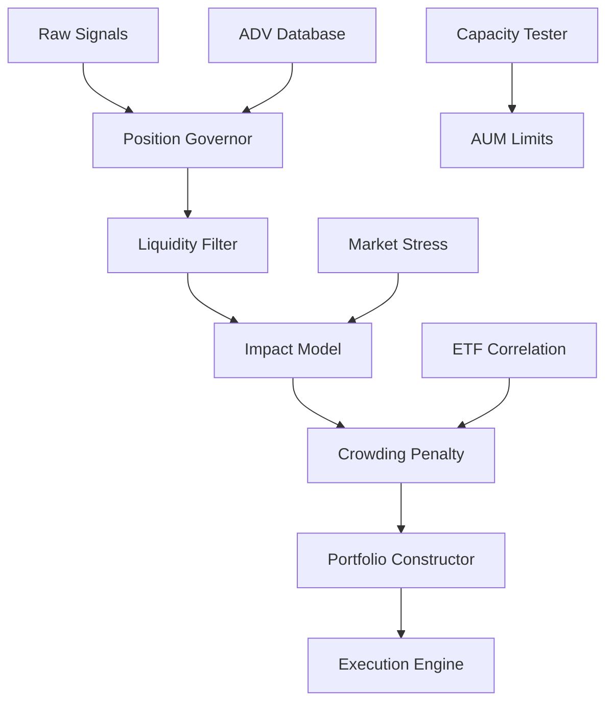

# Design Document - Capacity Engine

## Overview

The Capacity Engine is the institutional-grade system that transforms NorthStar from an unconstrained research prototype into a capital-realistic fund engine. It answers the critical question: "How much AUM can this strategy safely manage before alpha degrades?"

The engine implements four core subsystems:
1. **ADV-Scaled Position Governor** - Liquidity-constrained position sizing
2. **Market Impact Model** - Realistic execution cost simulation  
3. **Crowding Penalty System** - Anti-correlation enforcement with ETFs
4. **Capacity Analysis Engine** - Systematic AUM limit discovery

This bridges the gap between "does it work?" and "how much money can it run?" - the fundamental question that separates toys from funds.

## Architecture

### System Components



### Data Flow Architecture

1. **Signal Processing**: Raw alpha signals enter Position Governor
2. **Liquidity Filtering**: Positions constrained by ADV limits (α × ADV)
3. **Impact Calculation**: Market impact computed using square-root model
4. **Crowding Analysis**: Correlation penalties applied for ETF overlap
5. **Portfolio Construction**: Final weights with liquidity constraints
6. **Execution Simulation**: Realistic fill prices with impact costs
7. **Capacity Testing**: Systematic AUM scaling to find limits

## Components and Interfaces

### 1. ADV-Scaled Position Governor

**Purpose**: Enforce liquidity-realistic position sizing

**Interface**:
```python
class PositionGovernor:
    def calculate_max_position(self, symbol: str, adv: float, asset_class: str) -> float
    def apply_liquidity_constraints(self, target_weights: Dict[str, float]) -> Dict[str, float]
    def get_liquidity_tier(self, symbol: str) -> LiquidityTier
```

**Key Methods**:
- `calculate_max_position()`: Returns α × ADV limit for symbol
- `apply_liquidity_constraints()`: Caps all positions at liquidity limits
- `get_liquidity_tier()`: Classifies symbols by liquidity (Large/Mid/Small)

**Configuration**:
```python
ALPHA_FACTORS = {
    'large_cap': 0.05,    # 5% of ADV for large-cap
    'mid_cap': 0.03,      # 3% of ADV for mid-cap  
    'small_cap': 0.01     # 1% of ADV for small-cap
}
```

### 2. Market Impact Model

**Purpose**: Calculate realistic execution costs for large orders

**Interface**:
```python
class MarketImpactModel:
    def calculate_impact(self, order_size: float, adv: float, volatility: float) -> float
    def apply_impact_to_price(self, mid_price: float, order_size: float, impact: float) -> float
    def get_k_factor(self, market_regime: str, liquidity_tier: str) -> float
```

**Impact Formula**:
```
impact = k × σ × √(order_size / ADV)

Where:
- k = 0.1-0.3 (market condition dependent)
- σ = daily volatility
- order_size = position value in currency
- ADV = average daily volume in currency
```

**Fill Price Calculation**:
```
fill_price = mid_price × (1 + sign(order) × impact)
```

### 3. Crowding Penalty System

**Purpose**: Penalize strategies that overlap with ETF flows

**Interface**:
```python
class CrowdingPenaltySystem:
    def calculate_etf_correlation(self, portfolio_weights: Dict[str, float]) -> Dict[str, float]
    def apply_crowding_penalty(self, weights: Dict[str, float]) -> Dict[str, float]
    def get_factor_exposures(self, weights: Dict[str, float]) -> Dict[str, float]
```

**Penalty Formula**:
```python
if correlation > 0.7:
    penalty_factor = 1 - 0.5 * (correlation - 0.7)
    adjusted_capital = original_capital * penalty_factor
```

**ETF Benchmarks**:
- Momentum: MTUM, VMOT
- Quality: QUAL, JQUA  
- Value: VLUE, VMVL
- Size: IWM, VB

### 4. Capacity Analysis Engine

**Purpose**: Discover maximum deployable AUM through systematic testing

**Interface**:
```python
class CapacityAnalysisEngine:
    def run_capacity_sweep(self, aum_levels: List[float]) -> CapacityReport
    def calculate_capacity_metrics(self, aum: float) -> CapacityMetrics
    def find_capacity_knee(self, results: List[CapacityMetrics]) -> float
```

**AUM Test Levels**:
```python
AUM_LEVELS = [10e6, 50e6, 100e6, 250e6, 500e6, 1e9]  # $10M to $1B
```

**Capacity Metrics**:
- CAGR degradation vs baseline
- Sharpe ratio degradation  
- Maximum drawdown increase
- Turnover increase due to constraints
- Implementation shortfall

## Data Models

### ADV Database Schema

```python
@dataclass
class ADVData:
    symbol: str
    date: datetime
    adv_21d: float          # 21-day rolling ADV
    adv_63d: float          # 63-day rolling ADV  
    liquidity_tier: str     # Large/Mid/Small
    market_cap: float
    avg_spread: float       # Average bid-ask spread
```

### Capacity Report Schema

```python
@dataclass
class CapacityReport:
    test_date: datetime
    aum_levels: List[float]
    cagr_by_aum: Dict[float, float]
    sharpe_by_aum: Dict[float, float]
    capacity_knee: float
    max_recommended_aum: float
    stress_adjusted_capacity: float
    liquidity_constraints: Dict[str, int]  # Symbols rejected by AUM level
```

### Market Impact Parameters

```python
@dataclass
class ImpactParameters:
    k_factor: float         # Base impact coefficient
    volatility_adj: float   # Volatility adjustment
    regime_multiplier: float # Crisis/normal multiplier
    liquidity_tier_adj: float # Large/mid/small adjustment
```

## Correctness Properties

*A property is a characteristic or behavior that should hold true across all valid executions of a system-essentially, a formal statement about what the system should do. Properties serve as the bridge between human-readable specifications and machine-verifiable correctness guarantees.*

### Property 1: ADV Constraint Enforcement
*For any* portfolio construction, all position values should be ≤ α × ADV for their respective symbols
**Validates: Requirements 1.1, 1.3**

### Property 2: Market Impact Monotonicity  
*For any* order size increase, market impact should increase monotonically (larger orders = higher impact)
**Validates: Requirements 2.1, 2.2**

### Property 3: Crowding Penalty Consistency
*For any* portfolio with ETF correlation > 0.7, capital allocation should be reduced proportionally
**Validates: Requirements 3.2, 3.4**

### Property 4: Capacity Degradation
*For any* AUM increase, CAGR should remain stable or decrease (never increase due to scale)
**Validates: Requirements 4.2, 4.3**

### Property 5: Liquidity Classification Stability
*For any* symbol, liquidity tier should not change more than once per month under normal conditions
**Validates: Requirements 6.4, 6.5**

### Property 6: Execution Cost Realism
*For any* large order (>5% ADV), execution cost should exceed theoretical mid-market cost
**Validates: Requirements 8.2, 8.4**

### Property 7: Stress Test Conservatism
*For any* stress scenario, capacity limits should be ≤ normal market capacity limits
**Validates: Requirements 7.3, 7.4**

### Property 8: Capital Conservation
*For any* liquidity constraint application, total portfolio weight should remain ≤ 1.0
**Validates: Requirements 5.3, 5.4**

## Error Handling

### Liquidity Data Failures
- **Missing ADV**: Reject position entirely, log warning
- **Stale ADV**: Use last valid data with staleness penalty
- **Negative ADV**: Flag data error, exclude symbol

### Market Impact Calculation Errors
- **Division by Zero**: Set impact to maximum penalty (50%)
- **Infinite Impact**: Cap impact at 50% of mid-price
- **Negative Volatility**: Use market average volatility

### Capacity Analysis Failures
- **Insufficient Data**: Require minimum 252 days for capacity test
- **Convergence Issues**: Use conservative capacity estimate
- **Memory Constraints**: Implement chunked processing for large AUM tests

## Testing Strategy

### Unit Tests
- ADV constraint enforcement for edge cases
- Market impact calculation accuracy
- Crowding penalty mathematical correctness
- Capacity curve generation

### Property Tests (100+ iterations each)
- **Feature: capacity-engine, Property 1**: ADV constraint enforcement across random portfolios
- **Feature: capacity-engine, Property 2**: Market impact monotonicity across order sizes
- **Feature: capacity-engine, Property 3**: Crowding penalty consistency across correlations
- **Feature: capacity-engine, Property 4**: Capacity degradation across AUM levels
- **Feature: capacity-engine, Property 5**: Liquidity tier stability across time periods
- **Feature: capacity-engine, Property 6**: Execution cost realism across order sizes
- **Feature: capacity-engine, Property 7**: Stress test conservatism across scenarios
- **Feature: capacity-engine, Property 8**: Capital conservation across constraint applications

### Integration Tests
- End-to-end capacity analysis with real market data
- Stress testing under historical crisis periods
- Performance comparison: constrained vs unconstrained systems

### Capacity Validation Tests
- Reproduce capacity curves from academic literature
- Validate against known fund capacity limits
- Cross-validate with industry capacity benchmarks

## Performance Requirements

### Computational Efficiency
- ADV calculations: <100ms per 1000 symbols
- Impact model: <10ms per order
- Capacity sweep: <30 minutes for full AUM range
- Memory usage: <2GB for $1B AUM simulation

### Data Requirements
- ADV history: Minimum 252 days per symbol
- Price data: Tick-level for impact calibration
- ETF holdings: Monthly updates for crowding analysis
- Market regime data: Daily classification

## Deployment Considerations

### Data Pipeline Integration
- Real-time ADV calculation from market data feeds
- ETF holdings updates from fund providers
- Market stress indicators from regime detection system

### Risk Management Integration
- Capacity alerts when approaching AUM limits
- Liquidity warnings for position size violations
- Crowding alerts for high ETF correlation

### Monitoring and Alerting
- Daily capacity utilization reports
- Liquidity constraint violation tracking
- Market impact cost analysis
- Crowding penalty effectiveness metrics

This design transforms NorthStar from a research prototype into a fund-ready engine that can answer the critical question: "How much money can this safely run?" The system enforces capital realism while maintaining alpha generation capabilities.