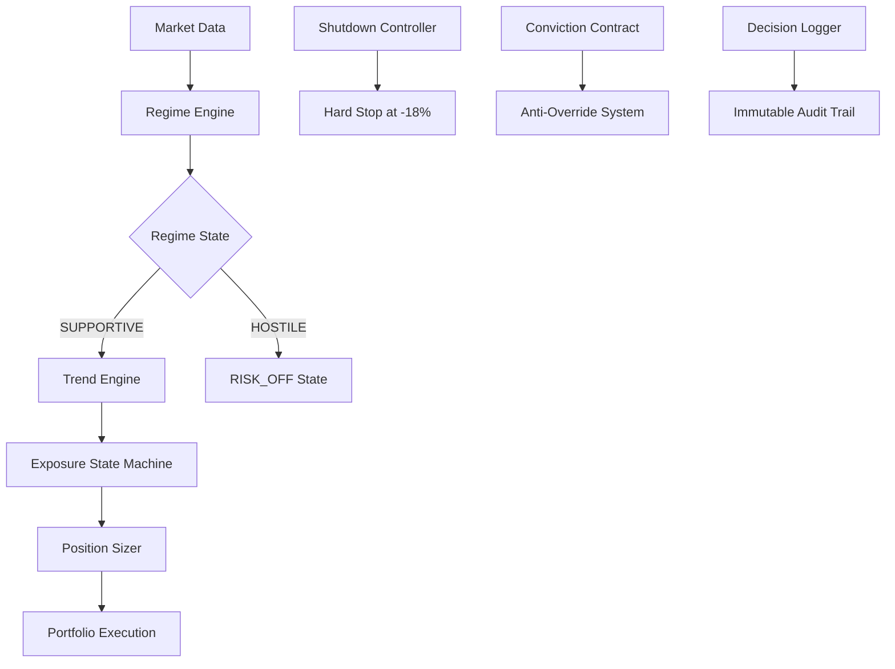

# Design Document: High-Conviction Trading Engine

## Overview

The High-Conviction Trading Engine represents a fundamental architectural transformation from Northstar V3's safety-first approach to an asymmetry-focused, conviction-based trading system. The design prioritizes capturing large market moves through sustained conviction rather than minimizing drawdowns through defensive mechanisms.

The system implements a single alpha thesis: "Markets trend longer and more violently than most participants expect when macro conditions, liquidity, and price action align." This thesis drives all architectural decisions, from module selection to position sizing logic.

Key design principles:
- **Conviction over Comfort**: System maintains positions through temporary discomfort
- **Structural Simplicity**: Eliminate 60-75% of V3 modules that optimize for safety
- **Binary Decision Making**: Clear SUPPORTIVE/HOSTILE regime states with no ambiguity
- **Discrete Exposure States**: Three distinct levels (RISK_OFF, NEUTRAL, RISK_ON) without continuous throttling
- **Psychological Resistance**: Anti-override mechanisms prevent fear-based modifications

## Architecture

The system follows a hierarchical decision-making architecture where regime assessment gates all trend-following activities:



The architecture eliminates the complex intelligence stack from V3, replacing it with a streamlined decision pipeline that prioritizes conviction over complexity.

## Components and Interfaces

### Core Authoritative Modules (Tier-1)

#### RegimeEngine
**Purpose**: Binary classification of market supportiveness for trend-following
**Interface**:
```python
class RegimeEngine:
    def assess_regime(self, market_data: MarketData) -> RegimeState
    def get_regime_confidence(self) -> float
    def get_regime_duration(self) -> int  # weeks in current regime
```

**Logic**: Combines liquidity conditions, volatility patterns, and policy environment to generate SUPPORTIVE/HOSTILE classification. Evaluation occurs weekly to prevent intraday panic reactions.

#### TrendEngine  
**Purpose**: Identifies and validates market trends when regime is supportive
**Interface**:
```python
class TrendEngine:
    def identify_trends(self, market_data: MarketData) -> List[TrendSignal]
    def validate_trend_strength(self, signal: TrendSignal) -> SignalStrength
    def check_trend_invalidation(self, position: Position) -> bool
```

**Logic**: Focuses on late-stage continuation patterns rather than early reversal timing. Only active when RegimeEngine returns SUPPORTIVE state.

#### ExposureStateMachine
**Purpose**: Manages discrete exposure transitions based on regime and trend signals
**Interface**:
```python
class ExposureStateMachine:
    def transition_exposure(self, regime: RegimeState, trends: List[TrendSignal]) -> ExposureState
    def get_current_exposure(self) -> ExposureState
    def validate_transition(self, from_state: ExposureState, to_state: ExposureState) -> bool
```

**States**:
- RISK_OFF: 0-20% exposure (hostile regime or no valid trends)
- NEUTRAL: 40-60% exposure (supportive regime, weak trends)  
- RISK_ON: 80-100% exposure (supportive regime, strong trends)

#### PositionSizer
**Purpose**: Deterministic position sizing based solely on exposure state
**Interface**:
```python
class PositionSizer:
    def calculate_position_size(self, signal: TrendSignal, exposure_state: ExposureState) -> float
    def apply_signal_multiplier(self, base_size: float, strength: SignalStrength) -> float
```

**Logic**: Equal weight allocation with signal strength multipliers:
- Strong signals: 1.5x base allocation
- Normal signals: 1.0x base allocation  
- Weak signals: 0.75x base allocation

#### ExitController
**Purpose**: Manages structural exits based on regime/trend invalidation
**Interface**:
```python
class ExitController:
    def check_exit_conditions(self, position: Position) -> ExitReason
    def execute_structural_exit(self, positions: List[Position], reason: ExitReason) -> None
```

**Exit Triggers**:
- Regime flip from SUPPORTIVE to HOSTILE
- Trend invalidation signal
- Shutdown event from maximum drawdown breach

#### ShutdownController
**Purpose**: Enforces -18% maximum drawdown covenant with hard shutdown
**Interface**:
```python
class ShutdownController:
    def monitor_drawdown(self, portfolio_value: float) -> DrawdownStatus
    def trigger_shutdown(self, reason: str) -> None
    def is_shutdown_active(self) -> bool
```

**Logic**: Monitors portfolio drawdown continuously. At -18% breach, executes immediate hard shutdown of all positions rather than gradual reduction.

### Psychological Safeguard Systems

#### ConvictionContract
**Purpose**: Locks in commitment parameters and prevents fear-based modifications
**Interface**:
```python
class ConvictionContract:
    def initialize_contract(self, parameters: TradingParameters) -> ContractId
    def validate_modification_attempt(self, modification: ParameterChange) -> bool
    def log_override_attempt(self, attempt: OverrideAttempt) -> None
```

#### AntiOverrideSystem
**Purpose**: Prevents unauthorized modifications during drawdown periods
**Interface**:
```python
class AntiOverrideSystem:
    def intercept_modification(self, change: SystemChange) -> InterceptionResult
    def is_modification_authorized(self, change: SystemChange) -> bool
    def escalate_unauthorized_attempt(self, attempt: UnauthorizedChange) -> None
```

### Accountability and Validation Systems

#### DecisionLogger
**Purpose**: Creates immutable audit trail of all system decisions
**Interface**:
```python
class DecisionLogger:
    def log_regime_decision(self, decision: RegimeDecision) -> None
    def log_exposure_transition(self, transition: ExposureTransition) -> None
    def log_position_action(self, action: PositionAction) -> None
    def generate_audit_report(self, period: TimePeriod) -> AuditReport
```

#### ShadowTradingValidator
**Purpose**: Validates system logic through paper trading before live deployment
**Interface**:
```python
class ShadowTradingValidator:
    def run_shadow_period(self, duration_days: int) -> ValidationResult
    def compare_shadow_vs_live(self, period: TimePeriod) -> ComparisonReport
    def certify_readiness(self) -> CertificationStatus
```

## Data Models

### Core Data Structures

```python
@dataclass
class RegimeState:
    classification: Literal["SUPPORTIVE", "HOSTILE"]
    confidence: float  # 0.0 to 1.0
    duration_weeks: int
    contributing_factors: List[str]
    timestamp: datetime

@dataclass  
class TrendSignal:
    asset: str
    direction: Literal["LONG", "SHORT"]
    strength: Literal["STRONG", "NORMAL", "WEAK"]
    entry_price: float
    invalidation_level: float
    confidence: float
    timestamp: datetime

@dataclass
class ExposureState:
    level: Literal["RISK_OFF", "NEUTRAL", "RISK_ON"]
    target_exposure: float  # 0.0 to 1.0
    transition_reason: str
    timestamp: datetime

@dataclass
class ConvictionParameters:
    max_drawdown_threshold: float  # -0.18
    regime_evaluation_frequency: str  # "WEEKLY"
    exposure_transition_rules: Dict[str, Any]
    position_sizing_multipliers: Dict[str, float]
    locked_until: datetime

@dataclass
class DrawdownStatus:
    current_drawdown: float
    max_historical_drawdown: float
    days_in_drawdown: int
    recovery_required: float
    shutdown_triggered: bool
```

### Decision Audit Models

```python
@dataclass
class DecisionRecord:
    decision_id: str
    timestamp: datetime
    decision_type: str
    inputs: Dict[str, Any]
    outputs: Dict[str, Any]
    reasoning: str
    confidence: float
    immutable_hash: str

@dataclass
class OverrideAttempt:
    attempt_id: str
    timestamp: datetime
    attempted_change: Dict[str, Any]
    rejection_reason: str
    user_context: str
    system_state: Dict[str, Any]

## Correctness Properties

*A property is a characteristic or behavior that should hold true across all valid executions of a system—essentially, a formal statement about what the system should do. Properties serve as the bridge between human-readable specifications and machine-verifiable correctness guarantees.*

### Property 1: Conviction Contract Immutability
*For any* initialized high-conviction system, once a ConvictionContract is created with trading parameters, those parameters should remain immutable throughout the trading period and any modification attempts should be logged and rejected.
**Validates: Requirements 1.1, 1.4**

### Property 2: Exposure State Constraints  
*For any* system operation, the exposure level should always be within exactly one of three discrete ranges: RISK_OFF (0-20%), NEUTRAL (40-60%), or RISK_ON (80-100%), and transitions between states should be immediate without intermediate throttling.
**Validates: Requirements 3.1, 3.2**

### Property 3: Override Resistance During Stress
*For any* market drawdown period or external pressure event, attempts to modify core trading logic, position sizes, or system parameters should be intercepted, logged, and rejected while maintaining original system behavior.
**Validates: Requirements 1.2, 12.2, 12.3**

### Property 4: Regime-Trend Signal Hierarchy
*For any* market evaluation cycle, when regime state is HOSTILE, trend signal processing should be disabled, and when regime state is SUPPORTIVE, trend signals should be processed but cannot override regime decisions.
**Validates: Requirements 6.2, 6.3, 6.4**

### Property 5: Position Persistence Under Valid Conditions
*For any* open position, as long as regime remains SUPPORTIVE and trend conditions remain valid, the position should be maintained regardless of unrealized P&L, drawdown level (below -18%), or market volatility.
**Validates: Requirements 2.4, 4.4, 8.3, 12.1**

### Property 6: Structural Exit Logic
*For any* position exit, the exit should occur only for structural reasons (regime flip, trend invalidation, or shutdown event) and never for drawdown-based, profit-taking, volatility-based, or news-reaction reasons.
**Validates: Requirements 4.1, 8.1, 8.2**

### Property 7: Hard Shutdown at Maximum Drawdown
*For any* portfolio drawdown that reaches exactly -18%, the system should execute immediate complete shutdown (0% exposure) rather than gradual exposure reduction.
**Validates: Requirements 4.2, 4.5**

### Property 8: Deterministic Position Sizing
*For any* position sizing calculation, the size should be determined solely by current exposure state and signal strength multipliers (Strong: 1.5x, Normal: 1.0x, Weak: 0.75x), without influence from P&L, volatility, or confidence metrics.
**Validates: Requirements 7.1, 7.2, 7.3, 7.5**

### Property 9: Signal Evaluation Frequency
*For any* market evaluation period, regime and trend signal assessments should occur on weekly cadence and never more frequently, regardless of market volatility or drawdown conditions.
**Validates: Requirements 6.5, 12.4**

### Property 10: Comprehensive Decision Logging
*For any* system decision (signals, exposures, trades, exits, override attempts), an immutable log entry should be created containing timestamp, reasoning, market context, and the log should be unmodifiable after creation.
**Validates: Requirements 8.5, 9.1, 9.4, 9.5**

### Property 11: Alpha Thesis Signal Filtering
*For any* incoming trading signal, if the signal contradicts the primary alpha thesis of late-stage trend continuation, the signal should be rejected and not influence position or exposure decisions.
**Validates: Requirements 2.2, 2.5**

### Property 12: Conviction Persistence Until Covenant Breach
*For any* market stress period, psychological pressure, or drawdown event below -18%, all conviction mechanisms (exposure maintenance, override resistance, evaluation frequency) should remain active until the maximum drawdown covenant is breached.
**Validates: Requirements 1.3, 1.5, 12.5**

## Error Handling

The system implements a fail-safe approach to error handling that prioritizes system integrity over continued operation:

### Regime Engine Failures
- **Data Unavailability**: Default to HOSTILE regime state to prevent inappropriate risk-taking
- **Calculation Errors**: Log error, maintain previous regime state, alert operators
- **Confidence Degradation**: Reduce exposure state by one level (RISK_ON → NEUTRAL → RISK_OFF)

### Trend Engine Failures  
- **Signal Generation Errors**: Invalidate all current trend signals, transition to RISK_OFF
- **Validation Failures**: Treat as trend invalidation, exit affected positions
- **Data Quality Issues**: Suspend trend processing until data quality restored

### Exposure State Machine Failures
- **Invalid Transition Attempts**: Log error, maintain current state, prevent execution
- **State Corruption**: Reset to RISK_OFF state, require manual validation before resumption
- **Calculation Errors**: Default to most conservative valid state

### Position Sizing Failures
- **Size Calculation Errors**: Use minimum valid position size, log error for review
- **Multiplier Application Failures**: Default to 1.0x multiplier (normal strength)
- **Exposure Allocation Errors**: Distribute equally among valid signals

### Shutdown Controller Failures
- **Drawdown Calculation Errors**: Use most conservative calculation method available
- **Threshold Monitoring Failures**: Implement backup monitoring with lower threshold (-15%)
- **Shutdown Execution Failures**: Force manual intervention, halt all trading

### Anti-Override System Failures
- **Detection Failures**: Default to allowing modifications but log all changes
- **Logging Failures**: Halt system operation until logging restored
- **Validation Failures**: Reject all modification attempts until system restored

## Testing Strategy

The High-Conviction Engine requires a dual testing approach combining unit tests for specific scenarios with property-based tests for comprehensive validation:

### Unit Testing Focus
- **Specific Examples**: Test concrete scenarios like regime transitions, drawdown events, signal generation
- **Edge Cases**: Boundary conditions at -18% drawdown, state transition edge cases, signal strength thresholds  
- **Integration Points**: Module interactions, data flow validation, error propagation
- **Error Conditions**: Failure modes, recovery procedures, fallback behaviors

### Property-Based Testing Configuration
- **Testing Library**: Use Hypothesis (Python) for property-based testing with minimum 100 iterations per property
- **Test Tagging**: Each property test must reference its design document property with format: **Feature: high-conviction-engine, Property {number}: {property_text}**
- **Comprehensive Coverage**: All 12 correctness properties must be implemented as property-based tests
- **Stress Testing**: Properties must be validated under extreme market conditions, data corruption, and system stress

### Critical Test Scenarios
- **Drawdown Progression**: Test system behavior from 0% to -18% drawdown in 1% increments
- **Regime Flip Sequences**: Test all possible regime transition sequences over extended periods
- **Override Attack Scenarios**: Adversarial testing of anti-override mechanisms under stress
- **Signal Conflict Resolution**: Test behavior when multiple competing signals are present
- **Recovery Validation**: Test system recovery after shutdown events and error conditions

### Shadow Trading Validation
- **Minimum Duration**: 30 days of shadow trading before live deployment
- **Parallel Execution**: Run shadow system alongside existing V3 for comparison
- **Decision Auditing**: Compare all decisions between shadow and live systems
- **Performance Validation**: Verify shadow system meets conviction and performance criteria
- **Stress Period Testing**: Ensure shadow system maintains conviction during market stress

The testing strategy ensures mathematical verification of system behavior while maintaining the conviction-focused philosophy that drives the architectural transformation.
```

Now I need to use the prework tool to analyze the acceptance criteria before writing the correctness properties:

<function_calls>
<invoke name="prework">
<parameter name="featureName">high-conviction-engine