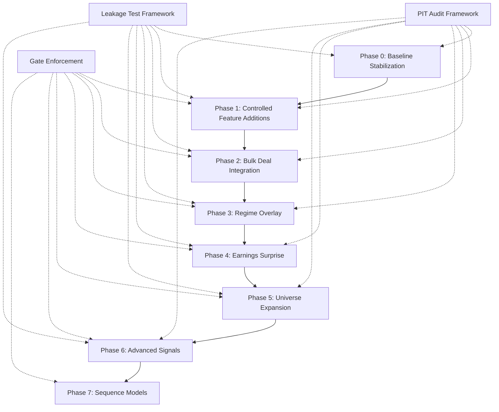
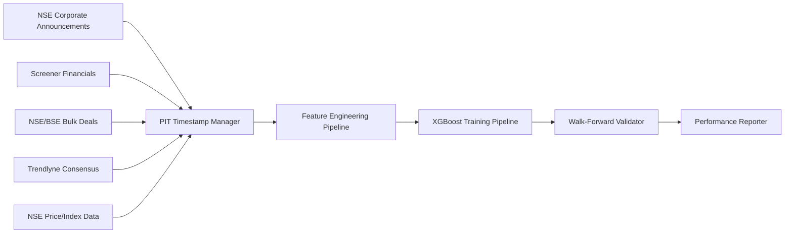
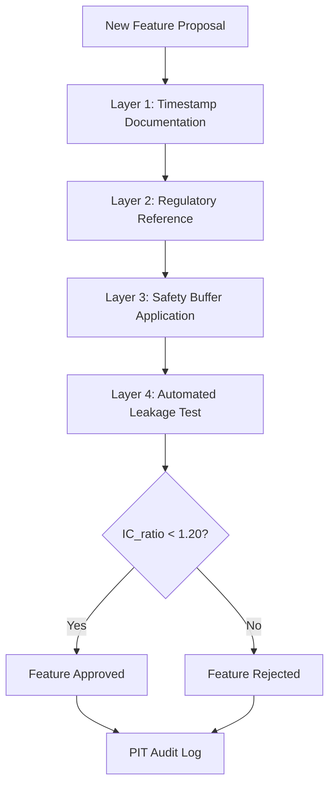

# Design Document: Northstar V3 Signal Engineering Plan

## Overview

The Northstar V3 Signal Engineering Plan is a systematic quantitative equity research improvement initiative targeting Information Coefficient (IC) enhancement from baseline 0.030 to 0.047+ through 7 phased implementations. The system addresses critical data integrity issues (point-in-time leakage), model configuration problems (over-regularization), and regime-specific performance gaps identified in adversarial review.

### Design Goals

1. **Data Integrity**: Eliminate all point-in-time (PIT) leakage through rigorous audit protocols and automated testing
2. **Incremental Validation**: Implement single-change experiments with gate enforcement to isolate IC contributions
3. **Regime Robustness**: Achieve IC > 0.010 across all 4 market regimes (risk_on_calm, risk_on_volatile, risk_off_calm, risk_off_volatile)
4. **Feature Discipline**: Enforce feature budget constraints (N/5 rule) to prevent overfitting
5. **Reproducibility**: Version all configurations and maintain complete experiment audit trails

### Success Metrics

- **Primary**: IC ≥ 0.047 (stretch target 0.050+)
- **Secondary**: Sharpe ratio > 0.25 after 25 bps transaction costs
- **Regime**: IC > 0.010 in all 4 regimes
- **Data Integrity**: IC_ratio < 1.20 for all features (leakage test)


## Architecture

### System Architecture Overview

The Signal Engineering System follows a 7-phase pipeline architecture with strict gate enforcement between phases:



### Data Pipeline Architecture

The data pipeline integrates 5 primary data sources with PIT-compliant timestamp management:




#### Data Source Integration Details

**1. NSE Corporate Announcements Scraper**
- **Purpose**: Extract earnings announcement dates for precise PIT constraints
- **Endpoint**: NSE corporate announcements page
- **Format**: DD-MMM-YYYY date parsing
- **Fallback**: Financial statement date + 30 days if scraping fails
- **Update Frequency**: Daily
- **PIT Buffer**: 1 trading day after announcement

**2. Screener Financials Integration**
- **Purpose**: Quarterly and annual financial statements
- **Data**: Balance sheet, P&L, cash flow statements
- **PIT Buffer**: 2 trading days after NSE announcement date
- **Update Frequency**: Quarterly
- **Coverage**: All NSE/BSE listed stocks

**3. NSE/BSE Bulk Deals Dataset**
- **Purpose**: Large block trade signals (informed trading)
- **Historical Records**: 333,826 transactions
- **Fields**: Date, stock, buyer name, seller name, quantity, price
- **PIT Compliance**: Trade date is public availability date (no buffer needed)
- **Update Frequency**: Daily

**4. Trendlyne Consensus API** (Conditional - Phase 6)
- **Purpose**: Analyst earnings estimates and revisions
- **Data**: Consensus EPS, revision diffusion, analyst count
- **PIT Buffer**: Estimate revision date (same day)
- **Update Frequency**: Daily
- **Authentication**: API subscription credentials

**5. NSE Price and Index Data**
- **Purpose**: Daily prices, India VIX, Nifty 50, index compositions
- **Data**: OHLCV, adjusted prices, index membership
- **PIT Compliance**: EOD data available next trading day
- **Update Frequency**: Daily


### PIT Audit Framework Design

The PIT Audit Framework ensures no future information leaks into historical analysis through a 4-layer validation system:



**Layer 1: Timestamp Documentation**
- Document data source timestamp (e.g., "NSE announcement date", "Screener quarterly filing date")
- Specify timestamp precision (date vs datetime)
- Identify timezone (IST for Indian markets)

**Layer 2: Regulatory Reference**
- Document public availability regulation (e.g., "SEBI Regulation 30 - Material Events")
- Specify disclosure timeline (e.g., "Within 30 minutes of board meeting")
- Reference regulatory source URL

**Layer 3: Safety Buffer Application**
- **Quarterly Financials**: 2 trading days after NSE announcement
- **Earnings Announcements**: 1 trading day after NSE announcement
- **Bulk Deals**: 0 days (trade date is public date)
- **Price Data**: 1 trading day (EOD data available next day)
- **Analyst Estimates**: 0 days (revision date is public date)

**Layer 4: Automated Leakage Test**
- Calculate baseline IC with correct PIT alignment
- Calculate shifted IC with data shifted forward 5 trading days
- Compute IC_ratio = shifted_IC / baseline_IC
- Reject feature if IC_ratio ≥ 1.20 (20% improvement indicates leakage)


### Leakage Test Framework Architecture

The Leakage Test Framework provides automated detection of PIT violations:

**Algorithm**:
```python
def leakage_test(feature_data, returns_data, test_period):
    # Step 1: Baseline IC with correct PIT alignment
    baseline_ic = calculate_ic(
        features=feature_data,
        returns=returns_data,
        period=test_period
    )
    
    # Step 2: Shifted IC with 5-day forward shift
    shifted_features = shift_forward(feature_data, days=5)
    shifted_ic = calculate_ic(
        features=shifted_features,
        returns=returns_data,
        period=test_period
    )
    
    # Step 3: Calculate IC ratio
    ic_ratio = shifted_ic / baseline_ic
    
    # Step 4: Flag if ratio exceeds threshold
    is_leaking = ic_ratio >= 1.20
    
    return {
        'baseline_ic': baseline_ic,
        'shifted_ic': shifted_ic,
        'ic_ratio': ic_ratio,
        'is_leaking': is_leaking
    }
```

**Test Execution Protocol**:
1. Run on out-of-sample test period (not training data)
2. Use identical universe and filters for baseline and shifted tests
3. Execute for each feature individually to isolate leakage source
4. Generate leakage report with IC_ratio for all features
5. Automatically reject features with IC_ratio ≥ 1.20


## Components and Interfaces

### Feature Engineering Pipeline

The Feature Engineering Pipeline transforms raw data into model-ready features with PIT compliance:

**Component Structure**:
```
FeatureEngineeringPipeline
├── RawDataLoader
│   ├── load_screener_financials()
│   ├── load_bulk_deals()
│   ├── load_nse_prices()
│   └── load_nse_announcements()
├── PITTimestampManager
│   ├── apply_safety_buffer()
│   ├── validate_timestamps()
│   └── align_to_trading_calendar()
├── FeatureTransformers
│   ├── WinsorizationTransformer
│   ├── LogTransformer
│   ├── RankTransformer
│   └── StandardizationTransformer
├── FeatureCalculators
│   ├── calculate_accruals()
│   ├── calculate_piotroski_fscore()
│   ├── calculate_amihud_illiquidity()
│   ├── calculate_bab_beta()
│   ├── calculate_momentum()
│   ├── calculate_max_lottery()
│   ├── calculate_earnings_quality()
│   ├── calculate_sue()
│   └── calculate_bulk_deal_features()
└── FeatureBudgetEnforcer
    ├── calculate_budget()
    ├── check_budget_utilization()
    └── reject_if_exceeded()
```

**Key Interfaces**:

```python
class PITTimestampManager:
    def apply_safety_buffer(self, data: pd.DataFrame, 
                           data_type: str) -> pd.DataFrame:
        """Apply regulatory safety buffers to timestamps"""
        
    def validate_timestamps(self, data: pd.DataFrame) -> bool:
        """Validate all timestamps are in the past"""
        
    def align_to_trading_calendar(self, data: pd.DataFrame) -> pd.DataFrame:
        """Align timestamps to NSE trading calendar"""

class FeatureBudgetEnforcer:
    def calculate_budget(self, universe_size: int) -> int:
        """Calculate feature budget as universe_size / 5"""
        return universe_size // 5
        
    def check_budget_utilization(self, current_features: int, 
                                 budget: int) -> float:
        """Return utilization percentage"""
        return (current_features / budget) * 100
        
    def reject_if_exceeded(self, current_features: int, 
                          budget: int) -> bool:
        """Return True if budget exceeded"""
        return current_features > budget
```


### XGBoost Model Training Pipeline

The XGBoost Training Pipeline implements walk-forward validation with strict temporal ordering:

**Component Structure**:
```
XGBoostTrainingPipeline
├── WalkForwardValidator
│   ├── generate_folds()
│   ├── train_fold()
│   └── validate_fold()
├── HyperparameterConfig
│   ├── max_depth: 4
│   ├── min_child_weight: 20
│   ├── learning_rate: 0.05
│   ├── n_estimators: 200
│   ├── subsample: 0.8
│   └── colsample_bytree: 0.8
├── FeatureStandardizer
│   ├── fit_on_train()
│   └── transform_test()
├── ModelTrainer
│   ├── train_xgboost()
│   ├── generate_predictions()
│   └── save_model()
└── PerformanceEvaluator
    ├── calculate_ic()
    ├── calculate_sharpe()
    ├── calculate_turnover()
    └── generate_report()
```

**Walk-Forward Validation Protocol**:
```python
class WalkForwardValidator:
    def __init__(self, train_window_months=24, test_window_months=3):
        self.train_window = train_window_months
        self.test_window = test_window_months
        
    def generate_folds(self, data: pd.DataFrame) -> List[Tuple]:
        """Generate train/test splits with temporal ordering"""
        folds = []
        start_date = data.index.min()
        end_date = data.index.max()
        
        current_date = start_date + pd.DateOffset(months=self.train_window)
        
        while current_date + pd.DateOffset(months=self.test_window) <= end_date:
            train_start = current_date - pd.DateOffset(months=self.train_window)
            train_end = current_date
            test_start = current_date
            test_end = current_date + pd.DateOffset(months=self.test_window)
            
            folds.append((train_start, train_end, test_start, test_end))
            current_date += pd.DateOffset(months=self.test_window)
            
        return folds
```

**Hyperparameter Rationale**:
- **max_depth=4**: Limits tree complexity to prevent overfitting on small samples
- **min_child_weight=20**: Requires minimum 20 samples per leaf (critical for 150-300 stock universe)
- **learning_rate=0.05**: Conservative rate for stable convergence
- **n_estimators=200**: Sufficient capacity without excessive training time
- **subsample=0.8**: Stochastic training for regularization
- **colsample_bytree=0.8**: Feature sampling for regularization


### Regime Classification Engine

The Regime Classification Engine implements a 2-axis framework (volatility × trend) for market state detection:

**Component Structure**:
```
RegimeClassificationEngine
├── VolatilityAxis
│   ├── load_india_vix()
│   └── classify_volatility()  # threshold = 20
├── TrendAxis
│   ├── calculate_nifty_200d_sma()
│   └── classify_trend()  # above/below SMA
├── RegimeClassifier
│   ├── classify_regime()
│   └── log_regime_transition()
└── RegimeWeightManager
    ├── load_regime_weights()
    └── apply_conditional_weights()
```

**Regime Classification Logic**:
```python
class RegimeClassifier:
    def classify_regime(self, india_vix: float, 
                       nifty_price: float, 
                       nifty_200d_sma: float) -> str:
        """Classify market regime based on 2-axis framework"""
        
        # Volatility axis
        is_volatile = india_vix > 20
        
        # Trend axis
        is_risk_on = nifty_price > nifty_200d_sma
        
        # 4-regime classification
        if is_risk_on and not is_volatile:
            return 'risk_on_calm'
        elif is_risk_on and is_volatile:
            return 'risk_on_volatile'
        elif not is_risk_on and not is_volatile:
            return 'risk_off_calm'
        else:  # not is_risk_on and is_volatile
            return 'risk_off_volatile'
```

**Regime-Conditional Feature Weights**:
- XGBoost supports regime-conditional weighting through sample weights
- Each regime gets separate weight vector learned during training
- Weights applied at prediction time based on current regime
- Hold-out validation on 2013-2016 period prevents regime overfitting

**Regime Transition Logging**:
```python
def log_regime_transition(self, date: pd.Timestamp, 
                         old_regime: str, 
                         new_regime: str):
    """Log regime changes for analysis"""
    self.transition_log.append({
        'date': date,
        'from_regime': old_regime,
        'to_regime': new_regime,
        'india_vix': self.current_vix,
        'nifty_vs_sma': self.current_nifty / self.current_sma
    })
```


### Bulk Deal Buyer Classification System

The Bulk Deal Buyer Classification System uses fuzzy string matching to categorize large block trades:

**Component Structure**:
```
BulkDealClassificationSystem
├── BuyerNameNormalizer
│   ├── remove_special_chars()
│   ├── standardize_abbreviations()
│   └── lowercase_and_strip()
├── FuzzyMatcher
│   ├── calculate_levenshtein_distance()
│   ├── calculate_similarity_score()
│   └── match_to_category()
├── CategoryClassifier
│   ├── FII_patterns
│   ├── DII_patterns
│   ├── Promoter_patterns
│   ├── Institutional_patterns
│   └── Retail_patterns
└── BulkDealAggregator
    ├── normalize_by_free_float()
    ├── aggregate_by_category()
    └── calculate_rolling_features()
```

**Buyer Categories**:
1. **FII** (Foreign Institutional Investors): Foreign funds, offshore entities
2. **DII** (Domestic Institutional Investors): Mutual funds, insurance companies, banks
3. **Promoter**: Company promoters, promoter group entities
4. **Institutional**: Other institutional investors (PMS, AIFs)
5. **Retail**: Individual investors, HNIs
6. **Unknown**: Unmatched buyers (similarity < 85%)

**Fuzzy Matching Algorithm**:
```python
class FuzzyMatcher:
    def __init__(self, similarity_threshold=0.85):
        self.threshold = similarity_threshold
        self.category_patterns = self.load_patterns()
        
    def match_to_category(self, buyer_name: str) -> str:
        """Match buyer name to category using fuzzy matching"""
        normalized_name = self.normalize(buyer_name)
        
        best_match_score = 0
        best_match_category = 'Unknown'
        
        for category, patterns in self.category_patterns.items():
            for pattern in patterns:
                score = self.calculate_similarity(normalized_name, pattern)
                if score > best_match_score:
                    best_match_score = score
                    best_match_category = category
                    
        # Assign to Unknown if below threshold
        if best_match_score < self.threshold:
            return 'Unknown'
        else:
            return best_match_category
            
    def calculate_similarity(self, str1: str, str2: str) -> float:
        """Calculate Levenshtein similarity (0-1 scale)"""
        distance = levenshtein_distance(str1, str2)
        max_len = max(len(str1), len(str2))
        return 1 - (distance / max_len)
```

**Bulk Deal Feature Engineering**:
```python
def calculate_bulk_deal_features(self, deals: pd.DataFrame, 
                                free_float: pd.Series) -> pd.DataFrame:
    """Calculate 4 bulk deal features"""
    
    # Normalize quantities by free float
    deals['normalized_qty'] = deals['quantity'] / free_float
    
    # Aggregate by category over 21-day windows
    features = pd.DataFrame()
    features['net_institutional_buying'] = (
        deals[deals['category'].isin(['FII', 'DII', 'Institutional'])]
        .groupby('date')['normalized_qty']
        .sum()
        .rolling(21).sum()
    )
    
    features['promoter_buying'] = (
        deals[deals['category'] == 'Promoter']
        .groupby('date')['normalized_qty']
        .sum()
        .rolling(21).sum()
    )
    
    features['fii_net_flow'] = (
        deals[deals['category'] == 'FII']
        .groupby('date')['normalized_qty']
        .sum()
        .rolling(21).sum()
    )
    
    features['dii_net_flow'] = (
        deals[deals['category'] == 'DII']
        .groupby('date')['normalized_qty']
        .sum()
        .rolling(21).sum()
    )
    
    return features
```


### Dual-Horizon Architecture (Conditional)

The Dual-Horizon Architecture trains separate models for 5-day and 21-day forward returns, with regime-conditional alpha blending:

**Decision Gate**: Implement only if Sharpe improvement ≥ 0.05 over single-horizon baseline

**Component Structure**:
```
DualHorizonArchitecture
├── ShortHorizonModel (5-day)
│   ├── train_xgboost()
│   ├── predict()
│   └── evaluate_ic()
├── LongHorizonModel (21-day)
│   ├── train_xgboost()
│   ├── predict()
│   └── evaluate_ic()
├── RegimeConditionalBlender
│   ├── load_alpha_weights()
│   ├── blend_predictions()
│   └── validate_ensemble()
└── SharpeGateEvaluator
    ├── calculate_baseline_sharpe()
    ├── calculate_ensemble_sharpe()
    └── evaluate_gate()
```

**Regime-Conditional Alpha Blending**:
```python
class RegimeConditionalBlender:
    def __init__(self):
        # Alpha weights for 5-day model (1-alpha for 21-day)
        self.alpha_weights = {
            'risk_on_calm': 0.65,
            'risk_on_volatile': 0.80,
            'risk_off_calm': 0.55,
            'risk_off_volatile': 0.50
        }
        
    def blend_predictions(self, pred_5d: np.ndarray, 
                         pred_21d: np.ndarray,
                         regime: str) -> np.ndarray:
        """Blend predictions based on current regime"""
        alpha = self.alpha_weights[regime]
        return alpha * pred_5d + (1 - alpha) * pred_21d
```

**Rationale for Regime-Conditional Weights**:
- **risk_on_volatile** (α=0.80): High volatility favors short-term signals
- **risk_on_calm** (α=0.65): Moderate preference for short-term in calm uptrends
- **risk_off_calm** (α=0.55): Balanced approach in calm downtrends
- **risk_off_volatile** (α=0.50): Equal weighting in volatile downtrends

**Sharpe Gate Evaluation**:
```python
def evaluate_gate(self, baseline_sharpe: float, 
                 ensemble_sharpe: float) -> bool:
    """Evaluate if dual-horizon meets gate criteria"""
    improvement = ensemble_sharpe - baseline_sharpe
    
    if improvement >= 0.05:
        print(f"Gate PASSED: Sharpe improvement = {improvement:.3f}")
        return True
    else:
        print(f"Gate FAILED: Sharpe improvement = {improvement:.3f} < 0.05")
        print("Retaining single 5-day model only")
        return False
```


### Sequence Model Integration (Conditional)

The Sequence Model Integration evaluates TCN and Transformer architectures for temporal dependency capture:

**Decision Gate**: Implement only if IC improvement ≥ 0.003 over XGBoost baseline

**Component Structure**:
```
SequenceModelEnsemble
├── TCNModel
│   ├── DilatedConvBlock (dilation=[1,2,4,8])
│   ├── ResidualBlock (4 blocks, 64 filters)
│   ├── DropoutLayer (p=0.2)
│   └── DenseOutput
├── TransformerModel
│   ├── PositionalEncoding
│   ├── MultiHeadAttention (4 heads)
│   ├── EncoderLayer (2 layers, 128 dim)
│   ├── DropoutLayer (p=0.2)
│   └── DenseOutput
├── SequenceDataGenerator
│   ├── create_lookback_windows()  # 60 days
│   ├── normalize_sequences()
│   └── batch_generator()
├── EnsembleBlender
│   ├── blend_with_xgboost()  # 60% XGBoost, 40% sequence
│   └── validate_ensemble()
└── ICGateEvaluator
    ├── calculate_xgboost_ic()
    ├── calculate_ensemble_ic()
    └── evaluate_gate()
```

**TCN Architecture**:
```python
class TCNModel:
    def __init__(self, input_dim, num_features, lookback=60):
        self.lookback = lookback
        self.num_features = num_features
        
        # Dilated causal convolutions
        self.conv_blocks = [
            DilatedConvBlock(filters=64, dilation=1),
            DilatedConvBlock(filters=64, dilation=2),
            DilatedConvBlock(filters=64, dilation=4),
            DilatedConvBlock(filters=64, dilation=8)
        ]
        
        # Residual connections
        self.residual_blocks = [
            ResidualBlock(filters=64) for _ in range(4)
        ]
        
        # Dropout for regularization
        self.dropout = Dropout(0.2)
        
        # Output layer
        self.dense = Dense(1, activation='linear')
        
    def forward(self, x):
        # x shape: (batch, lookback, num_features)
        for conv, residual in zip(self.conv_blocks, self.residual_blocks):
            x = conv(x)
            x = residual(x)
            x = self.dropout(x)
        
        # Take last timestep
        x = x[:, -1, :]
        return self.dense(x)
```

**Transformer Architecture**:
```python
class TransformerModel:
    def __init__(self, num_features, lookback=60):
        self.lookback = lookback
        self.num_features = num_features
        self.d_model = 128
        
        # Positional encoding
        self.pos_encoding = PositionalEncoding(d_model=self.d_model)
        
        # Multi-head attention
        self.attention = MultiHeadAttention(
            num_heads=4,
            d_model=self.d_model
        )
        
        # Encoder layers
        self.encoder_layers = [
            EncoderLayer(d_model=self.d_model) for _ in range(2)
        ]
        
        # Dropout
        self.dropout = Dropout(0.2)
        
        # Output layer
        self.dense = Dense(1, activation='linear')
        
    def forward(self, x):
        # x shape: (batch, lookback, num_features)
        x = self.pos_encoding(x)
        
        for encoder in self.encoder_layers:
            x = encoder(x)
            x = self.dropout(x)
        
        # Global average pooling
        x = tf.reduce_mean(x, axis=1)
        return self.dense(x)
```

**Ensemble Strategy**:
```python
def blend_with_xgboost(self, xgb_pred: np.ndarray, 
                      seq_pred: np.ndarray) -> np.ndarray:
    """Blend XGBoost (60%) with sequence model (40%)"""
    return 0.6 * xgb_pred + 0.4 * seq_pred
```

**IC Gate Evaluation**:
```python
def evaluate_gate(self, xgb_ic: float, ensemble_ic: float) -> bool:
    """Evaluate if sequence model meets gate criteria"""
    improvement = ensemble_ic - xgb_ic
    
    if improvement >= 0.003:
        print(f"Gate PASSED: IC improvement = {improvement:.4f}")
        return True
    else:
        print(f"Gate FAILED: IC improvement = {improvement:.4f} < 0.003")
        print("Retaining XGBoost only")
        return False
```


### Experiment Tracking and Gate Enforcement System

The Experiment Tracking System enforces single-change discipline and gate criteria:

**Component Structure**:
```
ExperimentTrackingSystem
├── ExperimentLogger
│   ├── log_experiment()
│   ├── record_baseline_ic()
│   ├── record_post_change_ic()
│   └── calculate_ic_delta()
├── GateEnforcer
│   ├── evaluate_phase_gate()
│   ├── halt_if_failed()
│   └── generate_diagnostic_report()
├── ChangeValidator
│   ├── validate_single_change()
│   ├── validate_identical_splits()
│   └── validate_fair_comparison()
└── ExperimentDatabase
    ├── store_experiment()
    ├── query_experiments()
    └── generate_changelog()
```

**Experiment Protocol**:
```python
class ExperimentLogger:
    def log_experiment(self, change_description: str,
                      baseline_ic: float,
                      post_change_ic: float,
                      phase: str) -> dict:
        """Log single experiment with before/after IC"""
        
        ic_delta = post_change_ic - baseline_ic
        
        experiment = {
            'timestamp': datetime.now(),
            'phase': phase,
            'change_description': change_description,
            'baseline_ic': baseline_ic,
            'post_change_ic': post_change_ic,
            'ic_delta': ic_delta,
            'decision': 'ACCEPT' if ic_delta >= 0 else 'REVERT'
        }
        
        self.experiments.append(experiment)
        
        if ic_delta < 0:
            print(f"WARNING: Negative IC delta ({ic_delta:.4f}). Reverting change.")
            
        return experiment
```

**Gate Enforcement**:
```python
class GateEnforcer:
    def __init__(self):
        self.phase_gates = {
            'Phase 0': 0.032,
            'Phase 1': 0.037,
            'Phase 2': 0.039,
            'Phase 3': 0.040,  # Plus regime IC > 0.010 for all regimes
            'Phase 4': 0.041,
            'Phase 5': 0.043,
            'Phase 6': 0.045,
            'Phase 7': 0.047
        }
        
    def evaluate_phase_gate(self, phase: str, 
                           current_ic: float,
                           regime_ics: dict = None) -> bool:
        """Evaluate if phase meets gate criteria"""
        
        gate_threshold = self.phase_gates[phase]
        
        # Check primary IC gate
        if current_ic < gate_threshold:
            print(f"Gate FAILED: IC {current_ic:.4f} < {gate_threshold:.4f}")
            return False
            
        # Check regime gates for Phase 3+
        if phase >= 'Phase 3' and regime_ics:
            for regime, ic in regime_ics.items():
                if ic < 0.010:
                    print(f"Gate FAILED: {regime} IC {ic:.4f} < 0.010")
                    return False
                    
        print(f"Gate PASSED: IC {current_ic:.4f} >= {gate_threshold:.4f}")
        return True
        
    def halt_if_failed(self, gate_passed: bool):
        """Halt progression if gate failed"""
        if not gate_passed:
            print("HALTING: Gate criteria not met. Diagnostic analysis required.")
            raise GateFailureException("Phase gate not met")
```

**Phase Gate Thresholds**:
- Phase 0: IC ≥ 0.032 (baseline stabilization)
- Phase 1: IC ≥ 0.037 (controlled features)
- Phase 2: IC ≥ 0.039 (bulk deals)
- Phase 3: IC ≥ 0.040 + all regime IC > 0.010 (regime overlay)
- Phase 4: IC ≥ 0.041 (earnings surprise)
- Phase 5: IC ≥ 0.043 (universe expansion)
- Phase 6: IC ≥ 0.045 (advanced signals)
- Phase 7: IC ≥ 0.047 (sequence models)


### Risk Register and Monitoring Framework

The Risk Register tracks 8 identified failure modes with automated mitigation protocols:

**Component Structure**:
```
RiskMonitoringFramework
├── RiskRegister
│   ├── track_risk_events()
│   ├── log_mitigation_actions()
│   └── generate_risk_reports()
├── LeakageMitigationProtocol
│   ├── detect_leakage()
│   ├── remove_leaking_feature()
│   └── revalidate_model()
├── CorrelationMitigationProtocol
│   ├── detect_high_correlation()
│   ├── reject_redundant_feature()
│   └── update_correlation_matrix()
├── RegimePerformanceMitigationProtocol
│   ├── detect_regime_underperformance()
│   ├── adjust_regime_weights()
│   └── revalidate_regime_ic()
└── OverfittingMitigationProtocol
    ├── detect_budget_exceeded()
    ├── remove_low_importance_features()
    └── revalidate_model()
```

**Risk Register (8 Failure Modes)**:

1. **PIT Leakage**
   - Detection: IC_ratio ≥ 1.20 in leakage test
   - Mitigation: Remove feature, document in audit log
   - Monitoring: Run leakage test on all new features

2. **Feature Correlation Redundancy**
   - Detection: Pairwise correlation > 0.85
   - Mitigation: Reject redundant feature, keep higher SHAP importance
   - Monitoring: Calculate correlation matrix after each addition

3. **Regime Underperformance**
   - Detection: Any regime IC < 0.010
   - Mitigation: Adjust regime-conditional weights, add regime-specific features
   - Monitoring: Calculate IC by regime monthly

4. **Overfitting (Budget Exceeded)**
   - Detection: Feature count > (universe_size / 5)
   - Mitigation: Remove low SHAP importance features
   - Monitoring: Check budget utilization after each addition

5. **IC Degradation**
   - Detection: IC drops > 0.005 from previous phase
   - Mitigation: Revert last change, run diagnostic analysis
   - Monitoring: Compare IC to previous phase after each experiment

6. **Data Staleness**
   - Detection: Data age > 2 trading days
   - Mitigation: Trigger data refresh, use cached data temporarily
   - Monitoring: Check data freshness daily

7. **Model Overfitting (Train/Test Gap)**
   - Detection: Train IC - Test IC > 0.015
   - Mitigation: Increase regularization (min_child_weight), reduce features
   - Monitoring: Compare train/test IC in each validation fold

8. **Survivorship Bias**
   - Detection: Backtest IC significantly higher than live IC
   - Mitigation: Include delisted stocks, apply forced delisting penalties
   - Monitoring: Maintain delisting event table, validate coverage

**Risk Event Logging**:
```python
class RiskRegister:
    def track_risk_event(self, risk_type: str, 
                        severity: str,
                        details: dict):
        """Log risk event with timestamp and details"""
        event = {
            'timestamp': datetime.now(),
            'risk_type': risk_type,
            'severity': severity,  # 'LOW', 'MEDIUM', 'HIGH', 'CRITICAL'
            'details': details,
            'mitigation_status': 'PENDING'
        }
        self.risk_events.append(event)
        
        if severity in ['HIGH', 'CRITICAL']:
            self.trigger_alert(event)
            
    def generate_risk_report(self, period='weekly'):
        """Generate risk summary report"""
        report = {
            'period': period,
            'total_events': len(self.risk_events),
            'events_by_type': self.count_by_type(),
            'events_by_severity': self.count_by_severity(),
            'open_mitigations': self.count_open_mitigations(),
            'resolved_mitigations': self.count_resolved_mitigations()
        }
        return report
```


### Configuration Management and Versioning

The Configuration Management System ensures reproducibility and change tracking:

**Component Structure**:
```
ConfigurationManagementSystem
├── ConfigSchema
│   ├── validate_schema()
│   ├── check_required_fields()
│   └── validate_types()
├── ConfigVersionControl
│   ├── tag_version()
│   ├── commit_changes()
│   └── rollback_to_version()
├── ChangelogManager
│   ├── log_config_change()
│   ├── generate_changelog()
│   └── compare_versions()
└── ConfigLoader
    ├── load_config()
    ├── merge_configs()
    └── validate_before_execution()
```

**Configuration File Structure**:
```yaml
# config/signal_engineering_v1.0.yaml
version: "1.0"
timestamp: "2024-01-15T10:30:00"
phase: "Phase 1"

model:
  type: "xgboost"
  hyperparameters:
    max_depth: 4
    min_child_weight: 20
    learning_rate: 0.05
    n_estimators: 200
    subsample: 0.8
    colsample_bytree: 0.8
    objective: "reg:squarederror"

universe:
  size: 150
  liquidity_threshold_cr: 2.0
  min_history_days: 252
  rebalance_frequency: "quarterly"

features:
  budget: 30
  current_count: 25
  active_features:
    - accruals
    - piotroski_fscore
    - amihud_illiquidity
    - bab_beta
    - momentum_3m
    - max_lottery
    - earnings_quality
    - sector_dummies

validation:
  method: "walk_forward"
  train_window_months: 24
  test_window_months: 3
  cv_folds: 5

pit_audit:
  safety_buffers:
    quarterly_financials: 2
    earnings_announcements: 1
    bulk_deals: 0
    price_data: 1
    analyst_estimates: 0

leakage_test:
  shift_days: 5
  ic_ratio_threshold: 1.20
  test_period: "out_of_sample"

gates:
  phase_0: 0.032
  phase_1: 0.037
  phase_2: 0.039
  phase_3: 0.040
  phase_4: 0.041
  phase_5: 0.043
  phase_6: 0.045
  phase_7: 0.047
  regime_minimum: 0.010

regime:
  framework: "2_axis"
  volatility_threshold: 20
  trend_sma_days: 200
  regimes:
    - risk_on_calm
    - risk_on_volatile
    - risk_off_calm
    - risk_off_volatile
```

**Version Control Protocol**:
```python
class ConfigVersionControl:
    def tag_version(self, config: dict, 
                   version_tag: str,
                   description: str):
        """Tag configuration version"""
        versioned_config = {
            'version_tag': version_tag,
            'timestamp': datetime.now(),
            'description': description,
            'config': config
        }
        
        self.versions[version_tag] = versioned_config
        self.save_to_git(version_tag)
        
    def rollback_to_version(self, version_tag: str) -> dict:
        """Rollback to previous configuration"""
        if version_tag not in self.versions:
            raise ValueError(f"Version {version_tag} not found")
            
        config = self.versions[version_tag]['config']
        print(f"Rolling back to version {version_tag}")
        return config
```

**Changelog Format**:
```markdown
# Configuration Changelog

## v1.2 - 2024-01-20
- Added bulk deal features (4 new features)
- Updated feature budget to 32
- Phase 2 gate passed (IC = 0.0395)

## v1.1 - 2024-01-18
- Added BAB beta, Amihud illiquidity, Piotroski F-Score
- Updated feature count to 28
- Phase 1 gate passed (IC = 0.0375)

## v1.0 - 2024-01-15
- Baseline configuration
- Fixed accruals sign inversion
- Fixed regime engine PIT bug
- Reverted min_child_weight to 20
- Phase 0 gate passed (IC = 0.0325)
```


## Data Models

### Core Data Structures

**Feature Data Model**:
```python
@dataclass
class Feature:
    name: str
    description: str
    data_source: str
    timestamp_field: str
    safety_buffer_days: int
    transformation: str  # 'winsorize', 'log', 'rank', 'standardize'
    pit_validated: bool
    leakage_test_result: dict
    shap_importance: float
    correlation_with_existing: dict
    added_date: datetime
    phase: str

@dataclass
class FeatureSet:
    features: List[Feature]
    budget: int
    current_count: int
    utilization_pct: float
    correlation_matrix: pd.DataFrame
```

**Experiment Data Model**:
```python
@dataclass
class Experiment:
    experiment_id: str
    timestamp: datetime
    phase: str
    change_description: str
    baseline_ic: float
    post_change_ic: float
    ic_delta: float
    baseline_sharpe: float
    post_change_sharpe: float
    train_test_split: dict
    decision: str  # 'ACCEPT', 'REVERT'
    notes: str
```

**Regime Data Model**:
```python
@dataclass
class RegimeState:
    date: pd.Timestamp
    regime: str  # 'risk_on_calm', 'risk_on_volatile', etc.
    india_vix: float
    nifty_price: float
    nifty_200d_sma: float
    is_volatile: bool
    is_risk_on: bool

@dataclass
class RegimePerformance:
    regime: str
    ic: float
    sharpe: float
    sample_size: int
    avg_return: float
    volatility: float
```

**Bulk Deal Data Model**:
```python
@dataclass
class BulkDeal:
    date: pd.Timestamp
    stock_symbol: str
    buyer_name: str
    seller_name: str
    quantity: int
    price: float
    buyer_category: str  # 'FII', 'DII', 'Promoter', 'Institutional', 'Retail', 'Unknown'
    seller_category: str
    normalized_quantity: float  # quantity / free_float
    fuzzy_match_score: float

@dataclass
class BulkDealFeatures:
    date: pd.Timestamp
    stock_symbol: str
    net_institutional_buying_21d: float
    promoter_buying_21d: float
    fii_net_flow_21d: float
    dii_net_flow_21d: float
```

**PIT Audit Data Model**:
```python
@dataclass
class PITAuditEntry:
    feature_name: str
    data_source: str
    timestamp_field: str
    public_availability_date: str
    regulatory_reference: str
    safety_buffer_days: int
    leakage_test_ic_ratio: float
    pit_validated: bool
    validation_date: datetime
    validator: str
    notes: str
```

**Leakage Test Data Model**:
```python
@dataclass
class LeakageTestResult:
    feature_name: str
    test_date: datetime
    baseline_ic: float
    shifted_ic: float
    ic_ratio: float
    is_leaking: bool
    test_period_start: pd.Timestamp
    test_period_end: pd.Timestamp
    shift_days: int
```

**Risk Event Data Model**:
```python
@dataclass
class RiskEvent:
    event_id: str
    timestamp: datetime
    risk_type: str  # 'PIT_LEAKAGE', 'CORRELATION', 'REGIME_UNDERPERFORMANCE', etc.
    severity: str  # 'LOW', 'MEDIUM', 'HIGH', 'CRITICAL'
    details: dict
    mitigation_action: str
    mitigation_status: str  # 'PENDING', 'IN_PROGRESS', 'RESOLVED'
    resolved_date: datetime
    notes: str
```


## Correctness Properties

A property is a characteristic or behavior that should hold true across all valid executions of a system—essentially, a formal statement about what the system should do. Properties serve as the bridge between human-readable specifications and machine-verifiable correctness guarantees.

### Property Reflection

After analyzing all acceptance criteria, several redundancies were identified and consolidated:
- Properties 2.4 and 1.5 both test leakage (IC_ratio < 1.20) - consolidated into Property 1
- Properties 7.3 and 7.4 are components of regime classification - consolidated into Property 6
- Properties 28.1-28.4 are all regime classification cases - consolidated into Property 6
- Properties 20.3 and 20.4 are complementary fuzzy matching cases - consolidated into Property 8
- Properties 39.4-39.7 are all dual-horizon alpha weights - consolidated into Property 10
- Multiple PIT buffer properties (2.3, 2.7, 8.7) - consolidated into Property 2

### Property 1: Leakage Test Detects Future Information

For any feature in the feature set, when the leakage test shifts data forward by 5 trading days and recalculates IC, the IC_ratio (shifted_IC / baseline_IC) should be less than 1.20, indicating no significant future information leakage.

**Validates: Requirements 1.5, 2.4, 2.5, 14.4, 14.8**

### Property 2: PIT Safety Buffers Applied Correctly

For any feature with a specified data type (quarterly_financials, earnings_announcements, bulk_deals, price_data, analyst_estimates), the system should apply the correct safety buffer (2 days, 1 day, 0 days, 1 day, 0 days respectively) and all feature timestamps should be at least the minimum buffer (1 day) after the data source timestamp.

**Validates: Requirements 2.3, 2.7, 8.7**

### Property 3: PIT Timestamp Round-Trip Preservation

For any financial data, parsing the data then applying PIT constraints then re-parsing should produce timestamps equivalent to the original timestamps (within the applied safety buffer).

**Validates: Requirements 1.6**

### Property 4: Feature Budget Enforcement

For any universe size N, the feature budget should equal N/5 (integer division), and when the current feature count exceeds this budget, the system should reject new feature additions.

**Validates: Requirements 3.3, 3.4**

### Property 5: Regime Classification PIT Compliance

For any date in the historical data, when calculating the regime classification (including Nifty_200d_SMA), the system should use only data up to and including that date, with no future information.

**Validates: Requirements 1.3, 47.4**

### Property 6: Regime Classification Logic

For any date with India_VIX and Nifty_50 price data, the regime classification should follow the 2-axis framework: classify as volatile if VIX > 20, classify as risk_on if price > 200d_SMA, and combine these to produce exactly one of four regimes (risk_on_calm, risk_on_volatile, risk_off_calm, risk_off_volatile).

**Validates: Requirements 7.3, 7.4, 28.1, 28.2, 28.3, 28.4**

### Property 7: Feature Correlation Rejection

For any new feature being added, if its pairwise correlation with any existing feature exceeds 0.85, the system should reject the feature; if correlation exceeds 0.70, the system should log a warning.

**Validates: Requirements 4.10, 5.6**

### Property 8: Bulk Deal Buyer Classification

For any bulk deal buyer name, the fuzzy matching system should assign the buyer to a category (FII, DII, Promoter, Institutional, Retail) if similarity score >= 85%, otherwise assign to Unknown category.

**Validates: Requirements 6.1, 20.3, 20.4**

### Property 9: Bulk Deal Normalization and Aggregation

For any bulk deal transaction, the quantity should be normalized by dividing by free float percentage, and bulk deals should be aggregated over 21-day rolling windows to produce the 4 bulk deal features.

**Validates: Requirements 6.2, 6.7**

### Property 10: Dual-Horizon Alpha Blending

For any prediction in the dual-horizon architecture, the alpha weight for the 5-day model should be regime-conditional: 0.80 for risk_on_volatile, 0.65 for risk_on_calm, 0.55 for risk_off_calm, 0.50 for risk_off_volatile.

**Validates: Requirements 39.4, 39.5, 39.6, 39.7**

### Property 11: Experiment Single-Change Discipline

For any experiment, exactly one change should be present in the change description, and if the IC delta is negative, the system should revert the change.

**Validates: Requirements 12.1, 12.6**

### Property 12: Gate Enforcement Halts Progression

For any phase completion, if the achieved IC is less than the phase gate threshold, the system should halt progression to the next phase and require diagnostic analysis.

**Validates: Requirements 13.2**

### Property 13: IC Calculation Formula

For any set of predictions and forward returns, the IC should be calculated as the Spearman rank correlation between predictions and returns.

**Validates: Requirements 17.1**

### Property 14: Leakage Test IC Ratio Calculation

For any feature, the leakage test IC_ratio should be calculated as shifted_IC divided by baseline_IC, where shifted_IC uses data shifted forward by 5 trading days.

**Validates: Requirements 14.3**

### Property 15: Delisting Return Treatment

For any delisted stock, if the delisting is classified as forced (fraud, suspension, insolvency), apply -100% return on delisting date; if voluntary (merger, buyout), use actual last traded price or buyout premium.

**Validates: Requirements 32.2, 32.3**

### Property 16: Feature Standardization PIT Compliance

For any test data standardization, the system should apply training statistics (mean and standard deviation calculated from training data only) to test data, ensuring no look-ahead bias.

**Validates: Requirements 48.2**

### Property 17: Accruals Calculation Formula

For any financial statement data, accruals should be calculated as (Net_Income - Operating_Cash_Flow) / Total_Assets, with the correct sign (high accruals predict higher returns in Indian markets).

**Validates: Requirements 46.1**

### Property 18: Data Quality Validation

For any price data, gaps should not exceed 5 trading days, and for any numeric feature data, all values should be finite (no NaN or Inf values).

**Validates: Requirements 45.1, 45.6**

### Property 19: Configuration Schema Validation

For any configuration file, the system should validate it against the configuration schema before execution, rejecting invalid configurations.

**Validates: Requirements 43.6**

### Property 20: PIT Audit Documentation

For any new feature added, the system should create a PIT audit log entry documenting the data timestamp source, public availability date with regulatory reference, and safety buffer applied.

**Validates: Requirements 2.1, 2.2, 2.6**

### Property 21: Feature Budget Utilization Logging

For any feature addition, the system should log the feature budget utilization percentage after the addition.

**Validates: Requirements 3.5**

### Property 22: Correlation Matrix Calculation

For any new feature added, the system should calculate pairwise correlations with all existing features and update the correlation matrix.

**Validates: Requirements 5.2**

### Property 23: Winsorization and Rank Transformation

For any feature with extreme outliers, the system should apply winsorization at specified percentiles, and for any cross-section, the system should apply rank transformation to reduce outlier impact.

**Validates: Requirements 15.1, 15.7**

### Property 24: Parser Round-Trip Properties

For any valid NSE announcement date, parsing then printing then parsing should produce an equivalent date. For any valid financial data, parsing then printing then parsing should produce equivalent values. For any valid bulk deal, parsing then printing then parsing should produce an equivalent transaction.

**Validates: Requirements from Notes section (Parser and Serializer Requirements)**


## Error Handling

### Error Categories and Handling Strategies

**1. Data Quality Errors**
- **Missing Data**: Apply forward-fill followed by median imputation (training data only)
- **Stale Data**: Log warning, use cached data temporarily, trigger data refresh
- **Invalid Timestamps**: Reject data, log error with details
- **Duplicate Records**: Remove duplicates, log warning
- **Out-of-Range Values**: Apply winsorization or reject based on severity

**2. PIT Violation Errors**
- **Future Timestamps**: Reject feature, log critical error
- **Leakage Detected**: Remove feature, update audit log, alert researcher
- **Missing Safety Buffer**: Reject feature, require buffer specification

**3. Model Training Errors**
- **Convergence Failure**: Reduce learning rate, increase iterations, log warning
- **Overfitting Detected**: Increase regularization (min_child_weight), reduce features
- **Memory Errors**: Reduce batch size, use incremental learning

**4. Gate Failure Errors**
- **IC Below Threshold**: Halt progression, generate diagnostic report, require analysis
- **Regime IC Below Minimum**: Adjust regime weights, add regime-specific features
- **Negative IC Delta**: Revert change, log experiment failure

**5. Configuration Errors**
- **Invalid Schema**: Reject configuration, display validation errors
- **Missing Required Fields**: Reject configuration, list missing fields
- **Type Mismatches**: Reject configuration, specify expected types

**6. Integration Errors**
- **API Failures**: Retry with exponential backoff, use cached data, log error
- **Scraping Failures**: Use fallback logic (e.g., statement date + 30 days), log warning
- **Database Errors**: Retry transaction, rollback on failure, alert operator

### Error Recovery Protocols

```python
class ErrorRecoveryManager:
    def handle_leakage_detection(self, feature_name: str, ic_ratio: float):
        """Handle detected PIT leakage"""
        self.log_critical(f"Leakage detected: {feature_name}, IC_ratio={ic_ratio}")
        self.remove_feature(feature_name)
        self.update_audit_log(feature_name, status='REJECTED_LEAKAGE')
        self.alert_researcher(f"Feature {feature_name} rejected due to leakage")
        
    def handle_gate_failure(self, phase: str, current_ic: float, gate_ic: float):
        """Handle phase gate failure"""
        self.log_critical(f"Gate failure: {phase}, IC={current_ic} < {gate_ic}")
        self.halt_progression()
        self.generate_diagnostic_report(phase)
        self.alert_researcher(f"Phase {phase} gate failed, diagnostic required")
        
    def handle_data_staleness(self, data_source: str, age_days: int):
        """Handle stale data"""
        self.log_warning(f"Stale data: {data_source}, age={age_days} days")
        self.trigger_data_refresh(data_source)
        self.use_cached_data(data_source)
        
    def handle_api_failure(self, api_name: str, error: Exception):
        """Handle API integration failure"""
        self.log_error(f"API failure: {api_name}, error={str(error)}")
        self.retry_with_backoff(api_name, max_retries=3)
        if not self.retry_successful:
            self.use_fallback_logic(api_name)
            self.alert_operator(f"API {api_name} failed, using fallback")
```

### Logging and Alerting

**Log Levels**:
- **DEBUG**: Detailed execution traces, feature calculations
- **INFO**: Experiment results, IC measurements, phase completions
- **WARNING**: Data quality issues, correlation warnings, budget utilization
- **ERROR**: API failures, data validation failures, configuration errors
- **CRITICAL**: PIT leakage, gate failures, system halts

**Alert Triggers**:
- IC degradation > 0.005 from previous phase
- Any regime IC < 0.010
- Leakage detected (IC_ratio >= 1.20)
- Gate failure
- Data staleness > 2 trading days
- API failures after retry exhaustion


## Testing Strategy

### Dual Testing Approach

The testing strategy employs both unit tests and property-based tests as complementary approaches:

- **Unit Tests**: Verify specific examples, edge cases, error conditions, and integration points
- **Property Tests**: Verify universal properties across all inputs through randomization
- **Together**: Provide comprehensive coverage (unit tests catch concrete bugs, property tests verify general correctness)

### Property-Based Testing Configuration

**Library Selection**: Use `hypothesis` for Python (mature, well-documented, excellent for financial data)

**Test Configuration**:
- Minimum 100 iterations per property test (due to randomization)
- Each property test must reference its design document property
- Tag format: `# Feature: northstar-v3-signal-engineering-plan, Property {number}: {property_text}`

**Example Property Test Structure**:
```python
from hypothesis import given, strategies as st
import hypothesis.extra.pandas as pdst

# Feature: northstar-v3-signal-engineering-plan, Property 1: Leakage Test Detects Future Information
@given(
    feature_data=pdst.data_frames(
        columns=[
            pdst.column('date', dtype='datetime64[ns]'),
            pdst.column('stock', dtype=str),
            pdst.column('feature_value', dtype=float)
        ],
        rows=st.integers(min_value=100, max_value=1000)
    ),
    returns_data=pdst.data_frames(
        columns=[
            pdst.column('date', dtype='datetime64[ns]'),
            pdst.column('stock', dtype=str),
            pdst.column('forward_return', dtype=float)
        ],
        rows=st.integers(min_value=100, max_value=1000)
    )
)
@settings(max_examples=100)
def test_leakage_detection_property(feature_data, returns_data):
    """Property: For any feature, IC_ratio should be < 1.20"""
    result = leakage_test(feature_data, returns_data, test_period='2020-2023')
    assert result['ic_ratio'] < 1.20, f"Leakage detected: IC_ratio={result['ic_ratio']}"
```

### Unit Testing Strategy

**Focus Areas for Unit Tests**:
1. **Specific Examples**: Known input/output pairs (e.g., accruals calculation for specific company)
2. **Edge Cases**: Empty data, single observation, extreme values
3. **Error Conditions**: Invalid inputs, missing data, malformed configurations
4. **Integration Points**: API calls, database operations, file I/O

**Example Unit Test Structure**:
```python
def test_xgboost_hyperparameters_baseline():
    """Unit test: Verify baseline XGBoost configuration"""
    config = load_config('baseline')
    assert config['model']['hyperparameters']['max_depth'] == 4
    assert config['model']['hyperparameters']['min_child_weight'] == 20
    
def test_accruals_calculation_known_example():
    """Unit test: Verify accruals calculation for known company"""
    financials = {
        'net_income': 1000,
        'operating_cash_flow': 800,
        'total_assets': 10000
    }
    accruals = calculate_accruals(financials)
    expected = (1000 - 800) / 10000  # = 0.02
    assert abs(accruals - expected) < 1e-6
    
def test_regime_classification_edge_case_vix_exactly_20():
    """Unit test: Edge case where VIX exactly equals threshold"""
    regime = classify_regime(india_vix=20.0, nifty_price=18000, nifty_200d_sma=17500)
    # VIX <= 20 should classify as calm
    assert regime in ['risk_on_calm', 'risk_off_calm']
```

### Property Test Coverage by Design Property

**Property 1: Leakage Test**
- Generate random feature data and returns
- Verify IC_ratio < 1.20 for all features
- Test with various time periods and universe sizes

**Property 3: PIT Round-Trip**
- Generate random financial data
- Parse → apply PIT constraints → re-parse
- Verify timestamps equivalent (within buffer)

**Property 4: Feature Budget**
- Generate random universe sizes (50-500)
- Verify budget = size / 5
- Verify rejection when count > budget

**Property 6: Regime Classification**
- Generate random VIX and Nifty price data
- Verify correct regime for all combinations
- Verify exactly one regime assigned

**Property 8: Bulk Deal Classification**
- Generate random buyer names
- Verify correct category assignment
- Verify Unknown for similarity < 85%

**Property 13: IC Calculation**
- Generate random predictions and returns
- Verify IC equals Spearman correlation
- Test with various data distributions

**Property 17: Accruals Formula**
- Generate random financial statements
- Verify accruals = (NI - OCF) / TA
- Test with positive and negative values

**Property 24: Parser Round-Trip**
- Generate random dates, financial data, bulk deals
- Parse → print → parse
- Verify equivalence

### Integration Testing

**End-to-End Pipeline Tests**:
1. **Phase 0 Baseline**: Load data → train model → validate IC >= 0.032
2. **Feature Addition**: Add feature → run leakage test → verify acceptance/rejection
3. **Gate Enforcement**: Complete phase → evaluate gate → verify halt if failed
4. **Walk-Forward Validation**: Generate folds → train → test → aggregate IC

**Integration Test Example**:
```python
def test_phase_1_feature_addition_pipeline():
    """Integration test: Add BAB beta feature through complete pipeline"""
    # Setup baseline
    baseline_ic = train_and_evaluate_baseline()
    
    # Add feature
    add_feature('bab_beta', data_source='prices', safety_buffer=1)
    
    # Run leakage test
    leakage_result = run_leakage_test('bab_beta')
    assert leakage_result['ic_ratio'] < 1.20
    
    # Train with new feature
    new_ic = train_and_evaluate_with_feature('bab_beta')
    
    # Verify IC improvement
    assert new_ic > baseline_ic
    
    # Log experiment
    log_experiment('Added BAB beta', baseline_ic, new_ic, 'Phase 1')
```

### Test Data Generation

**Synthetic Data Generators**:
- **Price Data**: Generate realistic OHLCV with trends and volatility
- **Financial Statements**: Generate balance sheets, P&L, cash flows with accounting identities
- **Bulk Deals**: Generate buyer names, quantities, prices with realistic distributions
- **Regime Data**: Generate VIX and Nifty data covering all 4 regimes

**Historical Data Subsets**:
- Use 2013-2016 as hold-out validation period
- Use 2017-2023 for training and testing
- Maintain separate test sets for each phase

### Continuous Testing

**Pre-Commit Hooks**:
- Run unit tests on changed files
- Verify configuration schema validation
- Check code formatting and linting

**CI/CD Pipeline**:
- Run full unit test suite
- Run property tests (100 iterations each)
- Run integration tests for critical paths
- Generate test coverage report (target: 80%+)

**Nightly Regression Tests**:
- Run full property test suite (1000 iterations each)
- Run end-to-end pipeline tests
- Validate IC on historical data
- Check for performance regressions

### Test Metrics and Monitoring

**Coverage Targets**:
- Unit test coverage: 80%+ for core modules
- Property test coverage: All 24 design properties
- Integration test coverage: All 7 phases

**Test Execution Metrics**:
- Unit test execution time: < 5 minutes
- Property test execution time: < 30 minutes (100 iterations)
- Integration test execution time: < 60 minutes

**Quality Gates**:
- All tests must pass before merge
- No decrease in test coverage
- No increase in test execution time > 20%


## Implementation Roadmap

### Phase Sequence and Timeline

**Phase 0: Baseline Stabilization** (Week 1)
- Fix XGBoost hyperparameters (max_depth=4, min_child_weight=20)
- Correct accruals sign inversion
- Fix regime engine PIT bug
- Run leakage tests on all existing features
- Gate: IC ≥ 0.032

**Phase 1: Controlled Feature Additions** (Week 2-3)
- Add BAB beta, Amihud illiquidity, Piotroski F-Score
- Add 3-month momentum, MAX lottery, earnings quality
- Add sector dummy variables
- One experiment per feature
- Gate: IC ≥ 0.037

**Phase 2: Bulk Deal Integration** (Week 4-5)
- Implement fuzzy buyer classification
- Calculate 4 bulk deal features
- Apply survivorship bias filter
- Gate: IC ≥ 0.039

**Phase 3: Regime Overlay** (Week 6-7)
- Implement 2-axis regime framework
- Apply regime-conditional weights
- Validate on 2013-2016 hold-out
- Gate: IC ≥ 0.040, all regime IC > 0.010

**Phase 4: Earnings Surprise** (Week 8)
- Scrape NSE announcement dates
- Calculate SUE with seasonal random-walk
- Evaluate dual-horizon architecture (gate: Sharpe improvement ≥ 0.05)
- Gate: IC ≥ 0.041

**Phase 5: Universe Expansion** (Week 9)
- Expand from 150 to 300 stocks
- Build PIT universe membership table
- Increase feature budget to 45
- Gate: IC ≥ 0.043

**Phase 6: Advanced Signals** (Week 10)
- Integrate Trendlyne consensus
- Add promoter pledge changes
- Add MAX5 lottery feature
- Gate: IC ≥ 0.045

**Phase 7: Sequence Models** (Week 11-12)
- Implement TCN and Transformer
- Ensemble with XGBoost (60/40 weights)
- Evaluate gate: IC improvement ≥ 0.003
- Final Gate: IC ≥ 0.047

### Key Design Decisions

1. **min_child_weight=20 (not 3)**: Critical for small sample sizes (150-300 stocks)
2. **Unknown category for bulk deals**: Conservative approach for unmatched buyers
3. **Indian accruals behavior**: High accruals → higher returns (opposite of US)
4. **2-axis regime framework**: Simpler than 14-label system, more robust
5. **Regime-conditional alpha blending**: Adapts dual-horizon to market conditions
6. **2013-2016 hold-out validation**: Protects against regime overfitting
7. **Sharpe ≥ 0.05 gate for dual-horizon**: Ensures complexity is justified
8. **IC ≥ 0.003 gate for sequence models**: Ensures deep learning adds value

### Success Criteria Summary

**Primary Metrics**:
- IC ≥ 0.047 (baseline 0.030 → 57% improvement)
- Sharpe ratio > 0.25 after 25 bps costs
- All regime IC > 0.010

**Data Integrity**:
- All features pass leakage test (IC_ratio < 1.20)
- Complete PIT audit log for all features
- No future information in any calculation

**Process Discipline**:
- One change per experiment
- All phase gates passed
- Complete experiment audit trail
- Configuration version control

### Risk Mitigation Summary

The design addresses 8 identified failure modes through automated detection and mitigation protocols:
1. PIT leakage → Automated leakage testing
2. Feature correlation → Correlation matrix monitoring
3. Regime underperformance → Regime-conditional weights
4. Overfitting → Feature budget enforcement
5. IC degradation → Gate enforcement
6. Data staleness → Freshness validation
7. Train/test gap → Walk-forward validation
8. Survivorship bias → Delisting event handling

