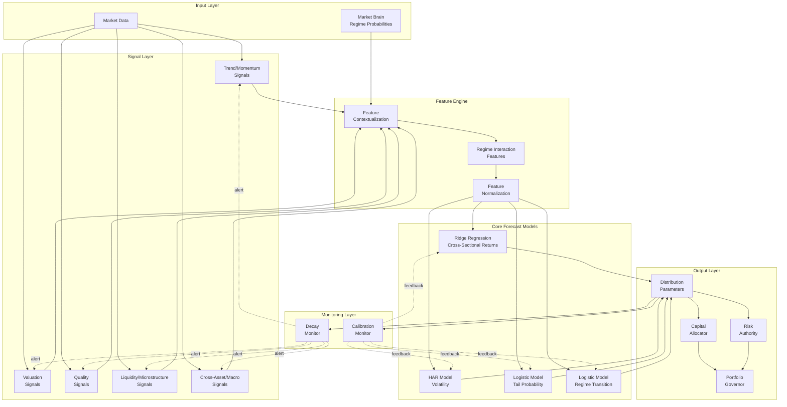

# Design Document: Probabilistic Forecasting Spine

## Overview

The Probabilistic Forecasting Spine is a 6-layer institutional-grade forecasting framework that produces distributional forecasts for cross-sectional returns, volatility, regime transitions, and tail risk. The design emphasizes stability over complexity, proper calibration, and realistic performance expectations.

The system follows a clean separation of concerns:
1. **Signal Layer** - Constructs orthogonal signals across 5 buckets
2. **Feature Engine** - Contextualizes signals with regime awareness
3. **Core Forecast Models** - Probabilistic models (Ridge, HAR, Logistic)
4. **Calibration Monitor** - Tracks forecast accuracy and drift
5. **Decay Monitor** - Detects signal degradation
6. **Integration Layer** - Connects to Market_Brain, Capital_Allocator, Risk_Authority

## Architecture



## Components and Interfaces

### 1. Signal Layer

**Purpose**: Construct orthogonal signals across 5 buckets to capture diverse alpha sources.

**Interface**:
```python
class SignalLayer:
    def compute_signals(self, market_data: MarketData, timestamp: datetime) -> SignalMatrix:
        """
        Compute signals for all assets at given timestamp.
        
        Args:
            market_data: Historical market data up to timestamp
            timestamp: Current time (no look-ahead allowed)
            
        Returns:
            SignalMatrix with shape (n_assets, n_signals) containing:
            - Trend/Momentum signals (columns 0-k1)
            - Valuation signals (columns k1-k2)
            - Quality signals (columns k2-k3)
            - Liquidity/Microstructure signals (columns k3-k4)
            - Cross-Asset/Macro signals (columns k4-k5)
        """
        pass
    
    def validate_orthogonality(self, signals: SignalMatrix, bucket: str) -> bool:
        """Validate that signals within bucket have correlation < 0.3"""
        pass
```

**Signal Buckets**:

1. **Trend/Momentum** (5-7 signals):
   - Short-term momentum (1-month return)
   - Medium-term momentum (3-month return)
   - Long-term momentum (12-month return)
   - Momentum acceleration (change in momentum)
   - Volume-weighted momentum
   - Relative strength index (RSI)

2. **Valuation** (4-6 signals):
   - Price-to-earnings ratio (P/E)
   - Price-to-book ratio (P/B)
   - Earnings yield
   - Dividend yield
   - Enterprise value / EBITDA

3. **Quality** (4-6 signals):
   - Return on equity (ROE)
   - Return on assets (ROA)
   - Profit margin
   - Earnings stability (volatility of earnings)
   - Debt-to-equity ratio

4. **Liquidity/Microstructure** (3-5 signals):
   - Bid-ask spread
   - Trading volume
   - Amihud illiquidity measure
   - Order imbalance
   - Price impact

5. **Cross-Asset/Macro** (3-5 signals):
   - Correlation with market index
   - Beta to market
   - Currency exposure
   - Interest rate sensitivity
   - Commodity exposure

**Orthogonality Enforcement**:
- Within each bucket, compute pairwise correlations
- If correlation > 0.3, apply Gram-Schmidt orthogonalization
- Equal weighting within bucket before cross-bucket combination

### 2. Feature Engine

**Purpose**: Contextualize signals with regime awareness and create interaction features.

**Interface**:
```python
class FeatureEngine:
    def contextualize_signals(
        self, 
        signals: SignalMatrix, 
        regime_probs: RegimeProbabilities,
        timestamp: datetime
    ) -> FeatureMatrix:
        """
        Augment signals with regime context.
        
        Args:
            signals: Raw signals from Signal Layer
            regime_probs: Current regime probabilities from Market_Brain
            timestamp: Current time
            
        Returns:
            FeatureMatrix with shape (n_assets, n_features) containing:
            - Original signals
            - Regime interaction features (signal × regime_prob)
            - Normalized features
        """
        pass
    
    def normalize_features(self, features: FeatureMatrix) -> FeatureMatrix:
        """Apply cross-sectional normalization (demean, scale by std)"""
        pass
```

**Feature Construction**:

1. **Base Features**: Raw signals from Signal Layer
2. **Regime Interactions**: For each signal s and regime r:
   ```
   feature_interaction = signal_s × P(regime = r)
   ```
3. **Cross-Sectional Normalization**:
   ```
   feature_normalized = (feature - mean(feature)) / std(feature)
   ```

### 3. Core Forecast Models

#### 3.1 Ridge Regression for Cross-Sectional Returns

**Purpose**: Forecast 10-day excess returns relative to universe mean.

**Mathematical Specification**:

Target variable:
```
y_i,t = r_i,t+10 - mean(r_j,t+10 for all j)
```

Model:
```
y_i,t = β' × X_i,t + ε_i,t
```

Ridge objective:
```
min_β Σ_t Σ_i (y_i,t - β' × X_i,t)² + λ ||β||²
```

Closed-form solution:
```
β = (X'X + λI)^(-1) X'y
```

Forecast distribution:
```
E[y_i,t+10 | X_i,t] = β' × X_i,t
Var[y_i,t+10 | X_i,t] = σ²_ε × (1 + X_i,t' (X'X + λI)^(-1) X_i,t)
```

**Interface**:
```python
class CrossSectionalRidgeModel:
    def __init__(self, lambda_: float = 1.0):
        self.lambda_ = lambda_
        self.beta = None
        self.sigma_epsilon = None
    
    def fit(self, X: FeatureMatrix, y: np.ndarray) -> None:
        """
        Fit ridge regression model.
        
        Args:
            X: Feature matrix (n_samples × n_assets, n_features)
            y: Target excess returns (n_samples × n_assets,)
        """
        pass
    
    def predict(self, X: FeatureMatrix) -> ForecastDistribution:
        """
        Predict excess return distribution.
        
        Returns:
            ForecastDistribution with mean, variance, and confidence intervals
        """
        pass
    
    def select_lambda(self, X: FeatureMatrix, y: np.ndarray) -> float:
        """Select regularization parameter using walk-forward CV"""
        pass
```

**Hyperparameter Selection**:
- Use walk-forward cross-validation
- Grid search over λ ∈ [0.01, 0.1, 1.0, 10.0, 100.0]
- Select λ that maximizes out-of-sample IC
- Refit on full training window with selected λ

#### 3.2 HAR Model for Volatility

**Purpose**: Forecast 10-day realized volatility using multi-horizon components.

**Mathematical Specification**:

Target variable:
```
σ_i,t+10 = sqrt(Σ_{s=t+1}^{t+10} r_i,s²)
```

HAR model:
```
σ_i,t+10 = β_0 + β_d × σ_i,t^(daily) + β_w × σ_i,t^(weekly) + β_m × σ_i,t^(monthly) + ε_i,t
```

Where:
```
σ_i,t^(daily) = σ_i,t
σ_i,t^(weekly) = (1/5) × Σ_{s=t-4}^{t} σ_i,s
σ_i,t^(monthly) = (1/22) × Σ_{s=t-21}^{t} σ_i,s
```

**Regime-Dependent Extension**:
```
σ_i,t+10 = Σ_r P(regime = r) × [β_0^r + β_d^r × σ_i,t^(daily) + β_w^r × σ_i,t^(weekly) + β_m^r × σ_i,t^(monthly)]
```

**Interface**:
```python
class HARVolatilityModel:
    def __init__(self, regime_dependent: bool = True):
        self.regime_dependent = regime_dependent
        self.beta = {}  # regime -> coefficients
    
    def fit(self, volatility_history: np.ndarray, regime_probs: np.ndarray) -> None:
        """
        Fit HAR model.
        
        Args:
            volatility_history: Historical realized volatility (n_samples, n_assets)
            regime_probs: Regime probabilities (n_samples, n_regimes)
        """
        pass
    
    def predict(
        self, 
        current_vol: np.ndarray, 
        regime_probs: np.ndarray
    ) -> ForecastDistribution:
        """
        Predict volatility distribution.
        
        Returns:
            ForecastDistribution with mean, variance, and confidence intervals
        """
        pass
```

#### 3.3 Logistic Model for Tail Probability

**Purpose**: Forecast probability of extreme losses (< -2σ).

**Mathematical Specification**:

Target variable:
```
y_i,t = 1 if r_i,t+10 < -2 × σ_i,t+10 else 0
```

Logistic model:
```
P(y_i,t = 1 | X_i,t) = 1 / (1 + exp(-β' × X_i,t))
```

**Class Imbalance Handling**:
- Tail events are rare (~2.5% for normal distribution)
- Use weighted logistic regression with class weights:
  ```
  w_positive = n_samples / (2 × n_positive)
  w_negative = n_samples / (2 × n_negative)
  ```

**Interface**:
```python
class TailProbabilityModel:
    def __init__(self, threshold_sigma: float = 2.0):
        self.threshold_sigma = threshold_sigma
        self.beta = None
    
    def fit(self, X: FeatureMatrix, returns: np.ndarray, volatility: np.ndarray) -> None:
        """
        Fit logistic model for tail probability.
        
        Args:
            X: Feature matrix
            returns: Realized returns
            volatility: Realized volatility (for threshold computation)
        """
        pass
    
    def predict(self, X: FeatureMatrix) -> np.ndarray:
        """
        Predict tail probability.
        
        Returns:
            Array of tail probabilities (n_assets,)
        """
        pass
```

#### 3.4 Logistic Model for Regime Transition

**Purpose**: Forecast probability of regime change.

**Mathematical Specification**:

Target variable:
```
y_t = 1 if regime_t+10 ≠ regime_t else 0
```

Logistic model:
```
P(y_t = 1 | X_t) = 1 / (1 + exp(-β' × X_t))
```

Features:
- Current regime probabilities
- Regime probability momentum (change in probabilities)
- Market volatility
- Cross-asset correlations
- Macro indicators

**Interface**:
```python
class RegimeTransitionModel:
    def __init__(self):
        self.beta = None
    
    def fit(self, features: np.ndarray, regime_history: np.ndarray) -> None:
        """
        Fit logistic model for regime transition.
        
        Args:
            features: Feature matrix (n_samples, n_features)
            regime_history: Historical regime labels (n_samples,)
        """
        pass
    
    def predict(self, features: np.ndarray) -> float:
        """
        Predict regime transition probability.
        
        Returns:
            Probability of regime change
        """
        pass
```

### 4. Calibration Monitor

**Purpose**: Track forecast accuracy and detect when models need retraining.

**Interface**:
```python
class CalibrationMonitor:
    def __init__(self, window_size: int = 60):
        self.window_size = window_size
        self.forecast_history = []
        self.realized_history = []
    
    def record_forecast(
        self, 
        timestamp: datetime, 
        asset_id: str, 
        forecast: ForecastDistribution
    ) -> None:
        """Record forecast for later validation"""
        pass
    
    def record_realized(
        self, 
        timestamp: datetime, 
        asset_id: str, 
        realized_value: float
    ) -> None:
        """Record realized outcome"""
        pass
    
    def compute_ic(self, window: int = 60) -> float:
        """
        Compute Information Coefficient (correlation between forecast and realized).
        
        Returns:
            IC over trailing window
        """
        pass
    
    def compute_calibration_metrics(self) -> Dict[str, float]:
        """
        Compute calibration metrics.
        
        Returns:
            Dictionary with:
            - directional_accuracy: % of correct direction predictions
            - mean_absolute_error: MAE of forecasts
            - calibration_slope: Regression slope of realized on forecast
            - calibration_intercept: Regression intercept
        """
        pass
    
    def validate_performance_bounds(self) -> Dict[str, bool]:
        """
        Validate performance is within realistic bounds.
        
        Returns:
            Dictionary with validation results:
            - directional_accuracy_valid: 52% <= accuracy <= 57%
            - ic_valid: 0.03 <= IC <= 0.06
            - sharpe_valid: 1.0 <= Sharpe <= 1.8
        """
        pass
```

**Calibration Metrics**:

1. **Information Coefficient (IC)**:
   ```
   IC = corr(forecast, realized)
   ```
   Target range: 0.03 - 0.06

2. **Directional Accuracy**:
   ```
   DA = (# correct direction predictions) / (# total predictions)
   ```
   Target range: 52% - 57%

3. **Calibration Slope**:
   ```
   realized = α + β × forecast + ε
   ```
   Well-calibrated: β ≈ 1, α ≈ 0

4. **Forecast Distribution Calibration**:
   - Compute empirical quantiles of realized outcomes
   - Compare to forecast distribution quantiles
   - Use Kolmogorov-Smirnov test for distribution match

### 5. Decay Monitor

**Purpose**: Detect signal degradation and model drift.

**Interface**:
```python
class DecayMonitor:
    def __init__(self, historical_window: int = 252):
        self.historical_window = historical_window
    
    def compute_stability_ratio(self, recent_window: int = 60) -> float:
        """
        Compute stability ratio.
        
        Returns:
            IC_recent / IC_historical
        """
        pass
    
    def compute_regime_dependent_ic(self) -> Dict[str, float]:
        """
        Compute IC for each regime.
        
        Returns:
            Dictionary mapping regime -> IC
        """
        pass
    
    def validate_crisis_survival(self, crisis_periods: List[Tuple[datetime, datetime]]) -> Dict[str, float]:
        """
        Validate signal performance during crisis periods.
        
        Args:
            crisis_periods: List of (start_date, end_date) for crises
            
        Returns:
            Dictionary mapping crisis_name -> IC during crisis
        """
        pass
    
    def detect_decay(self) -> DecayAlert:
        """
        Detect if signal is degrading.
        
        Returns:
            DecayAlert with:
            - is_degrading: bool
            - stability_ratio: float
            - recommended_action: str
        """
        pass
```

**Decay Detection Logic**:

1. **Stability Ratio**:
   ```
   stability_ratio = IC_recent(60 days) / IC_historical(252 days)
   ```
   Alert if stability_ratio < 0.7

2. **Regime-Dependent Decay**:
   - Compute IC separately for each regime
   - Alert if IC drops significantly in any regime

3. **Crisis Survival**:
   - Validate IC during 2008 financial crisis
   - Validate IC during 2020 COVID crash
   - Alert if IC < 0.01 during crisis

### 6. Integration Layer

**Purpose**: Connect Forecast_Engine to existing Northstar components.

**Interface**:
```python
class ForecastEngine:
    def __init__(
        self,
        signal_layer: SignalLayer,
        feature_engine: FeatureEngine,
        cross_sectional_model: CrossSectionalRidgeModel,
        volatility_model: HARVolatilityModel,
        tail_model: TailProbabilityModel,
        regime_model: RegimeTransitionModel,
        calibration_monitor: CalibrationMonitor,
        decay_monitor: DecayMonitor,
        market_brain_client: MarketBrainClient
    ):
        pass
    
    def generate_forecasts(
        self, 
        market_data: MarketData, 
        timestamp: datetime
    ) -> ForecastOutput:
        """
        Generate all forecasts for current timestamp.
        
        Returns:
            ForecastOutput with:
            - cross_sectional_returns: Dict[asset_id, ForecastDistribution]
            - volatility: Dict[asset_id, ForecastDistribution]
            - tail_probability: Dict[asset_id, float]
            - regime_transition_probability: float
        """
        pass
    
    def integrate_with_capital_allocator(self, forecasts: ForecastOutput) -> None:
        """Send forecast distributions to Capital_Allocator"""
        pass
    
    def integrate_with_risk_authority(self, forecasts: ForecastOutput) -> None:
        """Send tail probabilities and volatility to Risk_Authority"""
        pass
```

**Integration Points**:

1. **Market_Brain → Forecast_Engine**:
   - Query: `get_regime_probabilities(timestamp) -> RegimeProbabilities`
   - Notification: `on_regime_update(regime_probs)`

2. **Forecast_Engine → Capital_Allocator**:
   - Send: `update_forecasts(cross_sectional_returns, covariance_matrix)`
   - Format: Mean-variance parameters for portfolio optimization

3. **Forecast_Engine → Risk_Authority**:
   - Send: `update_tail_risk(tail_probabilities, volatility_forecasts)`
   - Trigger: Override if tail_probability > threshold

4. **Forecast_Engine → Portfolio_Governor**:
   - Indirect through Capital_Allocator
   - Forecast uncertainty → position size scaling

## Data Models

### ForecastDistribution

```python
@dataclass
class ForecastDistribution:
    """Represents a probabilistic forecast."""
    mean: float
    variance: float
    confidence_interval_95: Tuple[float, float]
    timestamp: datetime
    horizon: int  # forecast horizon in days
    
    def to_dict(self) -> Dict:
        """Serialize to JSON-compatible dict"""
        pass
    
    @classmethod
    def from_dict(cls, data: Dict) -> 'ForecastDistribution':
        """Deserialize from dict"""
        pass
```

### ForecastOutput

```python
@dataclass
class ForecastOutput:
    """Complete forecast output for all assets."""
    timestamp: datetime
    cross_sectional_returns: Dict[str, ForecastDistribution]  # asset_id -> distribution
    volatility: Dict[str, ForecastDistribution]  # asset_id -> distribution
    tail_probability: Dict[str, float]  # asset_id -> probability
    regime_transition_probability: float
    covariance_matrix: np.ndarray  # for portfolio optimization
    
    def to_json(self) -> str:
        """Serialize to JSON"""
        pass
    
    @classmethod
    def from_json(cls, json_str: str) -> 'ForecastOutput':
        """Deserialize from JSON"""
        pass
```

### SignalMatrix

```python
@dataclass
class SignalMatrix:
    """Matrix of signals for all assets."""
    data: np.ndarray  # shape: (n_assets, n_signals)
    asset_ids: List[str]
    signal_names: List[str]
    timestamp: datetime
    
    def get_bucket_signals(self, bucket: str) -> np.ndarray:
        """Extract signals for specific bucket"""
        pass
```

### FeatureMatrix

```python
@dataclass
class FeatureMatrix:
    """Matrix of features for all assets."""
    data: np.ndarray  # shape: (n_assets, n_features)
    asset_ids: List[str]
    feature_names: List[str]
    timestamp: datetime
```

### RegimeProbabilities

```python
@dataclass
class RegimeProbabilities:
    """Regime probabilities from Market_Brain."""
    probabilities: Dict[str, float]  # regime_name -> probability
    timestamp: datetime
    
    def validate(self) -> bool:
        """Validate probabilities sum to 1 and all non-negative"""
        return (
            abs(sum(self.probabilities.values()) - 1.0) < 1e-6 and
            all(p >= 0 for p in self.probabilities.values())
        )
```

### DecayAlert

```python
@dataclass
class DecayAlert:
    """Alert for signal decay detection."""
    is_degrading: bool
    stability_ratio: float
    regime_dependent_ic: Dict[str, float]
    crisis_survival_ic: Dict[str, float]
    recommended_action: str  # "retrain", "replace_signal", "monitor"
    timestamp: datetime
```

## Correctness Properties

*A property is a characteristic or behavior that should hold true across all valid executions of a system—essentially, a formal statement about what the system should do. Properties serve as the bridge between human-readable specifications and machine-verifiable correctness guarantees.*


### Property 1: Forecast Completeness
*For any* market state and asset universe, when forecasts are generated, the output SHALL contain forecasts for every asset in the universe (cross-sectional returns, volatility, and tail probability).
**Validates: Requirements 1.1, 2.1, 4.1**

### Property 2: Cross-Sectional Normalization
*For any* set of cross-sectional return forecasts, the forecasts SHALL be demeaned (sum to zero across all assets in the universe).
**Validates: Requirements 1.2**

### Property 3: Distribution Output Completeness
*For any* forecast (cross-sectional return or volatility), the output SHALL contain all required distribution parameters: mean, variance, and confidence interval.
**Validates: Requirements 1.5, 2.5, 7.4, 8.4**

### Property 4: Valid Probability Outputs
*For any* probability forecast (regime transition or tail probability), the output SHALL be a valid probability in the range [0, 1].
**Validates: Requirements 3.1, 4.1, 9.4**

### Property 5: Signal Bucket Structure
*For any* signal matrix output, the signals SHALL be organized into exactly 5 buckets: Trend/Momentum, Valuation, Quality, Liquidity/Microstructure, and Cross-Asset/Macro.
**Validates: Requirements 5.1**

### Property 6: Signal Orthogonality Within Buckets
*For any* signal bucket, the pairwise correlations between signals within that bucket SHALL be less than 0.3.
**Validates: Requirements 5.2**

### Property 7: Temporal Correctness (No Look-Ahead)
*For any* computation (signal, feature, forecast, or validation), the computation SHALL use only data with timestamps strictly less than or equal to the current time t.
**Validates: Requirements 5.4, 6.5, 12.4**

### Property 8: Graceful Error Handling
*For any* asset with missing data or computation failure, the system SHALL continue processing other assets without raising exceptions.
**Validates: Requirements 5.5, 23.2**

### Property 9: Feature Normalization
*For any* feature matrix output, the features SHALL be normalized with cross-sectional mean approximately 0 and standard deviation approximately 1 (within numerical tolerance).
**Validates: Requirements 6.4**

### Property 10: HAR Model Structure
*For any* HAR volatility model, the model SHALL have exactly 3 components: daily, weekly, and monthly volatility terms.
**Validates: Requirements 8.1**

### Property 11: Non-Overlapping Validation Windows
*For any* walk-forward validation, the validation windows SHALL not overlap (validation start time >= training end time).
**Validates: Requirements 8.3**

### Property 12: Forecast Recording
*For any* generated forecast, the Calibration_Monitor SHALL record the forecast value and timestamp in its history.
**Validates: Requirements 10.1**

### Property 13: IC Computation Correctness
*For any* set of forecasts and realized outcomes, the computed IC SHALL equal the Pearson correlation between forecast values and realized values.
**Validates: Requirements 10.3**

### Property 14: Stability Ratio Computation
*For any* recent and historical IC values, the computed stability ratio SHALL equal IC_recent / IC_historical.
**Validates: Requirements 11.1**

### Property 15: Regime Probability Validation
*For any* regime probability input, the validation SHALL accept if and only if all probabilities are non-negative and sum to 1.0 (within numerical tolerance).
**Validates: Requirements 15.5**

### Property 16: Covariance Matrix Properties
*For any* forecast covariance matrix output, the matrix SHALL be symmetric and positive semi-definite.
**Validates: Requirements 16.4**

### Property 17: Performance Bounds Validation
*For any* performance metrics (directional accuracy, IC, Sharpe), the validation SHALL correctly identify whether metrics fall within realistic bounds (DA: 52-57%, IC: 0.03-0.06, Sharpe: 1-1.8).
**Validates: Requirements 18.1, 18.2**

### Property 18: JSON Serialization Round-Trip
*For any* forecast output object, serializing to JSON and then deserializing SHALL produce an equivalent object.
**Validates: Requirements 21.1**

### Property 19: Forecast Output Field Completeness
*For any* forecast output, all required fields SHALL be present: asset_id, timestamp, mean, variance, confidence_interval for returns/volatility; asset_id, timestamp, probability, threshold for tail risk.
**Validates: Requirements 21.2**

### Property 20: Comprehensive Logging
*For any* forecast generation, the log SHALL contain all input features, model parameters, and output forecasts.
**Validates: Requirements 22.1**

### Property 21: Conservative Forecasts Under High Uncertainty
*For any* forecast with uncertainty above threshold, the forecast mean SHALL be shrunk toward zero compared to the raw model output.
**Validates: Requirements 23.4**

### Property 22: Configuration Validation
*For any* configuration input, the system SHALL accept valid configurations and reject invalid configurations according to the schema.
**Validates: Requirements 24.1, 24.3**

### Property 23: Cache Effectiveness
*For any* repeated forecast request with identical inputs, the second request SHALL complete faster than the first (cache hit).
**Validates: Requirements 25.4**

## Error Handling

### Error Categories

1. **Data Errors**:
   - Missing market data for specific assets
   - Stale regime probabilities from Market_Brain
   - Invalid input formats

2. **Model Errors**:
   - Training failure due to insufficient data
   - Numerical instability in matrix operations
   - Convergence failure in Bayesian inference

3. **Integration Errors**:
   - Market_Brain unavailable
   - Capital_Allocator communication failure
   - Risk_Authority timeout

4. **Performance Errors**:
   - Latency budget exceeded
   - Memory constraints
   - Cache overflow

### Error Handling Strategies

**Graceful Degradation**:
```python
class ForecastEngine:
    def generate_forecasts(self, market_data: MarketData, timestamp: datetime) -> ForecastOutput:
        try:
            # Attempt to get fresh regime probabilities
            regime_probs = self.market_brain_client.get_regime_probabilities(timestamp)
        except MarketBrainUnavailableError:
            # Fall back to cached regime probabilities
            regime_probs = self.cached_regime_probs
            logger.warning(f"Using cached regime probabilities (age: {timestamp - self.cache_timestamp})")
        
        forecasts = {}
        for asset_id in market_data.asset_ids:
            try:
                # Attempt to generate forecast for this asset
                forecast = self._generate_single_forecast(asset_id, market_data, regime_probs)
                forecasts[asset_id] = forecast
            except SignalComputationError as e:
                # Log error but continue with other assets
                logger.error(f"Failed to compute signals for {asset_id}: {e}")
                continue
        
        return ForecastOutput(
            timestamp=timestamp,
            cross_sectional_returns=forecasts,
            # ... other fields
        )
```

**Safe Mode**:
- If critical component fails (e.g., all models fail to load), enter safe mode
- In safe mode: no new forecasts, use last known good forecasts
- Notify operators immediately
- Require manual intervention to exit safe mode

**Conservative Fallbacks**:
- If forecast uncertainty too high: shrink forecast toward zero
- If model training fails: use previous model version
- If validation fails: increase regularization and retrain

## Testing Strategy

### Dual Testing Approach

The testing strategy combines unit tests and property-based tests for comprehensive coverage:

**Unit Tests**:
- Specific examples demonstrating correct behavior
- Edge cases (empty data, single asset, extreme values)
- Integration points between components
- Error conditions and exception handling

**Property-Based Tests**:
- Universal properties that hold for all inputs
- Comprehensive input coverage through randomization
- Minimum 100 iterations per property test
- Each test references its design document property

### Property-Based Testing Configuration

**Library Selection**:
- Python: Use `hypothesis` library
- Each property test runs minimum 100 iterations
- Use appropriate strategies for generating test data:
  - Market data: random prices, volumes, timestamps
  - Regime probabilities: random valid probability distributions
  - Features: random normalized matrices

**Test Tagging**:
Each property-based test must include a comment tag:
```python
# Feature: probabilistic-forecasting-spine, Property 1: Forecast Completeness
@given(market_data=market_data_strategy(), asset_universe=asset_universe_strategy())
@settings(max_examples=100)
def test_forecast_completeness(market_data, asset_universe):
    engine = ForecastEngine(...)
    forecasts = engine.generate_forecasts(market_data, datetime.now())
    
    # Verify forecast exists for every asset
    assert set(forecasts.cross_sectional_returns.keys()) == set(asset_universe)
    assert set(forecasts.volatility.keys()) == set(asset_universe)
    assert set(forecasts.tail_probability.keys()) == set(asset_universe)
```

### Test Organization

```
tests/
├── unit/
│   ├── test_signal_layer.py
│   ├── test_feature_engine.py
│   ├── test_ridge_model.py
│   ├── test_har_model.py
│   ├── test_logistic_models.py
│   ├── test_calibration_monitor.py
│   ├── test_decay_monitor.py
│   └── test_integration_layer.py
├── property/
│   ├── test_forecast_properties.py
│   ├── test_signal_properties.py
│   ├── test_model_properties.py
│   ├── test_monitoring_properties.py
│   └── test_integration_properties.py
├── integration/
│   ├── test_end_to_end.py
│   ├── test_market_brain_integration.py
│   ├── test_capital_allocator_integration.py
│   └── test_risk_authority_integration.py
└── validation/
    ├── test_walk_forward_validation.py
    ├── test_crisis_stress.py
    └── test_performance_bounds.py
```

### Critical Test Cases

**Signal Layer**:
- Orthogonality enforcement within buckets
- Handling missing data gracefully
- No look-ahead bias in signal computation

**Feature Engine**:
- Regime interaction feature construction
- Cross-sectional normalization correctness
- Time alignment validation

**Ridge Model**:
- Cross-sectional normalization of predictions
- Hyperparameter selection without leakage
- Forecast uncertainty quantification

**HAR Model**:
- Multi-horizon component construction
- Regime-dependent coefficient adaptation
- Non-overlapping validation windows

**Logistic Models**:
- Class imbalance handling
- Probability calibration (not raw logits)
- Regularization under data scarcity

**Calibration Monitor**:
- IC computation correctness
- Performance bounds validation
- Forecast recording and retrieval

**Decay Monitor**:
- Stability ratio computation
- Regime-dependent IC tracking
- Crisis survival validation

**Integration Layer**:
- Graceful degradation when Market_Brain unavailable
- Error isolation (one asset failure doesn't break others)
- Conservative forecasts under high uncertainty

### Validation Methodology

**Walk-Forward Validation**:
- Use rolling windows: train on [t-252, t], validate on [t+1, t+10]
- Advance window by 1 day, repeat
- Compute out-of-sample IC, directional accuracy, Sharpe
- Ensure no look-ahead bias in any step

**Crisis Stress Testing**:
- Identify crisis periods: 2008-09-15 to 2009-03-09 (financial crisis), 2020-02-20 to 2020-04-07 (COVID crash)
- Compute crisis-conditional IC
- Validate forecast uncertainty increases during crisis
- Ensure system remains stable (no crashes, no extreme forecasts)

**Performance Bounds Validation**:
- Directional accuracy: 52-57%
- IC: 0.03-0.06
- Sharpe: 1-1.8
- Max drawdown: <20%
- If metrics exceed bounds, flag potential overfitting or data leakage

### Continuous Monitoring

**Production Monitoring**:
- Real-time IC tracking (rolling 60-day window)
- Stability ratio monitoring (alert if < 0.7)
- Latency monitoring (alert if > budget)
- Error rate monitoring (alert if > threshold)

**Automated Alerts**:
- IC drops below 0.02: signal too weak
- Stability ratio < 0.7: signal degrading
- Latency > 5 seconds: performance issue
- Error rate > 5%: system instability

**Retraining Triggers**:
- Scheduled: weekly retraining with latest data
- Performance-based: retrain if IC drops below threshold
- Regime-based: retrain when regime transition detected
- Manual: operator-initiated retraining

## Implementation Notes

### Numerical Stability

**Matrix Operations**:
- Use regularization in all matrix inversions: (X'X + λI)^(-1)
- Check condition number before inversion
- Use SVD for ill-conditioned matrices
- Clip extreme values to prevent overflow

**Probability Computations**:
- Work in log-space for very small probabilities
- Use numerically stable sigmoid: 1 / (1 + exp(-x)) → exp(x) / (1 + exp(x)) for x > 0
- Clip probabilities to [ε, 1-ε] to avoid log(0)

**Covariance Estimation**:
- Use shrinkage estimators for small samples
- Ensure positive semi-definiteness (eigenvalue clipping)
- Regularize with identity matrix if needed

### Performance Optimization

**Caching Strategy**:
- Cache signal computations (invalidate on new data)
- Cache feature matrices (invalidate on regime update)
- Cache model predictions (invalidate on model update)
- Use LRU cache with size limits

**Parallel Processing**:
- Parallelize signal computation across assets
- Parallelize forecast generation across assets
- Use thread pool for I/O operations (Market_Brain queries)
- Use process pool for CPU-intensive operations (model training)

**Memory Management**:
- Use memory-mapped arrays for large historical data
- Stream data processing for walk-forward validation
- Garbage collect after each validation window
- Monitor memory usage and alert if approaching limits

### Configuration Management

**Configuration Schema**:
```yaml
forecast_engine:
  horizon_days: 10
  universe_size: 100
  
signal_layer:
  buckets:
    trend_momentum:
      signals: [short_momentum, medium_momentum, long_momentum]
      orthogonality_threshold: 0.3
    valuation:
      signals: [pe_ratio, pb_ratio, earnings_yield]
      orthogonality_threshold: 0.3
    # ... other buckets
  
models:
  ridge:
    lambda_grid: [0.01, 0.1, 1.0, 10.0, 100.0]
    cv_folds: 5
  har:
    regime_dependent: true
    components: [daily, weekly, monthly]
  logistic_tail:
    threshold_sigma: 2.0
    class_weight: balanced
  logistic_regime:
    regularization: l2
    
monitoring:
  calibration:
    window_size: 60
    ic_threshold: 0.02
    performance_bounds:
      directional_accuracy: [0.52, 0.57]
      ic: [0.03, 0.06]
      sharpe: [1.0, 1.8]
  decay:
    historical_window: 252
    stability_threshold: 0.7
    crisis_periods:
      - name: financial_crisis
        start: 2008-09-15
        end: 2009-03-09
      - name: covid_crash
        start: 2020-02-20
        end: 2020-04-07
        
integration:
  market_brain:
    endpoint: http://market-brain:8080
    timeout: 1.0
    cache_ttl: 300
  capital_allocator:
    endpoint: http://capital-allocator:8081
    timeout: 2.0
  risk_authority:
    endpoint: http://risk-authority:8082
    timeout: 1.0
    tail_probability_threshold: 0.1
    
performance:
  latency_budget:
    full_universe: 5.0
    single_asset: 0.1
    model_training: 60.0
  cache:
    max_size_mb: 1024
    ttl_seconds: 3600
  parallelism:
    signal_workers: 4
    forecast_workers: 4
```

### Deployment Considerations

**Staging Validation**:
- Run walk-forward validation on historical data
- Validate crisis survival (2008, 2020)
- Validate performance bounds
- Validate integration with Market_Brain, Capital_Allocator, Risk_Authority
- Run for minimum 30 days in shadow mode before production

**Production Rollout**:
- Deploy with conservative parameters (high regularization)
- Start with small position sizes
- Monitor IC, stability ratio, latency continuously
- Gradually increase position sizes as confidence builds
- Maintain rollback capability to previous version

**Monitoring and Alerting**:
- Set up dashboards for IC, stability ratio, latency, error rate
- Configure alerts for threshold violations
- Implement automated circuit breakers (safe mode on critical failures)
- Maintain audit trail for regulatory compliance

This design provides a robust, institutional-grade probabilistic forecasting framework that emphasizes stability, proper calibration, and realistic performance expectations while integrating cleanly with the existing Northstar architecture.
