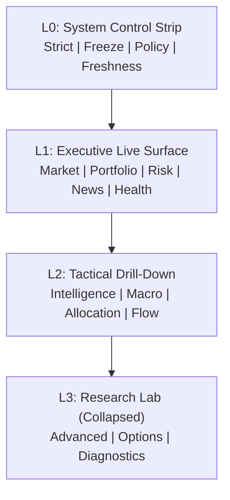

# Northstar V4 Visual Operating System Architecture

## Layered Topology

## Signal Flow (Data to Decision Surface)

## Live Decision Contract
- Live mode charts are rendered via `_render_chart_with_contract(...)`.
- Each contract defines: `chart_id`, required payload keys, schema columns, freshness SLA, degraded mode.
- Expired charts are blocked in live mode.
- Critical section failures emit structured health events and escalate in strict mode.

## Wave 1 Implementation Status
- Executive Live surface now routes through three canonical containers:
  - `render_market_pressure_surface(...)`
  - `render_portfolio_expression_surface(...)`
  - `render_survival_engine_surface(...)`
- Live Executive tabs are compacted to:
  - `Market Pressure`
  - `Portfolio Expression`
  - `Survival Engine`
  - `News Shock`
  - `System Health`
- Tactical live depth preserves deep legacy sections behind expanders so exploratory context is available without contaminating top-fold decision emissions.

## Layer Contracts
| Layer | Scope | SLA Behavior | Visual Budget |
|---|---|---|---|
| L0 | Live + Research | State-only (no chart render) | 0 charts |
| L1 | Live | Contract-managed, live-expired blocks | 8-12 surfaces |
| L2 | Live + Research | Stale warning allowed for non-critical tactical cards | 25-35 surfaces |
| L3 | Research | Collapsed by default, non-blocking | 40-45 emissions (collapsed) |

## Runtime View-Model Paths
- `data/processed/dashboard_view_model_live.pkl`
- `data/processed/dashboard_view_model_live.json`
- `data/processed/dashboard_view_model_research.pkl`
- `data/processed/dashboard_view_model_research.json`

## Enforcement Paths
- Dashboard chart contract CI: `scripts/ci/check_dashboard_chart_registry.py`
- Runtime strict gate: `scripts/ci/run_runtime_gate.sh`
- Reachability guard: `scripts/ci/check_reachability_regression.py`
